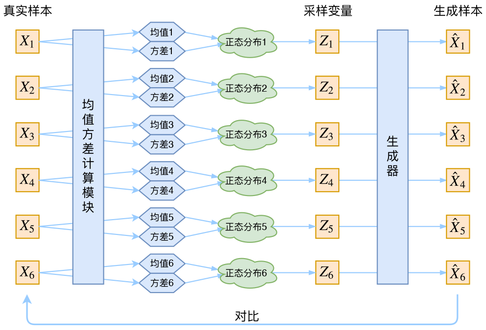
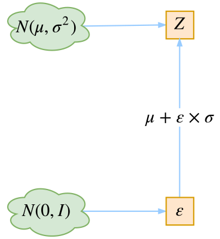

# VAE概述

## 数学

已知概率密度 $p(x)$，则有期望
$$
E(x)=\int x p(x) \mathrm{d}x
$$
而对其进行数值计算，则是
$$
E(x) \approx \sum_{i=1}^nx_ip(x_i)(x_i-x_{i-1})
$$
如果是采样计算，则是
$$
E(x) \approx \frac{1}{n} \sum_{i=1}^{n} x_i
$$
KL 散度
$$
KL(p(x)||q(x)) = \int p(x) \ln{\frac{p(x)}{q(x)}} \mathrm{d}x = E_{x \sim p(x)}\left [ \ln \frac{p(x)}{q(x)} \right ]
$$
更一般地，有
$$
E_{x \sim p(x)}\left [ f(x)\right ] = \int f(x)p(x) \mathrm{d}x \approx \frac{1}{n} \sum_{i=1}^{n}f(x_i)
$$

## 传统编码器

### 假设

假设有一批数据样本 $\left \{  X_1,X_2,...,X_n\right \} $ ，其整体用 $X$ 来描述，那么我们可以尝试用这样一批样本得到 $X$ 的分布 $p(X)$ ，然后直接对  $p(X)$ 采样，就可以得到所有的 $X$ 了。

然而这是不可能的。

因此假设存在 $Z$，就能把 $p(X)$ 分解为：
$$
p(X) = \int p(X|Z) p(Z)\, dZ
$$
其中 $p(Z)$ 可以选一个简单的分布（比如高斯），难点就转移到了 $p(X∣Z)$，而这个可以用神经网络表示。

于是有下面的图例：

但是问题是，这样的图的话，没法理解重新采样得到的 $Z_k$ 对应的到底是哪个 $X_k$ ，也就意味着直接最小化 $Dis(\hat{X}_k,X_k)$ 是不合理的。

### 实际与后验近似

在实际的 VAE 中，并没有使用 $p(Z)$ 去作为正态分布的假设，而是假设 $p(Z|X)$ 是正态分布。

具体来说，给定一个真实样本 $X_k$ ，我们假设存在一个专属于 $X_k$ 的分布$p(Z|X_k)$ ，并进一步假设这个分布是（独立的、多元的）正态分布。

下面是VAE的核心公式：
$$
\log  q_ϕ(z|x(i))=\log N(z;μ^{(i)},σ^{2(i)}I)
$$
我们知道正态分布有两组参数：均值 $μ$ 和方差 $σ^2$（多元的话，它们都是向量），那我怎么找出专属于 $X_k$ 的正态分布 $p(Z|X_k)$ 的均值和方差呢？好像并没有什么直接的思路。那好吧，那我就用神经网络来拟合出来吧！

我们构建两个神经网络 $μ_k=f_1(X_k)$,$\log σ^2_k=f_2(X_k)$ 来算它们。我们选择拟合 $\log σ^2_k$ 而不是直接拟合 $σ^2_k$，是因为 $σ^2_k$ 总是非负的，需要加激活函数处理，而拟合 $\log σ^2_k$ 不需要加激活函数，因为它可正可负。

如果按照上图训练，那在最小化 $Dis(\hat{X}_k,X_k)$ 的时候，肯定会想办法让方差为$0$，那么就失去了随机性。这会导致模型退化为自编码器。

为了保证随机性，VAE 让所有 $p(Z|X)$ 向 $\mathcal{N}~(0,1)$ 对齐，防止噪声为$0$ 。这样就能保证 $P(Z)$ 服从标准正态分布。

因此，使用 
$$
D_{KL}(q(z∣x)∥p(z))=\frac{1}{2}\sum _{i=1}^{k}(σ_i^2+μ_i^2−\log σ_i^2−1)
$$
作为 Loss 即可。

### 重参数化技巧

我们要从 $p(Z|X_k)$ 中采样一个 $Z_k$ 出来，尽管我们知道了 $p(Z|X_k)$ 是正态分布，但是均值方差都是靠模型算出来的，我们要靠这个过程反过来优化均值方差的模型，但是“采样”这个操作是不可导的，而采样的结果是可导的。

我们把采样过程写成一个**确定性函数 + 外部噪声**：
$$
z \sim q_\phi(z|x) = \mu(x) + \sigma(x) \odot \epsilon,\quad \epsilon \sim \mathcal{N}(0, I)
$$
我们将从 $\mathcal{N}(μ,σ^2)$ 采样变成了从 $\mathcal{N}(0,1)$ 中采样，然后通过参数变换得到从 $\mathcal{N}(μ,σ^2)$ 中采样的结果。这样一来，“采样”这个操作就不用参与梯度下降了，改为采样的结果参与，使得整个模型可训练了。

## 整体思路

从整体来看，我们有一批数据样本 $\left \{ x_1,...,x_n \right \}$， VAE的终极目标是学会数据分布：
$$
\log p(x) = \log \int p(x|z)p(z) \mathrm{d} z
$$
首先，引入联合分布：
$$
p(x,z) = p(x|z)\,p(z)
$$
构造一个可训练的联合分布 $q(x,z)$：
$$
q(x,z) = q(x|z) \, q(z)
$$
其中 $q(z)$ 是先验（简单高斯），$q(x|z)$ 是解码器（神经网络）。

可用 KL 散度去度量 $q(x,z)$ 与真实联合分布 $p(x,z)$ 的差距：
$$
\mathrm{KL}(q(x,z) \| p(x,z)) = \int \int p(x,z) \ln \frac{p(x,z)}{q(x,z) }\mathrm{d}z\mathrm{d}x
$$
那么优化 KL 散度，相当于同时逼近：潜变量的分布 $p(z)$ + 条件生成模型 $p(x|z)$。这样训练就一步到位，不必先推导后验再写 ELBO，而是直接优化联合分布的匹配。此时我们的目标转为优化 KL 散度。
$$
\begin{aligned}
\mathrm{KL}(q(x,z) \| p(x,z))  
&= \int \tilde{p}(x) \left[ \int p(z|x) \ln \frac{\tilde{p}(x)p(z|x)}{q(x,z)} \,\mathrm{d}z \right] \mathrm{d}x \\[6pt]
&= \mathbb{E}_{x \sim \tilde{p}(x)} \left[ \int p(z|x) \ln \frac{\tilde{p}(x)p(z|x)}{q(x,z)} \,\mathrm{d}z \right] \\[6pt]
&= \mathbb{E}_{x \sim \tilde{p}(x)} \left[ \int p(z|x) \Big( \ln \tilde{p}(x) + \ln \tfrac{p(z|x)}{q(x,z)} \Big)\,\mathrm{d}z \right] \\[6pt]
&= \mathbb{E}_{x \sim \tilde{p}(x)} \left[ \int p(z|x) \ln \tilde{p}(x)\,\mathrm{d}z + \int p(z|x) \ln \tfrac{p(z|x)}{q(x,z)} \,\mathrm{d}z \right] \\[6pt]
&= \mathbb{E}_{x \sim \tilde{p}(x)} \left[ \ln \tilde{p}(x) \int p(z|x)\,\mathrm{d}z + \int p(z|x) \ln \tfrac{p(z|x)}{q(x,z)} \,\mathrm{d}z \right] \\[6pt]
&= \mathbb{E}_{x \sim \tilde{p}(x)} \left[ \ln \tilde{p}(x) + \int p(z|x) \ln \tfrac{p(z|x)}{q(x,z)} \,\mathrm{d}z \right] \\[6pt]
&= C + \mathbb{E}_{x \sim \tilde{p}(x)} \left[ \int p(z|x) \ln \tfrac{p(z|x)}{q(x,z)} \,\mathrm{d}z \right].
\end{aligned}
$$
其中，由于  $\tilde{p}(x)$ 是一个虽然不能写出表达式的、但是实际存在的、且根据样本 $x_1,x_2,...,x_n $ 确定的先验分布，因此对其的期望是个常数。由于 ELBO 可写作 $ \mathrm{ELBO}(x)
 = \mathbb{E}_{z \sim p(z|x)}\big[\ln q(x|z)\big] - \mathrm{KL}\left(p(z|x)|q(z)\right)$ ，则目标转为最小化 ：
$$
\begin{aligned}
 \mathrm{Loss}
 &= \mathbb{E}_{x\sim\tilde{p}(x)}\left[\int p(z|x)\ln\frac{p(z|x)}{q(x,z)}\mathrm{d}z\right]\\
 &= \mathbb{E}_{x\sim\tilde{p}(x)}\left[\int p(z|x)\ln\frac{p(z|x)}{q(x|z)q(z)}\mathrm{d}z\right]\\
 &= \mathbb{E}_{x\sim\tilde{p}(x)}\left[-\int p(z|x)\ln q(x|z)\,\mathrm{d}z + \int p(z|x)\ln\frac{p(z|x)}{q(z)}\,\mathrm{d}z\right]\\
 &= \mathbb{E}_{x\sim\tilde{p}(x)}\left[\mathbb{E}_{z\sim p(z|x)}\big[-\ln q(x|z)\big] + \mathrm{KL}\!\left(p(z|x)\,\|\,q(z)\right)\right]\\[6pt]
 &\equiv -\,\mathbb{E}_{x\sim\tilde{p}(x)}\Big[\mathrm{ELBO}(x)\Big],
\end{aligned}
$$

### 后验分布近似

已知 $q(z), q(x|z), p(z|x)$ 都未知。为便于实验，需要给出明确形式。

先假设 $q(z) = \mathcal{N}(0,I)$ ，则解决了先验 $q(z)$。对于 $p(z|x)$，我们假设为高斯分布，均值和方差由 $x$ 决定，即 
$$
p(z|x)=\mathcal{N}\big(z;\mu(x),\sigma^2(x)I\big)
$$
 其中 $\mu(x), \sigma^2(x)$ 由神经网络输出（encoder）。

此时 KL 散度可解析：
$$
\mathrm{KL}(p(z|x)|q(z))=\tfrac{1}{2}\sum_{k=1}^d\big(\mu_k(x)^2+\sigma_k(x)^2-\ln\sigma_k(x)^2-1\big)
$$
这就是（8）中提到的KL loss。

### 生成模型近似

对于 $q(x|z)$（decoder），需选择合适分布：

**伯努利分布**（适用于二值数据）：$q(x|z)=\prod_{k=1}^D \rho_k(z)^{x_k}(1-\rho_k(z))^{1-x_k}$， 对应的损失是交叉熵。

**高斯分布**（适用于一般数据）： $q(x|z)=\mathcal{N}\big(x;,\tilde\mu(z),\tilde\sigma^2(z)I\big)$， -log 似然约化为 MSE 损失（若方差固定）。

### 采样与重参数化

$p(z|x)$ 既用于算 KL 散度，也用于期望 $\mathbb{E}_{z\sim p(z|x)}[-\ln q(x|z)]$。

使用重参数化技巧： $z = \mu(x) + \sigma(x)\odot\epsilon,\quad \epsilon\sim\mathcal{N}(0,I)$。

实际训练中，每个 $x$ 只采样一个 $z$。多个 epoch 的累积效果能保证采样充分性。最终目标函数：
$$
\mathcal{L} = \mathbb{E}_{x\sim\tilde p(x)}\Big[-\ln q(x|z) + \mathrm{KL}(p(z|x)|q(z))\Big], \quad z\sim p(z|x)
$$

