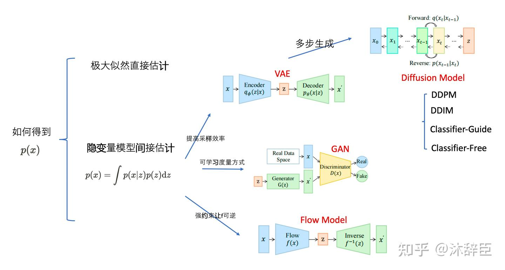
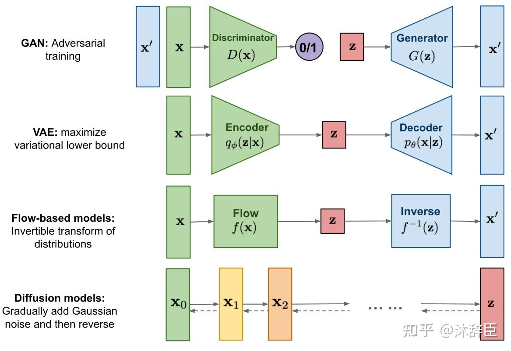
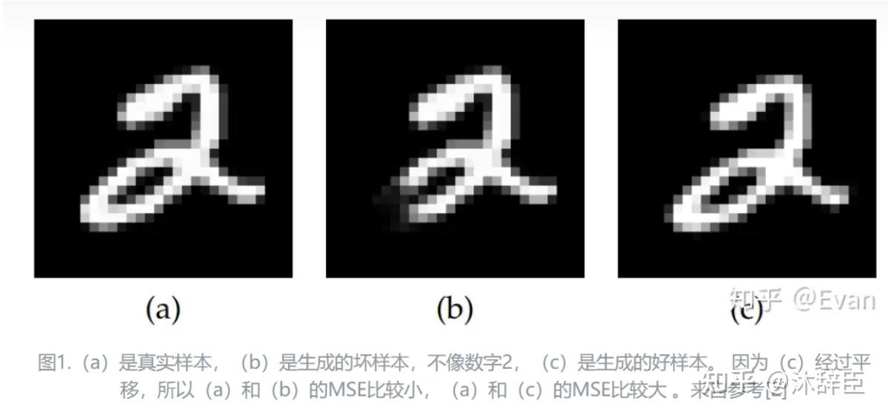
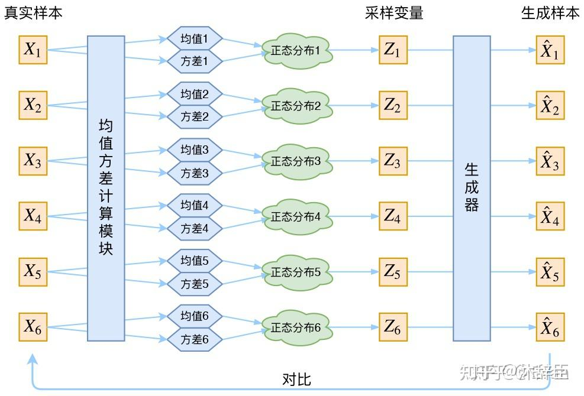
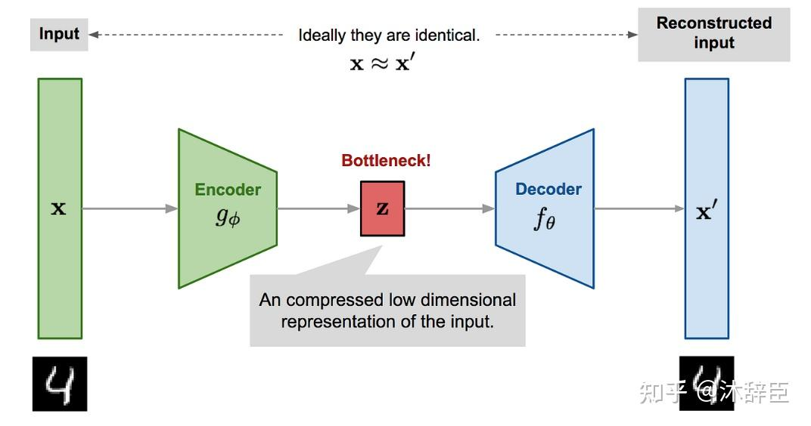
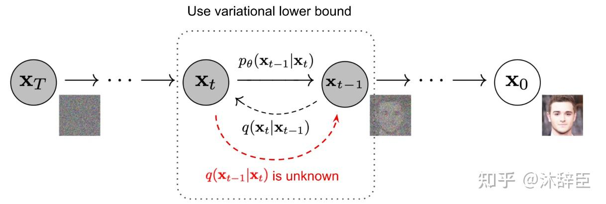
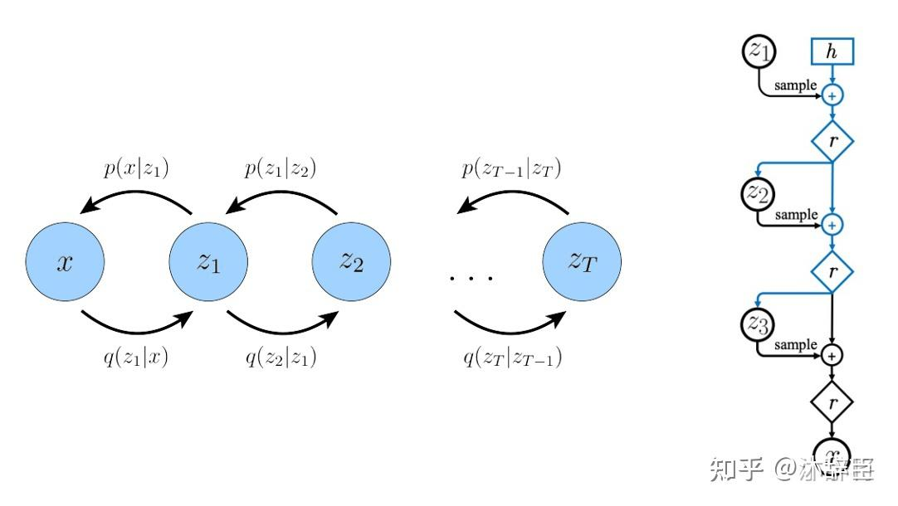

# 从隐变量模型到 VAE, GAN, Flow 到 Diffusion

本文旨在以究极通俗详细的说法串联着讲解VAE, [GAN](https://zhida.zhihu.com/search?content_id=248396402&content_type=Article&match_order=1&q=GAN&zhida_source=entity), FLOW 以及 Diffusion 等模型的原理和设计动机，从而使不同基础的人都能对其有一个基础的认识。

本篇文章的主要框架基于 @aaronxic 大佬的这篇文章 [\[Transformer 101系列\] AIGC组成原理(上)](https://zhuanlan.zhihu.com/p/646149258) ，知识层层递进，互相串联得很好，有种水到渠成的畅快感觉，但具体理论讲解有些简略且不甚清晰，故在此进行详细地补充。

（大佬看我这篇文章大概会觉得我在事无巨细地说明很多无关紧要的点，非常抱歉，这是我为了防止表述不够清晰引起部分读者误解或理解困难而养成的表达习惯了）

### 概览：VAE, GAN, [Flow Model](https://zhida.zhihu.com/search?content_id=248396402&content_type=Article&match_order=1&q=Flow+Model&zhida_source=entity) 和 Diffusion 的关系

  

  

  

  

### 生成式模型的基本目的

以图片生成和处理任务为例，假设我们的研究对象是一个16×16的RGB图片，抛开对图片内容的限制，假如我们完全随机地生成这样一个尺寸的图片，每个像素的可能取值有 $256 \times 256 \times 256$ 个，整个图片的可能取值情况有 $N = (256 \cdot 256 \cdot 256)^{(16 \cdot 16)}$ 个。

我们把可能随机生成的这样的一个图片设为一个随机变量 $X$，$X$ 的所有可能取值个数为 $N$，则我们可以将其样本空间表示为 $S_X = \{X_1, X_2, ..., X_N\}$。$X$ 这个随机变量必然是服从某个分布的，我们将其记为 $X \sim p(X)$。

> 即我们随机生成的这样一个图片$X$，其取值为$a$的概率为 $p(a)$（即 $P(X = a) = p(a)$）

模型生成图片的过程，实际上就是对服从这个分布 $p(X)$ 的随机变量 $X$ 进行采样的过程，采样得到的 $X'$ 就是一个属于 $S_X$ 的图片。

但我们在许多图片生成任务中肯定是希望得到一个在 $S_X$ 上有所倾向、有所特点的分布 $p(X)$（不然真随机生成的话大概率只会生成一团马赛克）。比如说，如果我们希望这个模型能生成一些与猫相关的图片，那这个模型对应的分布 $p(X)$ 在与猫相关的图片对应的 $X$ 值上的概率应该更高，而与猫无关的图片的概率应该更小，即：
$$
p(X_{\text{与猫相关}}) \text{ 较大} \\
p(X_{\text{与猫无关}}) \text{ 较小}
$$
也就是说，在许多任务中，我们对这个分布 $p(X)$ 是有特殊的要求和期望的，**我们的目的就是求出这个满足我们要求的分布 $p(X)$**。**只要我们能求出合适的分布 $p(X)$，我们就可以通过对这个分布进行采样得到我们期望的图片了**。（实际上不能说是对分布采样，应该说是对一个服从该分布的随机变量进行采样）

当然，不只是图片任务，在其他任务里，这里的 $X$ 也可以是视频音频或文本。

我们怎么求我们希望的分布 $p(X)$ 呢？如果 $N$ 比较小，我们大可以人为地对 $p(X)$ 按我们的偏好进行调整、设计，但实际任务中 $N$ 往往极大，难以直接获取 $p(X)$，我们只能用各种方式来逼近这个分布 $p(X)$ 了。

下面是几种估计 $p(X)$ 的方法。

### 估计分布的方法之一：极大似然估计

极大似然法的原理很直观易懂。在有一定先验知识的情况下，我们可以对 $p(X)$ 的形式进行一定的假设，而其中的待求参数为 $\theta$，记分布为 $p_\theta(X)$，我们的任务就转化成了如何求目标分布对应的参数 $\theta$。

> 举个例子，我们假设已知 $p(X)$ 是一个高斯分布，那我们只需要求该高斯分布对应的均值和方差即可，记 $\theta = (\mu, \sigma^2)$，这里的 $\theta$ 就是我们的待求参数，只要求出 $\theta$ 就可以确定分布了

在图片生成任务的例子中，假设我们有 $k$ 个我们希望这个模型生成的图片样例，那么我们显然是希望这个模型生成这些图片的概率能足够的大，即我们希望最大化如下概率：（我们记样例组成的集合为 $T_X$）
$$
L_{\theta}(T_X) = \prod_{i=1}^{k}p_{\theta}(X_i) \quad (X_i \in T_X)
$$
那我们希望的参数 $\theta$ 应该为：
$$
\hat{\theta} = \mathrm{argmax}_{\theta}L_{\theta}(S_X)
$$
这样我们就把分布 $p_\theta$ 的估计问题转化成了一个最优化问题，这就是极大似然估计（**即希望我们要求的分布能使当下我们期望发生的事发生的概率尽可能地大**）。

这种方法看似直观简便，但却有如下无法忽视的局限性：

*   实际上，我们**很难对 $p(X)$ 的形式有一个合理的预先认识和假设**（大多数时候我们对其一无所知）。
*   在很多情况下，参数 $\theta$ 对应的参数空间维度极大（比如16×16的图片生成任务中，我们假设每个像素位置的取值为一个高斯分布，那么整个图片服从一个16×16维的多元高斯分布，一共有 $16 \times 16 \times 2$ 个待求参数，即 $\theta$ 是一个长度为512的向量，其参数空间的维度为512维），**对这样一个高维的参数进行优化，需要相当相当多的数据才能取得有效的估计，数据成本极高**。

### 估计分布的方法之二：隐变量估计

直接求解或估计 $p(X)$ 还是有些困难，而直接用神经网络去拟合 $p(X)$ 效果也往往欠佳。故我们引入一个隐变量 $z$，先生成一个随机变量 $z$，再由 $z$ 经过某种变换生成最终的随机变量 $X$。

> 关于为什么要引入隐变量，更加理论化的解释请见另一篇关于贝叶斯方法和变分推断的笔记[贝叶斯统计] 1 贝叶斯方法概要与变分推断。  
>
> 这里给出一些更形象的描述：  
>
> 实际上，**观测数据只是我们可以直接观测到的样本指标或特征**，而在观测数据之下蕴含的还有一些我们不能直接观测到的、潜在的、未知的特征，这些特征可能对观测数据产生影响，我们称其为**隐藏特征**。  
>
> **观测特征所在的空间为观测空间，隐藏数据所在的空间为隐藏空间**。  
>
> 举例说明，**考虑一个电商平台的用户行为分析**。**观测空间是用户在平台上的实际行为数据**，如购买记录、浏览历史、搜索关键词等。**而隐藏空间可以是用户的潜在兴趣或偏好**。例如，假设一个用户购买了几本关于健康和健身的书籍，但观测数据中并没有直接记录用户的兴趣。  
>
> 用户的兴趣偏好会在一定程度上影响其在平台上的行为活动，但不会直接记录在观测数据中。用户在平台上的行为数据在形式上往往是比较复杂的，难以直接找到其一般的规律，那**我们可以人为地添加潜在的主题变量来表示“用户的兴趣”，然后想办法构建一个由“用户的兴趣”到“用户的行为数据”的映射**，因为“用户的兴趣”这一隐藏特征在表示和含义上远比观测特征简洁直白，可以很方便地分析理解数据，提供更精确和深入的推断和预测。  
>
> （再举个图像的例子，一个16×16的手写数字图像（假设其写的是9），作为直接的观测数据，数据量是较大的，但是其隐藏特征实际上就是一个数字9，我们可以把隐藏特征纳入考虑对观测数据进行分析）

引入隐变量 $z$ 后，我们记其服从于分布 $s(z)$，我们可以从较为简单的分布 $s(z)$ 出发，用积分公式（依据是 product rule）间接地求出相对复杂的分布 $p(x)$：
$$
p(x) = \int p(x|z)s(z)\mathrm{d}z
$$
这里需要注意：

1. $s(z)$ 分布的表达式形式一般比较简单，比如普通的多元高斯分布，并且往往是预先假设的一个没有未知量的确定分布。（对的，一般我们引入的这个隐变量就是相对简单的，这是我们人为设计规定的，不然不如不引）

2. $z$ 的自由度一般比较低，或者说其维度比较低，应该是一个相对简单的变量。

3. 在实践中，因为“从隐变量 $z$ 经过某种变换生成最终的随机变量 $X'$ 往往是个**确定**的变换过程，即 $x = f_{\theta}(z)$（很多时候我们会用神经网络来实现 $f_{\theta}$），所以有如下表达式：（没错，给定 $z$ 的情况下其实际上是个关于 $x$ 的冲激函数）
   $$
   p_{\theta}(x|z) = \left\{ \begin{array}{ll} 0 & \text{if } x \neq f_{\theta}(z) \\ \infty & \text{if } x = f_\theta (z) \\ \end{array} \right.
   $$

4. 在实践中从简单分布 $s(z)$ 生成任意分布 $p(x)$ 过程如下：假如我们想求 $p(X')$，则先解出 $x = f(z)$ 的解集 $\{z_1, z_2, ..., z_m\}$，经过一定计算化简可以发现 $p(X') = \sum_{i=1}^m s(z_i)$。<u>（存疑，毕竟这个解集很难求出来）</u>

5. 我们或许无法一开始就给出足够合理、正确的变换 $f$，但是我们一般是用神经网络来实现 $f$，神经网络的反应能力是哈基米的七倍，它不舒服的时候会自己训练拟合到合适的函数（而且实际上，这里唯一的待求参数就是 $f$ 这个函数的参数 $\theta$，所以**隐变量模型实际上把一个概率分布的估计问题转化成了一个函数逼近的问题**）。

隐变量模型背后的关键思想是：**任何一个简单的概率分布经过一个足够复杂的函数后可以映射到任意概率分布**。

但是，我们在训练这个模型（或者说，逼近求解 $f$）的时候，使用的还是极大似然的方法。

与前文类似，我们最大化的目标为：
$$
L_{\theta}(T_X) = \prod_{i=1}^{k}p_{\theta}(X_i) \quad (X_i \in T_X)
$$
其负对数为：
$$
l_{\theta}(T_X) = -\sum_{i=1}^n\ln{p_{\theta}(x_i)} = -\sum_{i=1}^n\ln{\int p_{\theta}(x_i|z)s(z)\mathrm{d}z}
$$
其关于 $\theta$ 的梯度为：
$$
\nabla_{\theta}~l_{\theta}(T_X) = -\sum_{i=1}^n \nabla_{\theta} \ln{\int p_{\theta}(x_i|z)s(z)\mathrm{d}z} = -\sum_{i=1}^n \frac {\int \nabla_{\theta} \ln{\int p_{\theta}(x_i|z)s(z)\mathrm{d}z}} {\int p_{\theta}(x_i|z)s(z)\mathrm{d}z}
$$
我们可以用这个梯度对模型参数 $\theta$ 进行更新。

但是这个方法可能存在如下问题：

1.  4中的解集一般很难求，因为 $f$ 在某些情况下并不可逆且较为复杂，不好直接求解。
2.  在实践中，为了能让 $z$ 表示更多的信息，我们往往假设其为一个连续的随机变量（比如高斯随机变量），这导致我们必须要计算连续空间上的积分（如果其为离散的我们就可以把积分转化为求和了），往往难以计算准确结果。

可见，这种方法在计算梯度时存在积分难以计算的问题，**故我们通常采用蒙特卡洛采样的方法来计算其近似解**。

下面简单讲解一下蒙特卡洛采样求积分的原理。

原本的积分可以表示成期望的形式：
$$
\int p_\theta(x|z)s(z)\mathrm{d}z = \mathbb{E}_{z \sim s(z)} [p_\theta(x|z)]
$$
我们可以**通过采样估计期望来估计积分**。步骤如下：

1. 对 $z \sim s(z)$ 进行 $m$ 次采样得到 $z_1, z_2,...,z_m$

2. 可以表示出 $p_\theta (x_j|z_j)$，并且不难证明：
   $$
   \int p_\theta(x|z)s(z)\mathrm{d}z = \mathbb{E}_{z \sim s(z)} [p_\theta(x|z)] \approx \frac{1}{m} \sum_{j=1}^m p_\theta(x_j|z_j)
   $$

蒙特卡洛方法虽然简单，但是还是有两个可改进方向：

1.  提高采样效率。这里的 $m$ 要非常大才能得到相对满意的结果，并且 $z$ 的取值范围中有一些值很可能产生坏样本，故我们尝试优化，**缩小 $z$ 的取值空间，缩小 $s(z)$ 的方差 $\sigma^2$，这样 $z$ 的采样范围也会缩小**，采样次数也不需要很大，同时也可以排除一部分坏的 $z$ 值。**（VAE方向）**
2.  这里我们将得到的 $X'$ 和真实图片 $X$ 做MSE，但很多真实情况表明MSE并不是很有效的度量，所以另外一种思路是**用神经网络来学习一个更好的度量方式 $D(x, x')$**。**（GAN方向）**

### 隐变量估计的改良之一：VAE

### VAE 理论基础：变分推断

怎样缩小 $z$ 的采样分布的方差呢，之前的采样方案是从 $z$ 的先验概率分布 $s(z)$ 中采样，现在可以考虑从 $z$ 的后验概率分布 $p(z|X)$ 中进行采样。

关于这点，可以这样理解：**先验概率 $p(z)$ 是没有限制的任意分布，而后验概率 $p(z|X)$ 是给定 $X$ 后的条件概率，$z$ 的取值空间会更小，采样范围也会缩小，所以更可能采样出能生成 $X$ 的 $z$**。

但是我们一般无法直接求出后验分布，故我们在**变分推断**中选择使用另一个分布 $q_\theta (z|X)$ 来近似地逼近、估计 $p(z|X)$，拿从 $q_\theta (z|X)$ 采样的结果近似地作为 $p(z|X)$ 中得到的采样。

> 为什么这种方法叫变分推断呢？在这个问题中我们的优化对象是 $q_\theta (z|X)$（更准确地说是其参数 $\theta$），而优化的目标是缩小 $q_\theta (z|X)$ 与 $p(z|X)$ 之间的"距离"，我们设其为 $dist$。
>
> 我们一般会表示出 $dist = f(\theta)$，而我们的优化手段往往是求 $f$ 关于 $\theta$ 的导数然后使用梯度下降法，而在数学中，变分是一种函数的微小变化或泛函的微小变化的概念，与导数关系密切，故我们称其为变分推断。（说人话就是通过求导优化一个分布去逼近另一个分布）

在变分推断中，我们采用 **KL散度** 衡量两个概率分布的相似程度，作为两个分布之间的"距离"。

$$
\begin{align}
KL(q_\theta(z|x) \parallel p(z|x)) &= \int q_\theta(z|x) \ln{\frac{q_\theta(z|x)}{p(z|x)}} \, \mathrm{d}z \\
&= \mathbb{E}_{z \sim q_\theta(z|x)}\left[\ln{\frac{q_\theta(z|x)}{p(z|x)}}\right] \\
&= \mathbb{E}_{z \sim q_\theta(z|x)}\left[\ln{q_\theta(z|x)} - \ln{p(z|x)}\right] \\
&= \mathbb{E}_{z \sim q_\theta(z|x)}\left[\ln{q_\theta(z|x)} - \ln{\frac{p(x|z)p(z)}{p(x)}}\right] \\
&= \mathbb{E}_{z \sim q_\theta(z|x)}\left[\ln{q_\theta(z|x)} - \ln{p(z)} - \ln{p(x|z)}\right] + \ln{p(x)} \\
&= KL(q_\theta(z|x) \parallel p(z)) - \mathbb{E}_{z \sim q_\theta(z|x)}\left[\ln{p(x|z)}\right] + \ln{p(x)}
\end{align}
$$

整理后得到：
$$
\ln{p(x)} - KL(q_\theta(z|x)||p(z|x)) = \mathbb{E}_{z \sim q_\theta(z|x)}[\ln{p(x|z)}] - KL(q_\theta(z|x)||p(z))
$$

这个式子是我们由纯粹推导得来的，但其中各部分又具有相当有实际意义的含义：

1.  我们的整体目的其实是要最大化 $\ln{p(x)} - KL(q_\theta(z|x)||p(z|x))$。在训练过程中，我喂给模型的图像 $x$ 都是希望其生成的模型，其中 $\ln{p(x)}$ 自然是模型生成图像 $x$ 的对数似然值，我们肯定希望其尽可能大。另一方面，$KL(q_\theta(z|x)||p(z|x))$ 是我们人为设定的分布 $q_\theta(z|x)$ 和希望其逼近的目标分布（即 $z$ 的后验分布）的KL散度，所以我们自然希望其尽可能的小，即其相反数尽可能的大。

2.  等号右面的第一部分，$\mathbb{E}_{z \sim q_\theta(z|x)}[\ln{p(x|z)}]$，$z \sim q_\theta(z|x)$ 表示我们先给定一个 $x$，然后我们从给定这个 $x$ 后的 $z$ 的后验分布 $q_\theta(z|x)$ 中采样得到一个隐变量 $z$，这个过程其实就是给定 $x$ 输出 $z$，相当于把 $x$ 编码成了 $z$，我们称这个过程**encode**，而 $p(x|z)$ 表示给定 $z$ 又生成回 $x$ 的概率，反映的是把 $z$ 解码为 $x$ 的过程，我们称其为**decode**。用这种方式可以把这个整体理解为**对于给定 $x$，将其按分布 $q_\theta(z|x)$ 编码为某个 $z$ 后能再成功解码（重构）回 $x$ 的对数似然函数值的期望**。如果这个期望足够大，说明得到的 $z$ 是 $x$ 的一个足够好足够有效的表示，是一个能有效反映 $x$ 的隐变量。我们称其为**重构误差**，希望其能足够的大（这个名字好奇怪，明明越大越好却起名为误差）。

3.  对于等号右面的第二项 $KL(q_\theta(z|x)||p(z))$，其表示我们用来拟合后验分布的函数与实际的先验分布的函数之间的KL散度，即我们不希望我们得到的后验函数和原先验分布之间的差距过大。这可以视为一种正则化技巧（至于具体是怎么正则的，下面讲VAE结构时会详细说明）。

又因为 $KL(q_\theta(z|x)||p(z|x)) \geq 0$，故：
$$
\ln{p(x)} \geq \mathbb{E}_{z \sim q_\theta(z|x)}[\ln{p(x|z)}] - KL(q_\theta(z|x)||p(z)) = ELBO
$$

ELBO（Evidence Lower Bound）称为对数似然的下界，此时可以**把最大化对数似然转化为最大化ELBO**。

> （因为 $p(x)$ 毕竟是我们所不知道的嘛，没法直接最小化 $KL(q_\theta(z|x)||p(z|x))$）  
>
> （而且只要ELBO这个下界足够大，说明 $\ln{(p(x))}$ 基本不会小）

### VAE 的结构与原理

我们上面通过理论推导得出，我们可以把最小化 $KL(q_\theta(z|x)||p(z|x))$ 的目标转化为最大化ELBO。接下来我们只要从工程角度实现 **encode** 和 **decode** 的过程即可。（在模型中其实就是构造 **encoder** 和 **decoder**）

1.  encoder的实现：

如同前面所说，对于每一个输入给定的 $x$，我们都会有（而且需要有）一个分布 $q_\theta(z|x)$ 来（通过对分布采样）得出一个与之对应的隐变量（或者说隐编码）$z$。而这个分布如何设计呢？我们假设其为正态分布，那么我们只需要决定其均值和方差即可。而这个均值和方差即可由神经网络输入 $x$ 后输出得到，这样这个神经网络就帮助实现了 encode 的过程，我们称这一部分为 encoder。

2.  $KL(q_\theta(z|x)||p(z))$ 的实现：

如果不对 $q_\theta(z|x)$ 做约束，其方差很可能趋近于0，导致给定 $x$ 后可能生成的 $z$ 局限到某个常数附近，使 VAE 退化到 AE，这会大大削减模型生成新样本的能力和隐变量表达的丰富性。所以我们希望其方差适当地小但不等于0。

我们可以通过使其与 $\mathcal{N}(0,I)$ 看齐来实现。我们可以直接假设 $p(z)$ 为 $\mathcal{N}(0,I)$，计算 $KL(q_\theta(z|x)||p(z))$。

在此基础上，我们可以进行如下计算（以一维情况为例）：
$$
\begin{split}
&KL(q_{\theta}(z|x)||\mathcal{N}(0, I)) \\
=& \int \frac{1}{\sqrt{2 \pi {\sigma}^2}} e^{-\frac{(x-{\mu})^2}{2{\sigma}^2}} \ln \frac{\frac{1}{\sqrt{2 \pi {\sigma}^2}} e^{-\frac{(x-{\mu})^2}{2{\sigma}^2}}}{\frac{1}{\sqrt{2 \pi}} e^{-\frac{x^2}{2}}} \text{d}x \\
=& \int \frac{1}{\sqrt{2 \pi {\sigma}^2}} e^{-\frac{(x-{\mu})^2}{2{\sigma}^2}} \ln \frac{1}{\sqrt{\sigma^2}}\times e^{\frac{x^2}{2} - \frac{(x-\mu)^2}{2\sigma^2}}\text{d}x \\
=& \int \frac{1}{\sqrt{2 \pi {\sigma}^2}} e^{-\frac{(x-{\mu})^2}{2{\sigma}^2}} [-\frac{1}{2} \ln \sigma^2 + \frac{1}{2}x^2 - \frac{1}{2}\frac{(x-\mu)^2}{\sigma^2}]\text{d}x \\
=& \frac{1}{2} \int \frac{1}{\sqrt{2 \pi {\sigma}^2}} e^{-\frac{(x-{\mu})^2}{2{\sigma}^2}} [-\ln \sigma^2 + x^2 - \frac{(x-\mu)^2}{\sigma^2}]\text{d}x \\
=& \frac{1}{2}(-\ln \sigma^2 + \mathbb{E}[x^2] - \frac{1}{\sigma^2}\mathbb{E}[(x-u)^2]) \\
=& \frac{1}{2}(-\ln \sigma^2 + \sigma^2 + \mu^2 - 1)
\end{split}
$$

其中 $\mathbb{E}[x^2]$ 的计算过程如下：
$$
\begin{align}
\mathbb{E}[x^2]&=\frac{1}{\sqrt{2\pi}\sigma}\underbrace{\int_{-\infty}^{+\infty}x^2\mathrm{e}^{-\frac{(x-\mu)^2}{2\sigma^2}}\mathrm{d}x}_{x\to \sqrt{2}\sigma x+\mu}\\
&=\frac{1}{\sqrt{\pi}}\int_{-\infty}^{+\infty}(\sqrt{2}\sigma x+\mu)^2\mathrm{e}^{-x^2}\mathrm{d}x\\
&=\frac{2\sigma^2}{\sqrt{\pi}}\int_{-\infty}^{+\infty}x^2\mathrm{e}^{-x^2}\mathrm{d}x\\
&\quad+\frac{2\sqrt{2}\mu\sigma}{\sqrt{\pi}}\int_{-\infty}^{+\infty}x\mathrm{e}^{-x^2}\mathrm{d}x\\
&\quad+\frac{\mu^2}{\sqrt{\pi}}\int_{-\infty}^{+\infty}\mathrm{e}^{-x^2}\mathrm{d}x\\
&=\frac{2\sigma^2}{\sqrt{\pi}}\cdot\frac{\sqrt{\pi}}{2}+\frac{2\sqrt{2}\mu\sigma}{\sqrt{\pi}}\cdot 0+\frac{\mu^2}{\sqrt{\pi}}\cdot\sqrt{\pi}\\
&=\sigma^2+\mu^2.
\end{align}
$$

3.  重参数化技巧：

由于采样过程本身不可导，这里我们使用**重参数化技巧（reparametrize）**，将从 $\mathcal{N}(\mu, \sigma^2)$ 采样得到一个 $Z$ 的过程视为为在 $\mathcal{N}(0,1)$ 上采样得到一个 $\epsilon$ 然后计算 $Z = \mu + \varepsilon \times \sigma$ 的过程，这样就可以计算 $Z$ 到 $\mu$、$\sigma$ 的导数了。

4.  多样本多维度情况下的目标函数：

上面介绍的重构误差是针对单个样本的，当样本数为 $n$ 时，可以表示为 $\frac{1}{n}\sum_{i=1}^{n} \ln p(x_i|z_i)$，**并且可以转化为要求 $x_i$ 和 $\hat{x}_i$ 的MSE尽可能地小**。即最小化 $\sum_{i=1}^n ||x_i - \hat{x}_i||_2^2$。

> 之所以可以互相转换是因为最小二乘实际上是极大似然的一个特殊情况，在该情境下可以证明两种方法的优化目标等价。

上面介绍的KL散度表示也是针对1维的隐变量 $z$。由于正态分布是各向同性的，当维度为 $d$ 时，可以表示为 $\frac{1}{2}\sum_{i=1}^{d} (-\ln \sigma^2 + \sigma^2 + \mu^2 - 1)$。

两个加起来为：
$$
Loss = \frac{1}{n}\sum_{i=1}^{n} [||x_i - \hat{x}_i||_2^2 + \frac{1}{2}\sum_{i=1}^{d} (-\ln \sigma^2 + \sigma^2 + \mu^2 - 1)]
$$

5.  decoder

decoder本身是个确定的过程，只需要用一个神经网络来实现 $x=f(z)$ 就行。

### 关于VAE再多说几句

虽然刚刚的理论推导已经足够完善清晰了，但是我们最好还是跳出来再审视一下VAE这个设计本身：

**为什么要有VAE？它是用来解决什么问题的？它解决了吗？**

虽然我们前面说的是其是为了解决隐变量估计中的采样复杂问题，但其实并不全面（毕竟只是在这篇文章串联讲述生成模型发展路径的叙事语境下的解释，和历史上的真实情况并不完全相同）

变分自编码器（Variational Autoencoder, VAE）是2013年由Kingma和Welling提出的一种生成模型。VAE的提出主要是为了**应对经典自动编码器（Autoencoder）在生成能力方面的不足**，特别是针对生成复杂数据（如图像、音频等）的分布建模问题。

### 背景

在深度学习的早期，自动编码器（Autoencoder, AE）被广泛用于无监督学习中，尤其是用于降维和特征学习。自动编码器的工作机制是通过一个编码器将输入数据压缩为一个潜在表示，再通过解码器从该潜在表示重建原始数据。虽然自动编码器在重构数据时有一定的能力，但它并不擅长生成新的数据点。这是因为传统的自动编码器将输入数据映射到一个**固定的潜在空间**，没有明确地对潜在空间的分布进行建模。

所以从结果上来讲，AE的泛化能力欠佳。

### 设计动机

为了改进这一点，Kingma和Welling提出了VAE，主要动机是通过概率模型对数据的生成过程进行建模，使得生成的潜在表示服从某种先验分布（通常是高斯分布），从而使模型具备更强的生成能力。VAE的设计动机可以概括为以下几点：

1.  **生成新数据的能力**：自动编码器**只能进行重构**而不是生成新的数据，而VAE通过**在潜在空间中引入概率分布**，使得从潜在空间中采样可以生成多样化且有效的数据样本。

2.  **潜在空间的结构化**：VAE通过引入先验分布（如标准正态分布），让潜在空间具备更好的结构，模型能够学习到数据的真实分布。这样在潜在空间中采样时，可以生成具有多样性的、与原始数据相似的新样本。

3.  **解决过拟合问题**：传统的自动编码器在**重建输入数据时可能会过拟合**，导致潜在空间的分布非常不连续，VAE通过变分推断的方法，在训练过程中加入KL散度正则项，鼓励潜在表示接近先验分布，从而防止过拟合。

4.  **利用概率图模型的思想**：VAE结合了概率图模型和深度学习的优点，**将数据生成过程建模为一个隐变量模型**，并通过变分推断的方式进行训练。

5.  **进行隐式的数据增强**：单从数学表示来看，VAE求得隐变量的过程 $Z = \mu + \varepsilon \times \sigma$ 相较于AE，实际上就是在AE所求的 $z$（对应VAE中的 $\mu$）上新加了一个方差为 $\sigma^2$ 的高斯噪声，故可以认为是在对每次输入的数据在隐藏空间内做一个基于加噪的数据增强，这种设计不仅能防止过拟合，还提升了模型的泛化能力和生成质量。（可以理解为：VAE的隐变量采样过程与经典的数据增强策略在概念上类似，只不过它作用于潜在空间而非直接的输入空间。）

### 总结

所以，综合来看，VAE实际上是为了弥补AE这种简单的重构模型生成泛化能力弱的局限，基于其encoder-decoder的结构在隐空间中引入了一个隐变量分布，从而使其变为一个隐变量模型，然后为了弥补隐变量估计采样复杂的问题，又补全了变分推断的理论，使其实现更具可行性。

那我们再来看一下这样一个VAE结构如何进行实际的图像生成任务：

**训练过程**：向encoder输入图像 -> encoder生成潜在分布 -> 重参数化采样 -> decoder重建图像 -> 最小化重构损失和KL散度。

**推理过程**：直接从潜在空间（标准正态分布）采样潜在变量 -> 解码器生成新图像。

很直白很简单对吧！

> 好吧其实不是那么直白，我在看这个原理的时候是懵了一阵子的。这些encoder-decoder结构的模型总是给我一种训练和推理脱节的错觉（应该说两个过程之间的联系没那么直观）  
>
> 就，我们在训练过程中是给encoder中输入一个图像，由encoder编码得到一个分布，这个分布的均值和方差都是由输入图像得到的，再从这个分布中采样得到一个隐变量输入decoder重建图像，过程相当自然合理。但是在推理时，怎么就变成直接从一个标准正态分布中采样了，这样显得encoder就一点用没有了的样子，这个纯高斯噪声能作为一个合理的隐变量来生成输出吗？ 
>
>
> 下面我们重新从变分推断的数学原理视角看这个过程，其实是合理的：  
>
> VAE的生成任务基于隐变量模型，即我们假设潜在变量 $z$ 服从一个简单的先验分布 $p(z)$，通常是标准正态分布 $p(z) = \mathcal{N}(0,1)$。从这个分布中采样得到潜在变量 $z$，通过一个生成函数 $f(z)$（即VAE中的解码器），将其映射回数据空间，生成数据样本 $x$，即 $x = f(z)$。  
>
> 而**普通隐变量模型的一个问题**是直接从复杂的先验分布 $p(z)$ 或后验分布 $p(z|x)$ 中采样非常困难，尤其是在高维数据（如图像）情况下。这时，**VAE通过编码器**来逼近后验分布 $p(z|x)$，即编码器输出的是一个近似的分布 $q(z|x)$，而不是直接从 $p(z|x)$ 中采样。编码器的作用就是帮助缩小采样范围，使得采样更加高效可行。  
>
> 在训练时，VAE的损失函数中包含了**KL散度**，它的作用是逼近编码器输出的后验分布 $q(z|x)$ 与先验分布 $p(z)$（通常是标准正态分布 $\mathcal{N}(0, 1)$）之间的差异。 
>
>
> 由于 $q(z|x)$ 在训练过程中被KL散度项逼近 $p(z)$，所以推理时我们可以直接从 $p(z)$ 采样，而不需要重新计算 $q(z|x)$。这是VAE的一个重要优势：通过训练，使得推理阶段可以简化为只需从简单的标准正态分布中采样。

### 隐变量模型的改良之二：GAN

### **GAN的基本思想**

GAN的工程实现思路看似简单，通俗来讲一句话就能讲完，就是让一个模型做生成，一个模型做判别，两者互相对抗训练，使各自的能力都越来越强。但其背后的数学内涵是颇为精妙的，这里我们进行更理论化的推导。

在隐变量估计中，我们希望最后求得的分布 $p_{\theta}(x) = \int p_{\theta}(x|z)s(z)\mathrm{d}z$ 与真实的分布 $p_{\theta}(x)$ 尽可能地相似。

### **使用KL距离度量分布差异**

需要特别指出，我们是要比较两个分布的接近程度，而不是比较样本之间的差距。通常来说，我们会用KL距离来描述两个分布的差异：设 $p_1(x), p_2(x)$ 是两个分布的概率密度（当然，还有其他距离可以选择，比如Wasserstein距离，但这不改变下面要讨论的内容的实质），那么：
$$
KL(p_1(x) \parallel p_2(x)) = \int p_1(x) \log \frac{p_1(x)}{p_2(x)} dx
$$

如果是离散概率，则将积分换成求和即可。KL距离并非真正的度量距离，但是它能够描述两个分布之间的差异，当它是0时，表明两个分布一致。但因为它不是对称的，有时候将它对称化，得到JS距离：
$$
JS(p_1(x), p_2(x)) = \frac{1}{2} KL(p_1(x) \parallel p_2(x)) + \frac{1}{2} KL(p_2(x) \parallel p_1(x))
$$

但我们毕竟不知道 $p_{\theta}(x)$ 和 $p(x)$ 的具体表达式，只能用样本进行估计。

假设我们可以将实数域分若干个不相交的区间 $I_1, I_2, \dots, I_K$，那么就可以估算给定分布 $Z$ 的概率分布：
$$
p_z(I_i) = \frac{1}{N} \sum_{j=1}^{N} \#(z_j \in I_i)
$$

其中 $\#(z_j \in I_i)$ 表示如果 $z_j \in I_i$，则取值为1，否则为0。也就是说，这只是一个简单的计数函数，用频率估计概率罢了。

接着我们生成 $M$ 个均匀随机数 $x_1, x_2, \dots, x_M$（这里不一定要 $M = N$，因为我们比较的是分布，不是样本本身，因此多一个少一个样本，对分布的估算差距不大），然后通过 $Y = G(X, \theta)$ 计算对应的 $y_1, y_2, \dots, y_M$，根据公式可以计算：
$$
p_y(I_i) = \frac{1}{M} \sum_{j=1}^{M} \#(y_j \in I_i)
$$

现在有了 $p_z(I_i)$ 和 $p_y(I_i)$，那么我们就可以计算它们的差距了，比如选择JS距离：
$$
Loss = JS(p_y(I_i), p_z(I_i))
$$

注意 $y_i$ 是由 $G(X, \theta)$ 生成的，所以 $p_y(I_i)$ 是带有参数 $\theta$ 的。因此可以通过最小化 Loss 来得到参数 $\theta$ 的最优值，从而决定网络 $Y = G(X, \theta)$。

假如我们只研究单变量概率分布之间的变换，那上述过程完全够用了。然而，很多真正有意义的事情都是多维的。比如在MNIST上做实验，想要将随机噪声变换成手写数字图像。要注意，MNIST的图像是 $28 \times 28 = 784$ 像素的，假如每个像素都是随机的，那么这就是一个784维的概率分布。

如果按前面分区间来计算KL距离或JS距离，哪怕每个像素只分两个区间，那么就有 $2^{784} \approx 10^{236}$ 个区间，计算量巨大！

### **引入神经网络学习分布之间的差距**

那我们不用KL散度了！我们用神经网络来学习一个分布之间差异的度量来！
$$
L(\{y_i\}_{i=1}^{M}, \{z_i\}_{i=1}^{N}, \Theta)
$$

也就是说，直接将造出来的 $y_i$ 和真实的 $z_i$ 放进去这个神经网络，自动计算出距离，多方便。

我们来看看，要是真有这么个 $L$ 存在，它应该是怎样的？

1. **样本无关性**：对于特定任务，$\{z_i\}_{i=1}^{N}$ 是给定的，因此它并非变量。我们可以把它当作模型的一部分，简写为：
   $$
   L(\{y_i\}_{i=1}^{M}, \Theta)
   $$

2. **无序性**：分布的距离应该与样本的顺序无关。因此，尽管 $L$ 是各个 $y_i$ 的函数，但它必须是全对称的函数。这是个很强的约束，但可以通过下面的形式实现：
   $$
   L = \frac{1}{M!} \sum_{\text{对 } y_1, \dots, y_M \text{ 所有的排列求和}} D(y_1, y_2, \dots, y_M, \Theta)
   $$
   显然这个计算量是 $O(M!)$，过于复杂，所以我们选择最简单的实现方式：
   $$
   L = \frac{1}{M} \sum_{i=1}^{M} D(y_i, \Theta)
   $$

### **训练生成器和判别器**

那 $D(Y, \Theta)$ 怎么训练呢？

既然 $L$ 是衡量两个分布的差异，它要能将两个分布区分开来，应该是 $L$ 越大越好；同时，我们又希望我们生成的 $p_{\theta}(x) = \int p_{\theta}(x|z)s(z)\mathrm{d}z$ 与与真实的分布 $p_{\theta}(x)$ 尽可能地相似，因此其希望 $L$ 越小越好。

首先我们随机初始化 $p_{\theta}(x|z)$，固定它，生成一批 $Y$。此时我们训练 $D(Y, \Theta)$，既然 $L$ 代表"与指定样本 $Z$ 的差异"，那么：
$$
\Theta = \text{argmax}_{\Theta} \frac{1}{M} \sum_{i=1}^{M} D(y_i, \Theta)
$$

而对于真实样本 $Z$，则有：
$$
\Theta = \text{argmin}_{\Theta} \frac{1}{N} \sum_{i=1}^{N} D(z_i, \Theta)
$$

接下来，固定 $\Theta$，只训练 $p_{\theta}(x|z)$ 来让 $L$ 变小：
$$
\theta = \text{argmin}_{\theta} \frac{1}{M} \sum_{i=1}^{M} D(G(x_i, \theta), \Theta)
$$

这就是对抗网络的精髓！神经网络 $D$ 充当判别器，$p_{\theta}(x|z)$ 充当生成器，互相博弈，GAN由此而生。

### **引入Lipschitz连续性约束**

稍微思考一下，我们会发现，问题还没解决完整。目前我们还没有对判别器 $D$ 加入任何限制。如果不对 $D$ 进行限制，那么损失函数（Loss）很容易就会趋向负无穷，这显然是不合理的。

因此，我们需要对 $D$ 加上一些约束。一个最直接的想法是给 $D$ 的输出加个限制范围，比如使用 Sigmoid 激活函数将输出限制在 0 到 1 之间。虽然这个方法理论上可行，但在实际训练中会带来困难。原因是 Sigmoid 函数在接近 0 或 1 的区域会饱和，一旦 $D$ 进入这个"饱和区"，反向传播时的梯度会变得非常小，导致生成器 $G$ 的参数难以更新。

那么，什么样的约束比较好呢？我们应该从最基本的原理出发，尽量避免人为的干预。距离的作用是衡量两个对象的差距，通常来说，如果对象发生了微小变化，距离的变化也应该是平稳的，不能大幅波动。也就是说，距离应该有稳定性。这种要求在数学上叫做"Lipschitz 连续性"。

例如，经典的 JS 距离并不具备这种稳定性。对于两个相似的伯努利分布 $\{0:0.1, 1:0.9\}$ 和 $\{0:0, 1:1\}$，JS 距离会因为出现了 $0.1/0$ 的项而变为无穷大。显然，这种距离的定义不符合我们的稳定性要求。

那么，如何将这个稳定性要求应用到我们的 $D$ 上呢？假设我们有两个样本 $y_i$ 和 $y'_i$，它们之间的欧式距离 $\|y_i - y'_i\|$ 很小（即 $y$ 可能是多元向量），因此对整个分布的影响也不应该太大。我们用 $D$ 的输出均值 $L$ 来衡量分布的距离，若只改变一个样本 $y_i$，所产生的分布变化应正比于 $\|D(y_i, \theta) - D(y'_i, \theta)\|$。

理想情况下，当 $y'_i \to y_i$ 时，我们希望 $\|D(y_i, \theta) - D(y'_i, \theta)\| \to 0$。一个简单的方案是让 $D$ 满足以下约束：
$$
\|D(y, \theta) - D(y', \theta)\| \leq C \|y - y'\|^\alpha
$$

这里 $\alpha > 0$，最简单的情况是：
$$
\|D(y, \theta) - D(y', \theta)\| \leq C \|y - y'\|
$$

这就是常见的 Lipschitz 连续性约束。如果满足这个约束，那么距离的波动会保持在一个合理范围内。这是一个充分条件，而不是必须条件，但它是一个简单易行的方案。而让函数 $D$ 满足 Lipschitz 连续性的充分条件是：
$$
\left\| \frac{\partial D(y, \Theta)}{\partial y} \right\| \leq C
$$

### **在损失函数中加入惩罚项**

我们可以通过在损失函数中加入一个惩罚项来实现。在以下优化目标的基础上：
$$
\Theta = \text{argmax}_\Theta \frac{1}{B} \sum_{i=1}^{B} [D(y_i, \Theta) - D(z_i, \Theta)] = \text{argmin}_\Theta \frac{1}{B} \sum_{i=1}^{B} [D(z_i, \Theta) - D(y_i, \Theta)]
$$

我们加入一个惩罚项：
$$
\Theta = \text{argmin}_\Theta \frac{1}{B} \sum_{i=1}^{B} [D(z_i, \Theta) - D(y_i, \Theta)] + \lambda \max\left(\left\| \frac{\partial D(y, \Theta)}{\partial y} \right\|, 1\right)
$$

这个惩罚项是"软约束"，即最终结果可能不会完全满足这个约束，但会在允许范围内波动。虽然我们指定了 $C=1$，但最终的 $C$ 可能会在 1 附近波动，这就是一个更宽松的 Lipschitz 约束。我们不关心 $C$ 的具体值，只要它有一个上界即可。

值得一提的是，WGAN 的作者 Martin Arjovsky 提出了另一种形式的惩罚项：
$$
\Theta = \text{argmin}_\Theta \frac{1}{B} \sum_{i=1}^{B} [D(z_i, \Theta) - D(y_i, \Theta)] + \lambda \left(\left\| \frac{\partial D(y, \Theta)}{\partial y} \right\| - 1\right)^2
$$

哪种方法更好呢？实验结果表明，两者的效果差别不大。

理论上，最理想的方式是对整个空间中的所有样本 $y$ 计算 $\left\| \frac{\partial D(y, \Theta)}{\partial y} \right\|$ 的平均值，但显然这不切实际。因此，我们采用一个折中的办法：只对真实样本 $z_i$ 和生成样本 $y_i$ 进行计算。不过，这样的约束范围可能仍不够广。因此，我们随机插值真实样本和生成样本，希望约束可以覆盖两者之间的空间：
$$
\Theta = \text{argmin}_\Theta \frac{1}{B} \sum_{i=1}^{B} [D(z_i, \Theta) - D(y_i, \Theta)] + \lambda \sum_{i=1}^{B} \max\left(\left\| \frac{\partial D(y, \Theta)}{\partial y} \right\|_{y = \epsilon_i y_i + (1 - \epsilon_i) z_i}, 1\right)
$$

以及：
$$
\Theta = \text{argmin}_\Theta \frac{1}{B} \sum_{i=1}^{B} [D(z_i, \Theta) - D(y_i, \Theta)] + \lambda \sum_{i=1}^{B} \left(\left\| \frac{\partial D(y, \Theta)}{\partial y} \right\|_{y = \epsilon_i y_i + (1 - \epsilon_i) z_i} - 1\right)^2
$$

这里的 $\epsilon_i$ 是服从均匀分布 $U[0,1]$ 的随机数。这应该是我们目前可以做到的最优方案之一。这就是 WGAN-GP（Wasserstein Generative Adversarial Nets - Gradient Penalty）的基本思路。

有人可能会质疑：既然梯度有上界是 Lipschitz 约束的充分条件，为什么不直接用差分形式的 Lipschitz 约束呢？原因有两个：首先，很多深度学习框架不支持直接计算梯度，其次，即使框架支持，如果判别器是 RNN，梯度计算也会遇到困难。因此，直接使用梯度惩罚可能只是为了简化计算。

具体的惩罚项可以写成：
$$
\Theta = \text{argmin}_\Theta \frac{1}{B} \sum_{i=1}^{B} [D(z_i, \Theta) - D(y_i, \Theta)] + \lambda \sum_{i=1}^{B} \max\left(\frac{|D(y_{i,1}, \Theta) - D(y_{i,2}, \Theta)|}{\|y_{i,1} - y_{i,2}\|}, 1\right)
$$

或：
$$
\Theta = \text{argmin}_\Theta \frac{1}{B} \sum_{i=1}^{B} [D(z_i, \Theta) - D(y_i, \Theta)] + \lambda \sum_{i=1}^{B} \left(\frac{|D(y_{i,1}, \Theta) - D(y_{i,2}, \Theta)|}{\|y_{i,1} - y_{i,2}\|} - 1\right)^2
$$

这里的 $y_{i,j} = \epsilon_{i,j} y_i + (1 - \epsilon_{i,j}) z_i$，即每次插值两次，然后用插值的结果算差分。

> 从上面也可以看到VAE和GAN并不是对立的互不相容的关系，只是不同的架构思路，两者完全可以结合在一起，用VAE的方法构造GAN中的生成器。

### 隐变量模型的改良之三：FLOW

在前面我们提到，传统的隐变量模型，如果不使用蒙特卡洛采样，对 $x = f(z)$ 这个方程进行求解是十分困难的（因为 $f$ 往往十分复杂且不可逆）。

但在FLOW中，	我们希望设计一个方便进行求解的函数 $f$，这样一个函数需要满足如下性质：

1.  $f$ 可逆。
2.  $f$ 为一一映射（其实可以由1得到），并且定义域和值域维度相同。
3.  因为 $f$ 可逆，容易得到 $z = f^{-1}(x) \sim \mathcal{N}(0,I)$
4.  且 $p(x)=\frac{1}{(2\pi)^{D/2}}\exp(-\frac{1}{2}||f^{-1}(x)||^2)\bigg |\det[\frac{\partial {f^{-1}}}{\partial x}]\bigg|$ 故我们应该要求 $f^{-1}(x)$ 的行列式也要易于计算。

这就是FLOW的理念，在这个理念上的代表作是 RevNet (Reversible Network)，其详细原理的学习待进一步完善。

### Diffusion Model（DDPM）的基本思路

对于隐变量模型给出的基本思路：
$$
p(x)=\int p(x|z) p(z) \mathrm{d}z
$$

VAE给出的优化是提高 $p(z)$ 的采样效率：

1.  encoder 用参数化的后验分布模型 $q_\theta(z|x)$，直接预测均值 $\mu$ 和方差 $\Sigma$，使得 $q_\theta(z|x) = \mathcal{N}(\mu,\Sigma)$
2.  decoder 将从 $q_\theta(z|x)$ 中采样得到的 $z$ 经过参数化的 $p_\theta(x|z)$ 生成最后的 $\hat{x}$

diffusion model 的大体思路其实与之类似，但是在diffusion model 中，$q_\theta(z|x)$ 所对应的过程不是一步得到的，而是由P步连续变换得来的，即在encoder中：
$$
q_\theta(z,x_{1:T}|x)=q_\theta(z|x_{T-1})\cdot q_\theta(x_{T-1}|x_{T-2})\cdots q_\theta(x_{t}|x_{t-1}) \cdots q_\theta(x_2|x_1) \cdot q_\theta(x_1|x)
$$
同理，在decoder中有：
$$
p_\theta(x,x_{1:T}|z)=p_\theta(x|x_1)\cdot p_\theta(x_1|x_2)\cdots p_\theta(x_{t-1}|x_t) \cdots p_\theta(x_{T-2}|x_{T-1})\cdot p_\theta(x_{T-1}|z)
$$
（这种马尔科夫链式的分布加噪过程在某种程度是受非平衡热力学提出的）

其图解如下（符号略有不同，$x$ 变成了 $x_0$，$z$ 变成了 $x_T$）：

1.  从右向左是encoder过程，是一个无参数的 $q(x_t|x_{t-1})$，即这是一个纯粹人为的过程（比如从原始的清晰图片每次按照高斯分布进行一个映射）。
2.  从左往右是decoder过程，是一个带参数的 $p_\theta(x_{t-1}|x_t)$。其并非像VAE那样直接预测 $\hat{x}$，而是预测高斯噪声，在decode过程中逐渐减去高斯噪声，还原出清晰的图像。
3.  在diffusion model 中隐变量 $z$（在图中是 $x_T$）和原始图片的维度是一样大的（但是理论上还是简单的（因为很像高斯噪声））。

### Diffusion Model 的 encoder过程

首先定义递增的常量序列 $\{\beta_t\}$，满足 $0<\beta_1 < \beta_2 < \cdots < \beta_T<1$

定义观测原图为随机变量 $x_0$，然后定义从随机变量 $x_{t-1}$ 到随机变量 $x_t$ 的分布关系为：
$$
\begin{align}
q(x_t|x_{t-1})=\mathcal{N}(x_t;\sqrt{1-\beta_t}x_{t-1}, \beta_t )
\end{align}
$$
即 $x_t$ 是均值 $\sqrt{1-\beta_t}x_{t-1}$ 且方差为 $\beta_t$ 的高斯分布，用类似重参数分解可以得到：
$$
\begin{align}
x_t = \sqrt{1-\beta_t}x_{t-1} + \sqrt{\beta_t} \epsilon_{t-1}, \ \epsilon_i \sim \mathcal{N}(0, 1)
\end{align}
$$

对于公式(2)有以下一些解释：

- $x_{t-1}$ 和 $\epsilon_{t-1}$ 前面的两个系数平方和等于1
- $\beta_t$ 单调递增且 $\beta_t \in (0, 1)$，则可以保证t=0时候方差几乎为0，t=T时方差几乎为1

如果定义：

- $\alpha_t=1-\beta_t$。为了书写方便
- $\bar{\alpha}_t=\prod_{i=1}^t \alpha_i$。为了书写方便
- $\bar{\epsilon}_k \sim \mathcal{N}(0, 1)$。代表k个高斯分布合并之后的新高斯分布

那么递推展开可以得到：
$$
\begin{align}
x_t&=\sqrt{\alpha_t} x_{t-1} + \sqrt{1-\alpha_t} \epsilon_{t-1} \\
&=\sqrt{\alpha_t \alpha_{t-1}} x_{t-2} + \sqrt{1-\alpha_t \alpha_{t-1}} \bar{\epsilon}_2 \\
&=\cdots \\
&=\sqrt{\bar{\alpha}_t}x_0 +\sqrt{1-\bar{\alpha}_t}\bar{\epsilon}_t
\end{align}
$$

注意：

- 这里用了方差的性质，即两个高斯分布的和还是高斯分布，并且新方差等于这两个高斯分布的方差
- $\bar{\epsilon}_k$ 是k个高斯分布合并之后的新高斯分布
- $x_0$ 和 $\bar{\epsilon}_t$ 前面两个系数的平方和仍然是1

观察公式(6)里的$x_t$可以发现：

- 随着 $t \rightarrow T$，$\sqrt{\bar{\alpha}_t} \rightarrow 0$ 且 $\sqrt{1-\bar{\alpha}_t} \rightarrow 1$，**因此 $x_t \rightarrow \mathcal{N}(0, 1)$，逐渐变成标准高斯分布**，极端情况下$x_T =\mathcal{N}(0, 1)$
- 不仅 $q(x_t|x_{t-1})=\mathcal{N}(\sqrt{1-\beta_t}x_{t-1}, \beta_t )$ 可以直接计算，并且 $q(x_t|x_0)=\mathcal{N}(\sqrt{\bar{\alpha}_t}x_0 , 1-{\bar{\alpha}_t})$ 也可以直接计算
- 整个encoder过程的是完全透明的，可以高效地计算中间任意分布 $q(x_t|x_0)$ 的方式

### Diffusion Model 的 decoder 过程

扩散过程是将数据噪音化，那么反向过程就是**一个去噪的过程**，如果我们可以求出反向过程的每一步的真实分布 $q(\mathbf{x}_{t-1} \vert \mathbf{x}_t)$，那么从一个随机噪音 $\mathbf{x}_T \sim \mathcal{N}(\mathbf{0}, \mathbf{I})$ 开始，逐渐去噪就能生成一个真实的样本，所以反向过程也就是**生成数据的过程**。

（打个比方，Diffusion Model 的原理类似于我想让模型学会盖楼，于是我们在模型面前把一栋完整的楼一锤一锤地砸烂成shit，但是每一锤都很小很简单，让模型学会把每一锤恢复，他就能把这一堆shit恢复成一栋楼。这样随便给模型一堆shit，模型就能以此盖一栋楼）

原论文认为，对于encoder过程的每一步 
$$
\begin{align}q(x_t|x_{t-1})=\mathcal{N}(x_t;\sqrt{1-\beta_t}x_{t-1}, \beta_t )\end{align}
$$
当 $\beta_t$ 足够小的时候，其逆过程的分布 $q(\mathbf{x}_{t-1} \vert \mathbf{x}_t)$ 也可以近似地看做一个正态分布。（具体的理论证明似乎比较地复杂，暂且按下）

那我们可以做出如下假设，并用神经网络来计算其中的参数：
$$
p_\theta(\mathbf{x}_{0:T}) = p(\mathbf{x}_T) \prod^T_{t=1} p_\theta(\mathbf{x}_{t-1} \vert \mathbf{x}_t) \quad p_\theta(\mathbf{x}_{t-1} \vert \mathbf{x}_t) = \mathcal{N}(\mathbf{x}_{t-1}; \boldsymbol{\mu}_\theta(\mathbf{x}_t, t), \boldsymbol{\Sigma}_\theta(\mathbf{x}_t, t))
$$
这里 $p(\mathbf{x}_T)= \mathcal{N}(\mathbf{0}, \mathbf{I})$，而 $p_\theta(\mathbf{x}_{t-1} \vert \mathbf{x}_t)$ 为参数化的高斯分布，它们的均值和方差由训练的网络 $\boldsymbol{\mu}_\theta(\mathbf{x}_t, t)$ 和 $\boldsymbol{\Sigma}_\theta(\mathbf{x}_t, t)$ 给出。我们训练扩散的模型实际上就是要训练得到这些模型。我们要用神经网络计算出的这些分布来估计 $q(x_{t-1}|x_t)$。

但是实际的分布 $q(x_{t-1}|x_t)$ 是难以处理的，但是加上条件 $x_0$ 的后验分布 $q(x_{t-1}|x_t,x_0)$ 是方便处理的，我们不妨假设：
$$
q(\mathbf{x}_{t-1} \vert \mathbf{x}_t, \mathbf{x}_0) = \mathcal{N}(\color{blue}{\tilde{\boldsymbol{\mu}}}(\mathbf{x}_t, \mathbf{x}_0), \color{red}{\tilde{\beta}_t} \mathbf{I})
$$
下面我们对其中的参数进行推导计算如下：

首先，由贝叶斯分布，我们有：
$$
q(\mathbf{x}_{t-1} \vert \mathbf{x}_t, \mathbf{x}_0) = q(\mathbf{x}_t \vert \mathbf{x}_{t-1}, \mathbf{x}_0) \frac{ q(\mathbf{x}_{t-1} \vert \mathbf{x}_0) }{ q(\mathbf{x}_t \vert \mathbf{x}_0) }
$$
又因为encoder过程符合马尔科夫链特性，我们有 
$$
q(x_t|x_{t-1}, x_0) = q(x_t|x_{t-1}) = \mathcal{N}(\mathbf{x}_t; \sqrt{1 - \beta_t} \mathbf{x}_{t-1}, \beta_t\mathbf{I})
$$
并且由前面 encoder过程中的推导，我们知道：
$$
q(\mathbf{x}_{t-1} \vert \mathbf{x}_0)=\mathcal{N}(\mathbf{x}_{t-1}; \sqrt{\bar{\alpha}_{t-1}} \mathbf{x}_0, (1 - \bar{\alpha}_{t-1})\mathbf{I}) \\
q(\mathbf{x}_t \vert \mathbf{x}_0) = \mathcal{N}(\mathbf{x}_t; \sqrt{\bar{\alpha}_t} \mathbf{x}_0, (1 - \bar{\alpha}_t)\mathbf{I})
$$
（其实从这里就可以看出 $q(x_{t-1}|x_t,x_0)$ 是货真价实的高斯分布了）带进原式子可得：
$$
\begin{aligned}
q(\mathbf{x}_{t-1} \vert \mathbf{x}_t, \mathbf{x}_0) &= q(\mathbf{x}_t \vert \mathbf{x}_{t-1}, \mathbf{x}_0) \frac{ q(\mathbf{x}_{t-1} \vert \mathbf{x}_0) }{ q(\mathbf{x}_t \vert \mathbf{x}_0) } \\
&\propto \exp \Big(-\frac{1}{2} \big(\frac{(\mathbf{x}_t - \sqrt{\alpha_t} \mathbf{x}_{t-1})^2}{\beta_t} + \frac{(\mathbf{x}_{t-1} - \sqrt{\bar{\alpha}_{t-1}} \mathbf{x}_0)^2}{1-\bar{\alpha}_{t-1}} - \frac{(\mathbf{x}_t - \sqrt{\bar{\alpha}_t} \mathbf{x}_0)^2}{1-\bar{\alpha}_t} \big) \Big) \\
&= \exp \Big(-\frac{1}{2} \big(\frac{\mathbf{x}_t^2 - 2\sqrt{\alpha_t} \mathbf{x}_t \color{blue}{\mathbf{x}_{t-1}} \color{black}{+ \alpha_t} \color{red}{\mathbf{x}_{t-1}^2} }{\beta_t} + \frac{ \color{red}{\mathbf{x}_{t-1}^2} \color{black}{- 2 \sqrt{\bar{\alpha}_{t-1}} \mathbf{x}_0} \color{blue}{\mathbf{x}_{t-1}} \color{black}{+ \bar{\alpha}_{t-1} \mathbf{x}_0^2} }{1-\bar{\alpha}_{t-1}} - \frac{(\mathbf{x}_t - \sqrt{\bar{\alpha}_t} \mathbf{x}_0)^2}{1-\bar{\alpha}_t} \big) \Big) \\
&= \exp\Big( -\frac{1}{2} \big( \color{red}{(\frac{\alpha_t}{\beta_t} + \frac{1}{1 - \bar{\alpha}_{t-1}})} \mathbf{x}_{t-1}^2 - \color{blue}{(\frac{2\sqrt{\alpha_t}}{\beta_t} \mathbf{x}_t + \frac{2\sqrt{\bar{\alpha}_{t-1}}}{1 - \bar{\alpha}_{t-1}} \mathbf{x}_0)} \mathbf{x}_{t-1} \color{black}{ + C(\mathbf{x}_t, \mathbf{x}_0) \big) \Big)}
\end{aligned}
$$
这里的 $C(\mathbf{x}_t, \mathbf{x}_0)$ 是一个和 $\mathbf{x}_{t-1}$ 无关的部分，所以省略。根据高斯分布的概率密度函数定义和上述结果，我们可以通过待定系数求出后验分布 $q(\mathbf{x}_{t-1} \vert \mathbf{x}_{t}, \mathbf{x}_0)$ 的均值和方差：
$$
\begin{aligned}
\tilde{\beta}_t &= 1/(\frac{\alpha_t}{\beta_t} + \frac{1}{1 - \bar{\alpha}_{t-1}}) \\
&= 1/(\frac{\alpha_t - \bar{\alpha}_t + \beta_t}{\beta_t(1 - \bar{\alpha}_{t-1})}) \\
&= \color{green}{\frac{1 - \bar{\alpha}_{t-1}}{1 - \bar{\alpha}_t} \cdot \beta_t} \\
\tilde{\boldsymbol{\mu}}_t (\mathbf{x}_t, \mathbf{x}_0) &= (\frac{\sqrt{\alpha_t}}{\beta_t} \mathbf{x}_t + \frac{\sqrt{\bar{\alpha}_{t-1} }}{1 - \bar{\alpha}_{t-1}} \mathbf{x}_0)/(\frac{\alpha_t}{\beta_t} + \frac{1}{1 - \bar{\alpha}_{t-1}}) \\
&= (\frac{\sqrt{\alpha_t}}{\beta_t} \mathbf{x}_t + \frac{\sqrt{\bar{\alpha}_{t-1} }}{1 - \bar{\alpha}_{t-1}} \mathbf{x}_0) \color{green}{\frac{1 - \bar{\alpha}_{t-1}}{1 - \bar{\alpha}_t} \cdot \beta_t} \\
&= \frac{\sqrt{\alpha_t}(1 - \bar{\alpha}_{t-1})}{1 - \bar{\alpha}_t} \mathbf{x}_t + \frac{\sqrt{\bar{\alpha}_{t-1}}\beta_t}{1 - \bar{\alpha}_t} \mathbf{x}_0
\end{aligned}
$$
可以看到方差是一个定量（扩散过程参数固定），而均值是一个依赖 $\mathbf{x}_0$ 和 $\mathbf{x}_t$ 的函数。这个分布将会被用于推导扩散模型的优化目标。

### Diffusion Model 的优化目标

上面介绍了扩散模型的扩散过程和反向过程，现在我们来从另外一个角度来看扩散模型：如果我们把中间产生的变量看成隐变量的话，那么扩散模型其实是包含T个隐变量的**隐变量模型（latent variable model）**，它可以看成是一个特殊的**Hierarchical VAEs**:

相比VAE来说，扩散模型的隐变量是和原始数据同维度的，而且encoder（即扩散过程）是固定的。既然扩散模型是隐变量模型，那么我们可以就可以基于**变分推断**来得到 variational lower bound（**VLB**，又称**ELBO**）作为最大化优化目标，这里有：
$$
\begin{aligned}
\log p_\theta(\mathbf{x}_0) &=\log\int p_\theta(\mathbf{x}_{0:T}) d\mathbf{x}_{1:T}\\
&=\log\int \frac{p_\theta(\mathbf{x}_{0:T}) q(\mathbf{x}_{1:T}\vert \mathbf{x}_{0})}{q(\mathbf{x}_{1:T}\vert \mathbf{x}_{0})} d\mathbf{x}_{1:T}\\
&\geq \mathbb{E}_{q(\mathbf{x}_{1:T}\vert \mathbf{x}_{0})}[\log \frac{p_\theta(\mathbf{x}_{0:T})}{q(\mathbf{x}_{1:T}\vert \mathbf{x}_{0})}]
\end{aligned}
$$
（这里最后一步使用了琴生不等式）

对于网络训练来说，我们的训练目标是VLB取负：
$$
L=-L_{\text{VLB}}=\mathbb{E}_{q(\mathbf{x}_{1:T}\vert \mathbf{x}_{0})}[-\log \frac{p_\theta(\mathbf{x}_{0:T})}{q(\mathbf{x}_{1:T}\vert \mathbf{x}_{0})}]=\mathbb{E}_{q(\mathbf{x}_{1:T}\vert \mathbf{x}_{0})}[\log \frac{q(\mathbf{x}_{1:T}\vert \mathbf{x}_{0})}{p_\theta(\mathbf{x}_{0:T})}]
$$
我们对其进行进一步分解可以得到：
$$
\begin{aligned}
L &= \mathbb{E}_{q(\mathbf{x}_{1:T}\vert \mathbf{x}_{0})} \Big[ \log\frac{q(\mathbf{x}_{1:T}\vert\mathbf{x}_0)}{p_\theta(\mathbf{x}_{0:T})} \Big] \\
&= \mathbb{E}_{q(\mathbf{x}_{1:T}\vert \mathbf{x}_{0})} \Big[ \log\frac{\prod_{t=1}^T q(\mathbf{x}_t\vert\mathbf{x}_{t-1})}{ p_\theta(\mathbf{x}_T) \prod_{t=1}^T p_\theta(\mathbf{x}_{t-1} \vert\mathbf{x}_t) } \Big] \\
&= \mathbb{E}_{q(\mathbf{x}_{1:T}\vert \mathbf{x}_{0})} \Big[ -\log p_\theta(\mathbf{x}_T) + \sum_{t=1}^T \log \frac{q(\mathbf{x}_t\vert\mathbf{x}_{t-1})}{p_\theta(\mathbf{x}_{t-1} \vert\mathbf{x}_t)} \Big] \\
&= \mathbb{E}_{q(\mathbf{x}_{1:T}\vert \mathbf{x}_{0})} \Big[ -\log p_\theta(\mathbf{x}_T) + \sum_{t=2}^T \log \frac{q(\mathbf{x}_t\vert\mathbf{x}_{t-1})}{p_\theta(\mathbf{x}_{t-1} \vert\mathbf{x}_t)} + \log\frac{q(\mathbf{x}_1 \vert \mathbf{x}_0)}{p_\theta(\mathbf{x}_0 \vert \mathbf{x}_1)} \Big] \\
&= \mathbb{E}_{q(\mathbf{x}_{1:T}\vert \mathbf{x}_{0})} \Big[ -\log p_\theta(\mathbf{x}_T) + \sum_{t=2}^T \log \frac{q(\mathbf{x}_t\vert\mathbf{x}_{t-1}, \mathbf{x}_{0})}{p_\theta(\mathbf{x}_{t-1} \vert\mathbf{x}_t)} + \log\frac{q(\mathbf{x}_1 \vert \mathbf{x}_0)}{p_\theta(\mathbf{x}_0 \vert \mathbf{x}_1)} \Big] & \text{ ;use } q(\mathbf{x}_t \vert \mathbf{x}_{t-1}, \mathbf{x}_0)=q(\mathbf{x}_t \vert \mathbf{x}_{t-1})\\
&= \mathbb{E}_{q(\mathbf{x}_{1:T}\vert \mathbf{x}_{0})} \Big[ -\log p_\theta(\mathbf{x}_T) + \sum_{t=2}^T \log \Big( \frac{q(\mathbf{x}_{t-1} \vert \mathbf{x}_t, \mathbf{x}_0)}{p_\theta(\mathbf{x}_{t-1} \vert\mathbf{x}_t)}\cdot \frac{q(\mathbf{x}_t \vert \mathbf{x}_0)}{q(\mathbf{x}_{t-1}\vert\mathbf{x}_0)} \Big) + \log \frac{q(\mathbf{x}_1 \vert \mathbf{x}_0)}{p_\theta(\mathbf{x}_0 \vert \mathbf{x}_1)} \Big] & \text{ ;use Bayes' Rule }\\
&= \mathbb{E}_{q(\mathbf{x}_{1:T}\vert \mathbf{x}_{0})} \Big[ -\log p_\theta(\mathbf{x}_T) + \sum_{t=2}^T \log \frac{q(\mathbf{x}_{t-1} \vert \mathbf{x}_t, \mathbf{x}_0)}{p_\theta(\mathbf{x}_{t-1} \vert\mathbf{x}_t)} + \sum_{t=2}^T \log \frac{q(\mathbf{x}_t \vert \mathbf{x}_0)}{q(\mathbf{x}_{t-1} \vert \mathbf{x}_0)} + \log\frac{q(\mathbf{x}_1 \vert \mathbf{x}_0)}{p_\theta(\mathbf{x}_0 \vert \mathbf{x}_1)} \Big] \\
&= \mathbb{E}_{q(\mathbf{x}_{1:T}\vert \mathbf{x}_{0})} \Big[ -\log p_\theta(\mathbf{x}_T) + \sum_{t=2}^T \log \frac{q(\mathbf{x}_{t-1} \vert \mathbf{x}_t, \mathbf{x}_0)}{p_\theta(\mathbf{x}_{t-1} \vert\mathbf{x}_t)} + \log\frac{q(\mathbf{x}_T \vert \mathbf{x}_0)}{q(\mathbf{x}_1 \vert \mathbf{x}_0)} + \log \frac{q(\mathbf{x}_1 \vert \mathbf{x}_0)}{p_\theta(\mathbf{x}_0 \vert \mathbf{x}_1)} \Big]\\
&= \mathbb{E}_{q(\mathbf{x}_{1:T}\vert \mathbf{x}_{0})} \Big[ \log\frac{q(\mathbf{x}_T \vert \mathbf{x}_0)}{p_\theta(\mathbf{x}_T)} + \sum_{t=2}^T \log \frac{q(\mathbf{x}_{t-1} \vert \mathbf{x}_t, \mathbf{x}_0)}{p_\theta(\mathbf{x}_{t-1} \vert\mathbf{x}_t)} - \log p_\theta(\mathbf{x}_0 \vert \mathbf{x}_1) \Big] \\
&= \mathbb{E}_{q(\mathbf{x}_{T}\vert \mathbf{x}_{0})}\Big[\log\frac{q(\mathbf{x}_T \vert \mathbf{x}_0)}{p_\theta(\mathbf{x}_T)}\Big]+\sum_{t=2}^T \mathbb{E}_{q(\mathbf{x}_{t}, \mathbf{x}_{t-1}\vert \mathbf{x}_{0})}\Big[\log \frac{q(\mathbf{x}_{t-1} \vert \mathbf{x}_t, \mathbf{x}_0)}{p_\theta(\mathbf{x}_{t-1} \vert\mathbf{x}_t)}\Big] - \mathbb{E}_{q(\mathbf{x}_{1}\vert \mathbf{x}_{0})}\Big[\log p_\theta(\mathbf{x}_0 \vert \mathbf{x}_1)\Big] \\
&= \mathbb{E}_{q(\mathbf{x}_{T}\vert \mathbf{x}_{0})}\Big[\log\frac{q(\mathbf{x}_T \vert \mathbf{x}_0)}{p_\theta(\mathbf{x}_T)}\Big]+\sum_{t=2}^T \mathbb{E}_{q(\mathbf{x}_{t}\vert \mathbf{x}_{0})}\Big[q(\mathbf{x}_{t-1} \vert \mathbf{x}_t, \mathbf{x}_0)\log \frac{q(\mathbf{x}_{t-1} \vert \mathbf{x}_t, \mathbf{x}_0)}{p_\theta(\mathbf{x}_{t-1} \vert\mathbf{x}_t)}\Big] - \mathbb{E}_{q(\mathbf{x}_{1}\vert \mathbf{x}_{0})}\Big[\log p_\theta(\mathbf{x}_0 \vert \mathbf{x}_1)\Big] \\
&= \underbrace{D_\text{KL}(q(\mathbf{x}_T \vert \mathbf{x}_0) \parallel p_\theta(\mathbf{x}_T))}_{L_T} + \sum_{t=2}^T \underbrace{\mathbb{E}_{q(\mathbf{x}_{t}\vert \mathbf{x}_{0})}\Big[D_\text{KL}(q(\mathbf{x}_{t-1} \vert \mathbf{x}_t, \mathbf{x}_0) \parallel p_\theta(\mathbf{x}_{t-1} \vert\mathbf{x}_t))\Big]}_{L_{t-1}} -\underbrace{\mathbb{E}_{q(\mathbf{x}_{1}\vert \mathbf{x}_{0})}\log p_\theta(\mathbf{x}_0 \vert \mathbf{x}_1)}_{L_0}
\end{aligned}
$$

可以看到最终的优化目标共包含 T+1 项，其中 L₀ 可以看成是原始数据重建，优化的是负对数似然，L₀ 可以用估计的 $\mathcal{N}(\mathbf{x}_0; \boldsymbol{\mu}_\theta(\mathbf{x}_1, 1), \boldsymbol{\Sigma}_\theta(\mathbf{x}_1, 1))$ 来专门构建一个离散化的decoder来计算：
$$
p_{\theta}(\mathbf{x}_0\vert\mathbf{x}_1)=\prod^D_{i=1}\int ^{\delta_+(x_0^i)}_{\delta_-(x_0^i)}\mathcal{N}(x; \mu^i_\theta(x_1, 1), \Sigma^i_\theta(x_1, 1))\mathrm{d}x
$$

$$
\delta_+(x)= \begin{cases} 
\infty & \text{ if } x=1 \\ 
x+\frac{1}{255} & \text{ if } x <1 
\end{cases}
$$

$$
\delta_-(x)= \begin{cases} 
-\infty & \text{ if } x=-1 \\ 
x-\frac{1}{255} & \text{ if } x >-1 
\end{cases}
$$

（其中 i 是对像素点的编号），相当于计算由 $\mathbf{x}_1$ 大致生成 $\mathbf{x}_0$ 的所有像素的概率。

而 $L_T$ 计算的是最后得到的噪音的分布和先验分布的KL散度，这个KL散度没有训练参数，近似为0，因为先验 $p(\mathbf {x}_T)=\mathcal{N}(\mathbf{0}, \mathbf{I})$ ，而扩散过程最后得到的随机噪音 $q(\mathbf{x}_{T}\vert \mathbf{x}_{0})$ 也近似为 $\mathcal{N}(\mathbf{0}, \mathbf{I})$；而 $L_{t-1}$ 则是计算的是估计分布 $p_\theta(\mathbf{x}_{t-1} \vert\mathbf{x}_t)$ 和真实后验分布$q(\mathbf{x}_{t-1} \vert \mathbf{x}_t, \mathbf{x}_0)$ 的KL散度，这里希望我们估计的去噪过程和依赖真实数据的去噪过程近似一致。

DDPM对 $p_\theta(\mathbf{x}_{t-1} \vert\mathbf{x}_t)$ 做了近一步简化，**采用固定的方差**：$\boldsymbol{\Sigma}_\theta(\mathbf{x}_t, t)= \sigma_t^2\mathbf{I}$，这里的 $\sigma_t^2$ 可以设定为 $\beta_t$ 或者 $\tilde{\beta}_t$（这其实是两个极端，分别是上限和下限，也可以采用可训练的方差，见论文[Improved Denoising Diffusion Probabilistic Models](https://link.zhihu.com/?target=https%3A//arxiv.org/abs/2102.09672)和[Analytic-DPM: an Analytic Estimate of the Optimal Reverse Variance in Diffusion Probabilistic Models](https://link.zhihu.com/?target=https%3A//arxiv.org/abs/2201.06503)）。这里假定 $\sigma_t^2=\tilde{\beta}_t$，那么：

$$
q(\mathbf{x}_{t-1} \vert \mathbf{x}_t, \mathbf{x}_0)=\mathcal{N}(\mathbf{x}_{t-1}; {\tilde{\boldsymbol{\mu}}} (\mathbf{x}_t, \mathbf{x}_0), {\sigma_t^2} \mathbf{I})
$$

$$
p_\theta(\mathbf{x}_{t-1} \vert \mathbf{x}_t) = \mathcal{N}(\mathbf{x}_{t-1}; \boldsymbol{\mu}_\theta(\mathbf{x}_t, t), {\sigma_t^2} \mathbf{I})
$$

对于两个高斯分布的KL散度，其计算公式为（具体推导见[生成模型之VAE](https://zhuanlan.zhihu.com/p/452743042)）：

$$
\text{KL}(p_1||p_2) = \frac{1}{2}(\text{tr}(\boldsymbol{\Sigma}_2^{-1}\boldsymbol{\Sigma}_1)+(\boldsymbol{\mu}_2-\boldsymbol{\mu}_1)^{\top}\boldsymbol{\Sigma}_2^{-1}(\boldsymbol{\mu}_2-\boldsymbol{\mu}_1)-n+\log\frac{\det(\boldsymbol{\Sigma}_2)}{\det(\boldsymbol{\Sigma}_1)})
$$

那么就有：

$$
\begin{aligned}
D_\text{KL}(q(\mathbf{x}_{t-1} \vert \mathbf{x}_t, \mathbf{x}_0)\parallel p_\theta(\mathbf{x}_{t-1} \vert \mathbf{x}_t)) &=D_\text{KL}(\mathcal{N}(\mathbf{x}_{t-1}; {\tilde{\boldsymbol{\mu}}} (\mathbf{x}_t, \mathbf{x}_0), {\sigma_t^2} \mathbf{I}) \parallel \mathcal{N}(\mathbf{x}_{t-1}; \boldsymbol{\mu}_\theta(\mathbf{x}_t, t), {\sigma_t^2} \mathbf{I})) \\
&=\frac{1}{2}(n+\frac{1}{{\sigma_t^2}}\|{\tilde{\boldsymbol{\mu}}}_t(\mathbf{x}_t, \mathbf{x}_0) - {\boldsymbol{\mu}_\theta(\mathbf{x}_t, t)} \|^2 -n+\log1) \\
&=\frac{1}{2{\sigma_t^2}}\|{\tilde{\boldsymbol{\mu}}}_t(\mathbf{x}_t, \mathbf{x}_0) - {\boldsymbol{\mu}_\theta(\mathbf{x}_t, t)} \|^2
\end{aligned}
$$

那么优化目标 $L_{t-1}$ 即为：

$$
L_{t-1}=\mathbb{E}_{q(\mathbf{x}_{t}\vert \mathbf{x}_{0})}\Big[ \frac{1}{2{\sigma_t^2}}\|{\tilde{\boldsymbol{\mu}}}_t(\mathbf{x}_t, \mathbf{x}_0) - {\boldsymbol{\mu}_\theta(\mathbf{x}_t, t)} \|^2\Big]
$$

从上述公式来看，我们其实是在希望网络学习到的均值 $\boldsymbol{\mu}_\theta(\mathbf{x}_t, t)$ 和后验分布的均值 ${\tilde{\boldsymbol{\mu}}} (\mathbf{x}_t, \mathbf{x}_0)$ 尽可能地一致。不过DDPM发现，**预测均值并不是最好的选择**。根据前面得到的扩散过程的特性，我们有：

$$
\mathbf{x}_t(\mathbf{x}_0,\mathbf{\epsilon})=\sqrt{\bar{\alpha}_t}\mathbf{x}_0 + \sqrt{1 - \bar{\alpha}_t}\mathbf{\epsilon} \quad \text{ where } \mathbf{\epsilon}\sim \mathcal{N}(\mathbf{0}, \mathbf{I})
$$

将这个公式带入上述优化目标（注意这里的损失我们加上了对 $\mathbf{x}_0$ 的数学期望），可以得到：

$$
\begin{aligned}
L_{t-1}&=\mathbb{E}_{\mathbf{x}_{0}}\Big(\mathbb{E}_{q(\mathbf{x}_{t}\vert \mathbf{x}_{0})}\Big[ \frac{1}{2{\sigma_t^2}}\|{\tilde{\boldsymbol{\mu}}}_t(\mathbf{x}_t, \mathbf{x}_0) - {\boldsymbol{\mu}_\theta(\mathbf{x}_t, t)} \|^2\Big]\Big) \\
&=\mathbb{E}_{\mathbf{x}_{0},\mathbf{\epsilon}\sim \mathcal{N}(\mathbf{0}, \mathbf{I})}\Big[ \frac{1}{2{\sigma_t^2}}\|{\tilde{\boldsymbol{\mu}}}_t\Big(\mathbf{x}_t(\mathbf{x}_0,\mathbf{\epsilon}), \frac{1}{\sqrt{\bar \alpha_t}} \big(\mathbf{x}_t(\mathbf{x}_0,\mathbf{\epsilon}) - \sqrt{1 - \bar{\alpha}_t} \mathbf{\epsilon} \big)\Big ) - {\boldsymbol{\mu}_\theta(\mathbf{x}_t(\mathbf{x}_0,\mathbf{\epsilon}), t)} \|^2\Big] \\
&=\mathbb{E}_{\mathbf{x}_{0},\mathbf{\epsilon}\sim \mathcal{N}(\mathbf{0}, \mathbf{I})}\Big[ \frac{1}{2{\sigma_t^2}}\|\Big (\frac{\sqrt{\alpha_t}(1 - \bar{\alpha}_{t-1})}{1 - \bar{\alpha}_t} \mathbf{x}_t(\mathbf{x}_0,\mathbf{\epsilon}) + \frac{\sqrt{\bar{\alpha}_{t-1}}\beta_t}{1 - \bar{\alpha}_t} \frac{1}{\sqrt{\bar \alpha_t}} \big(\mathbf{x}_t(\mathbf{x}_0,\mathbf{\epsilon}) - \sqrt{1 - \bar{\alpha}_t} \mathbf{\epsilon} \big) \Big) - {\boldsymbol{\mu}_\theta(\mathbf{x}_t(\mathbf{x}_0,\mathbf{\epsilon}), t)} \|^2\Big] \\
&=\mathbb{E}_{\mathbf{x}_{0},\mathbf{\epsilon}\sim \mathcal{N}(\mathbf{0}, \mathbf{I})}\Big[ \frac{1}{2{\sigma_t^2}}\|\frac{1}{\sqrt{\alpha_t}}\Big( \mathbf{x}_t(\mathbf{x}_0,\mathbf{\epsilon}) - \frac{\beta_t}{\sqrt{1 - \bar{\alpha}_t}}\mathbf{\epsilon}\Big) - {\boldsymbol{\mu}_\theta(\mathbf{x}_t(\mathbf{x}_0,\mathbf{\epsilon}), t)} \|^2\Big]
\end{aligned}
$$

近一步地，我们对 $\boldsymbol{\mu}_\theta(\mathbf{x}_t(\mathbf{x}_0,\mathbf{\epsilon}), t)$ 也进行重参数化，变成：

$$
\boldsymbol{\mu}_\theta(\mathbf{x}_t(\mathbf{x}_0,\mathbf{\epsilon}), t)=\frac{1}{\sqrt{\alpha_t}}\Big( \mathbf{x}_t(\mathbf{x}_0,\mathbf{\epsilon}) - \frac{\beta_t}{\sqrt{1 - \bar{\alpha}_t}}\mathbf{\epsilon}_\theta\big(\mathbf{x}_t(\mathbf{x}_0,\mathbf{\epsilon}), t\big)\Big)
$$

这里的 $\mathbf{\epsilon}_\theta$ 是一个基于神经网络的拟合函数，这意味着我们**由原来的预测均值而换成预测噪音** $\mathbf{\epsilon}$。我们将上述等式带入优化目标，可以得到：

$$
\begin{aligned}
L_{t-1}&=\mathbb{E}_{\mathbf{x}_{0},\mathbf{\epsilon}\sim \mathcal{N}(\mathbf{0}, \mathbf{I})}\Big[ \frac{1}{2{\sigma_t^2}}\|\frac{1}{\sqrt{\alpha_t}}\Big( \mathbf{x}_t(\mathbf{x}_0,\mathbf{\epsilon}) - \frac{\beta_t}{\sqrt{1 - \bar{\alpha}_t}}\mathbf{\epsilon}\Big) - {\boldsymbol{\mu}_\theta(\mathbf{x}_t(\mathbf{x}_0,\mathbf{\epsilon}), t)} \|^2\Big] \\
&= \mathbb{E}_{\mathbf{x}_{0},\mathbf{\epsilon}\sim \mathcal{N}(\mathbf{0}, \mathbf{I})}\Big[ \frac{\beta_t^2}{2{\sigma_t^2}\alpha_t(1-\bar{\alpha}_t)}\| \mathbf{\epsilon}- \mathbf{\epsilon}_\theta\big(\mathbf{x}_t(\mathbf{x}_0,\mathbf{\epsilon}), t\big)\|^2\Big]\\
&=\mathbb{E}_{\mathbf{x}_{0},\mathbf{\epsilon}\sim \mathcal{N}(\mathbf{0}, \mathbf{I})}\Big[ \frac{\beta_t^2}{2{\sigma_t^2}\alpha_t(1-\bar{\alpha}_t)}\| \mathbf{\epsilon}- \mathbf{\epsilon}_\theta\big(\sqrt{\bar{\alpha}_t}\mathbf{x}_0 + \sqrt{1 - \bar{\alpha}_t}\mathbf{\epsilon}, t\big)\|^2\Big]
\end{aligned}
$$

DDPM近一步对上述目标进行了简化，即去掉了权重系数，变成了：

$$
L_{t-1}^{\text{simple}}=\mathbb{E}_{\mathbf{x}_{0},\mathbf{\epsilon}\sim \mathcal{N}(\mathbf{0}, \mathbf{I})}\Big[ \| \mathbf{\epsilon}- \mathbf{\epsilon}_\theta\big(\sqrt{\bar{\alpha}_t}\mathbf{x}_0 + \sqrt{1 - \bar{\alpha}_t}\mathbf{\epsilon}, t\big)\|^2\Big]
$$

这里的t在[1, T]范围内取值（如前所述，其中取1时对应L₀）。由于去掉了不同t的权重系数，所以这个简化的目标其实是VLB优化目标进行了reweight。从DDPM的对比实验结果来看，预测噪音比预测均值效果要好，采用简化版本的优化目标比VLB目标效果要好。

> 作者：沐辞臣
> 链接：undefined