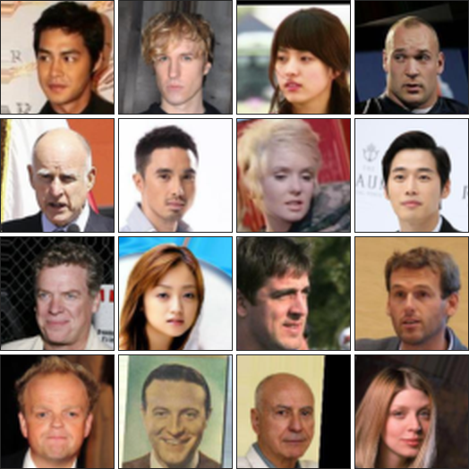
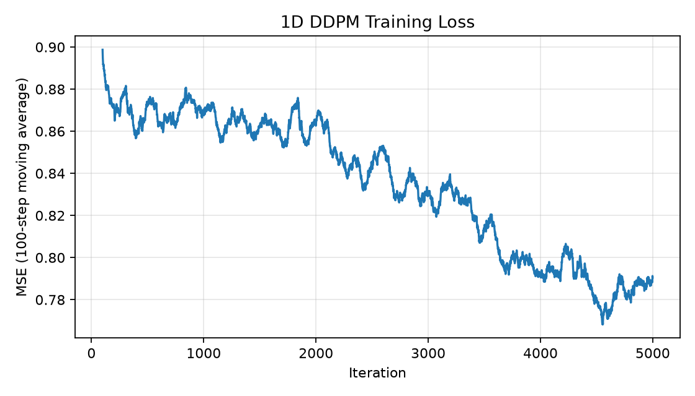
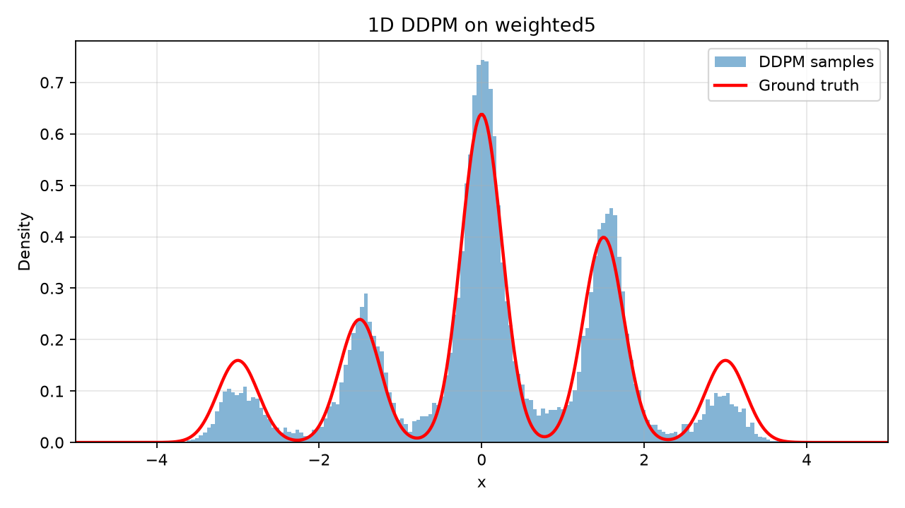
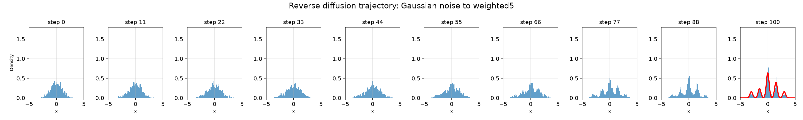

# Homework 1

## Part 0: Set up your codebase

**目的**

准备 Homework 1 使用的代码库和运行环境，确保后续数据探索、模型实现、训练与评估都能在当前单卡 RTX 3090 工作站上复现。

**完成内容**

1. Fork 课程 starter code，并将上游 commit `e666fe97654e7463de43134a5e7317de6cb50f9a` 的工作树导入 `homeworks/project/code/`。导入时不保留嵌套的 `.git/`，HW1-HW4 后续都在这一份代码上增量开发。源码来源与许可记录在 `code/REFERENCES.md`。

   ```bash
   gh repo fork KellyYutongHe/cmu-10799-diffusion --clone=false
   ```

2. 将开发、检查、训练、采样和评估统一到当前工作站。项目命令从 `homeworks/project/code/` 执行，数据集、checkpoint、日志、样本和指标统一写入 `homeworks/project/artifacts/`。

3. 使用 `uv` 创建 Python 3.12 虚拟环境，并从完整依赖快照安装 cu126 环境。

   ```bash
   cd homeworks/project/code

   curl -LsSf https://astral.sh/uv/install.sh | sh
   source "$HOME/.local/bin/env"

   uv venv .venv-cu126 --python 3.12.13
   uv pip install \
     --python .venv-cu126/bin/python \
     -r environments/requirements-cu126-lock.txt
   ```

4. 检查依赖一致性、CUDA 张量计算以及训练和采样命令行入口。

   ```bash
   uv pip check --python .venv-cu126/bin/python
   .venv-cu126/bin/python train.py --help
   .venv-cu126/bin/python sample.py --help
   ```

**结果**

| 检查项 | 结果 |
|---|---|
| Python | `3.12.13` |
| uv | `0.11.29` |
| PyTorch | `2.11.0+cu126` |
| torchvision | `0.26.0+cu126` |
| torchaudio | `2.11.0+cu126` |
| GPU | 1 × NVIDIA GeForce RTX 3090 24 GB |
| NVIDIA driver | `535.274.02` |
| CUDA | 可用，张量计算通过 |
| 依赖检查 | 163 个包兼容 |
| `train.py --help` | 通过 |
| `sample.py --help` | 通过 |

Part 0 已完成，可以进入 Part I 的数据探索。

## Part I: Understanding Your Data

### Q1. Visual Exploration

**(a) [2 分] 从训练集中随机抽取至少 16 个样本，并将它们可视化为网格。请在下方附上该网格。**



该网格使用随机种子 42，从 63,715 张训练图片中无放回抽取 16 张样本生成。数据集版本为 Hugging Face revision `cea8d2312303971a09528db035498464cbb01e37`。

**(c) [3 分] 该数据集利用 CelebA 的 40 个二元属性从完整数据集中筛选得到。根据你的视觉探索，推测创建该子集时可能使用了哪些属性。具体的筛选条件是什么？为什么？**

从样本网格看，这个子集保留了不同性别、年龄、发型、表情和背景，但人物普遍没有眼镜、帽子、浓妆或明显胡须，图像也没有明显模糊。因此，我推测筛选条件为：`Blurry = 0`、`Eyeglasses = 0`、`Heavy_Makeup = 0`、`Wearing_Hat = 0` 且 `No_Beard = 1`。对训练集的 40 个属性进行统计后，这五个条件在全部 63,715 个样本中都成立。少量人物仍可能有轻微胡茬、鬓角或小胡子，因为 CelebA 的这些属性可以重叠，且标注并不完全互斥。

### Q2. What did you learn?

**(a) [3 分] 假设你找到一个预训练扩散模型，它在包含 20 万张多样化人脸的完整 CelebA 数据集上达到了 SOTA 性能。现在使用该模型生成样本，并通过 KID 或 FID 将生成样本与这个筛选后的子集进行比较。你是否认为 FID 和 KID 仍会达到 SOTA 水平？为什么？**

不会。该预训练模型学习的是完整 CelebA 的分布，而评估集来自经过条件筛选的子分布。即使模型生成的人脸清晰且在完整 CelebA 上达到 SOTA，它仍可能生成眼镜、帽子、浓妆、胡须或模糊图片，也会保留与该子集不同的属性比例。FID 和 KID 比较的是生成样本与真实样本在特征空间中的分布；这种分布失配会使分数变差，不能直接继承完整 CelebA 上的 SOTA 结果。只有对模型进行条件生成、子集微调或筛选生成样本，使输出匹配该子分布后，分数才可能恢复。

**(b) [2 分] 根据数据探索结果，你计划在训练中使用哪些数据增强变换？为什么？**

训练时只使用随机水平翻转，并将图片转换为张量后归一化到 `[-1, 1]`。水平翻转能增加姿态和左右朝向的变化，同时保持人脸结构以及该子集的属性筛选条件。数据已经经过中心裁剪并缩放到 64×64，因此不使用随机旋转、强随机裁剪、垂直翻转或明显颜色抖动；这些变换可能破坏对齐、丢失面部区域，或人为改变真实数据分布。

## Part II: Implement DDPM

### Q3. Building Intuition

**(a) [0 分] 在开始完整规模的训练之前，通常应先通过更容易调试的简单示例建立对算法的直觉。课程提供了 `01_1d_playground.ipynb`，其中包含若干一维高斯混合分布及其可视化。请先在该 playground 中尝试你的算法。**

在官方 notebook 中实现并运行了一个独立的一维 DDPM。实验使用随机种子 42，以具有五个不同混合权重的 `weighted5` 分布为目标；噪声预测器是带正弦时间步编码的 MLP，共 37,505 个可训练参数。DDPM 使用 100 个扩散时间步，batch size 为 512，共训练 5,000 次迭代。



前 100 次迭代的平均噪声预测损失为 0.8987，最后 100 次迭代为 0.7904。扩散损失不需要降到 0，因为模型要在随机时间步上预测随机高斯噪声；下降趋势表明模型逐步学会了利用带噪输入和时间步信息预测噪声。



模型生成了全部五个目标模态。目标模态权重为 `[0.10, 0.15, 0.40, 0.25, 0.10]`，生成模态权重为 `[0.071, 0.159, 0.439, 0.271, 0.060]`，生成样本与真实样本之间的 Wasserstein-1 距离为 0.1696。模型较好地恢复了主要模态和相对权重，但对两侧低概率模态略有低估。



反向轨迹显示，初始标准高斯噪声在迭代去噪过程中逐渐拉伸并分裂，最终形成五个峰。这说明 DDPM 的反向过程不是一次性生成目标样本，而是通过多个小的去噪步骤逐渐把简单先验变换为多模态数据分布。

**(b) [0 分] 完整规模训练有时难以调试，因此 `train.py` 提供了 `--overfit-single-batch` 参数，可让模型反复拟合同一个 batch。与完整训练相比，该实验应能更快迭代，并用于检查模型能否成功过拟合。**

已确认 `--overfit-single-batch` 会缓存第一个训练 batch，并在后续每次迭代中重复使用该 batch。该检查依赖 Q4 中尚待完成的 CelebA 数据变换、U-Net 和 DDPM 实现，因此将作为 Q4 完整训练前的强制 sanity check：只有当单 batch 损失显著下降且能够生成对应训练样本的结构后，才开始完整数据集训练。
