# CMU 10-799: Diffusion & Flow Matching — 课程笔记

[TOC]

------

## Lecture 1 — 01/13: Basics of Probabilistic & Generative Modeling

------

资源

- [Lecture 1 Slides](https://cmu-diffusion-10799.github.io/10799S26/assets/slides/Lecture1_Basics.pdf)
- [YouTube Video](https://youtu.be/p7Q77S_ZhdA)
- [Panopto Recording (CMU only)](https://scs.hosted.panopto.com/Panopto/Pages/Viewer.aspx?id=64500c0f-77c8-4610-a3ab-b3d101815eac)

阅读材料

**Tutorials:**

1. [Stanford CS236: Deep Generative Models](https://deepgenerativemodels.github.io/) — Stefano Ermon, Aditya Grover
2. [CMU 10-423/10-623: Generative AI](https://www.cs.cmu.edu/~mgormley/courses/10423-s25/) — Matt Gormley, Yuanzhi Li, Henry Chai, Pat Virtue, Aran Nayebi
3. [CMU 18-789: Deep Generative Modeling](https://cmu-dgm.github.io/index.html) — Beidi Chen, Xun Huang
4. [CMU 10-708: Probabilistic Graphical Models](https://andrejristeski.github.io/10708F25/) — Andrej Risteski, Albert Gu
5. [Stanford CS228: Probabilistic Graphical Models](https://ermongroup.github.io/cs228/) — Stefano Ermon
6. [The Principles of Diffusion Models - Chapter 1: Deep Generative Modeling](https://arxiv.org/pdf/2510.21890#page=20.19) — Lai, Song, Kim, Mitsufuji, Ermon
7. [Deep Learning - Chapter 3: Probability and Information Theory](https://www.deeplearningbook.org/contents/prob.html) — Goodfellow, Bengio, Courville
8. [Deep Learning - Chapter 20: Deep Generative Models](https://www.deeplearningbook.org/contents/generative_models.html) — Goodfellow, Bengio, Courville
9. [An Introduction to Variational Autoencoders](https://arxiv.org/abs/1906.02691) — Kingma, Welling
10. [Tutorial on Variational Autoencoders](https://arxiv.org/abs/1606.05908) — Carl Doersch

**Papers:**

1. [Auto-Encoding Variational Bayes](https://arxiv.org/abs/1312.6114) — Kingma, Welling (foundational VAE paper)
2. [Generative Adversarial Networks](https://arxiv.org/abs/1406.2661) — Goodfellow et al. (foundational GAN paper)

------

### 什么是一个好的图像生成模型？

1. **真实性（Fidelity）**：是否一个人有四根手指/六根手指？有没有奇怪的噪点？
2. **可控性（Controllability）**：我是否用文本生成一个我想的图像？我的模型能和其他模型交互吗？
3. **速度（Speed）**：我的生成是否够快？我加速时是否会损失质量？

### 概率论中的一些关键概念

联合概率分布： $p(X,Y)$，边缘概率分布： $p(X)$ and $p(Y)$，条件概率分布： $p(X \mid Y)$ and $p(Y \mid X)$

贝叶斯理论：

$$
p(X \mid Y)
=
\frac{p(X,Y)}{p(Y)}
=
\frac{p(Y \mid X)p(X)}{p(Y)}
$$

- 先验： $p(X)$

- 后验： $p(X \mid Y)$

独立性：

$$
p(X \mid Y) = p(X)
$$

$$
p(X,Y) = p(X)p(Y)
$$

### 什么是概率建模？

概率建模的一般目标是为了学习一个概率分布，e.g. 高斯分布、泊松分布……，而如果能够参数化概率分布，那么目标就变成了从给定数据中学习参数。

在给定模型参数 $\theta$ 的条件下，观察到数据 $x$ 的概率称为**可能性/似然（likelihood）**，记作 $p(x|\theta)$ 。

### 什么是生成建模？

如果说，判别建模是为了学习 P(Y|X)，那么生成建模则是为了学习 P(X,Y) or P(X)。

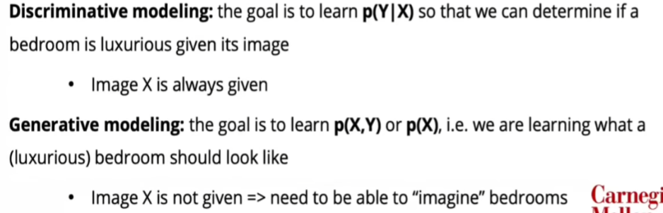

假定有一组数据{x}，以及一些先验假设&知识。

- 数据：样本（在这里，可以是一组图片）
- 先验知识&假设：参数分布、损失函数、优化方式等（我们相信它该服从什么分布blabla）

我们想要学习一个由模型参数化的**概率分布 $p_ \theta (x)$**使得

- **生成**：在从这个概率分布中采样一组新的数据点的时候，它看上去像是一个**真实的**新的样本（比如，是否看起来像是一个真的房间）
- **密度估计**：对一个样本，我们**能够给他一个概率大小的值**（比如，这个图片是房间的概率是多少）
- **无监督学习**：我们并不需要标签（虽然好像用的不多？）

因此针对“我们希望让真的样本被赋予更高的概率，而且我们已经有了一堆真实样本”的情况，我们有一些尝试。

尝试1：最大化似然函数。

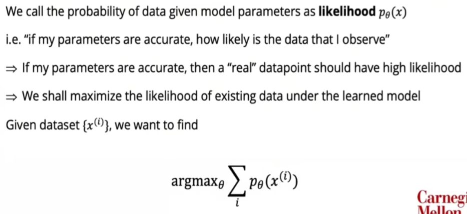

然后通过链式法则

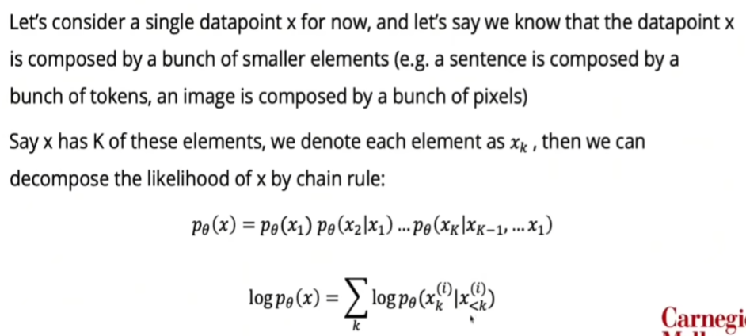

进行自回归建模

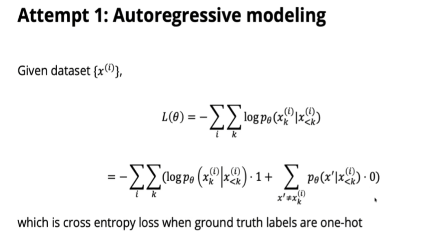

尝试2：潜空间变量

在这里我们引入了VAE（超神论文！），尝试对潜变量进行建模。

我们所要做的是：

1. 最大化 $X$ 的似然；
2. 确保 X 编码到 Z 之后能够还原回去。

然而问题是，我们不知道 $Z$ 是什么。我们也无法对他进行任何监督。说人话就是，我们的目的是：

1. 最大化 $\log p_\theta (x)$；
2. 最小 $q_\phi(z|x)$ 和 $p_\theta(z|x)$ 之间的差别。

对于第二点，我们没法像连续空间那样度量几何距离。我们使用“概率散度”来度量。

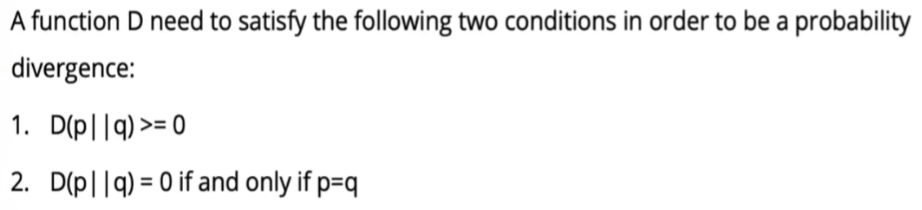

### VAE 的 ELBO 是什么？

（这一部分苏剑林大佬的博客中有讲解）

我们的目标是：

1. 最大化 $\log p_\theta (x)$；
2. 最小 $q_\phi(z|x)$ 和 $p_\theta(z|x)$ 之间的差别。

首先讨论第二点。其中，最流行的散度是 KL 散度：
$$
D_{KL}(p \| q) = \mathbb{E}_{x \sim p}\left[\log \frac{p(x)}{q(x)}\right]
$$
因此，我们的目标就是：

$$
\arg\max_{\phi,\theta} \log p_{\theta}(x) - D_{KL}\left(q_{\phi}(z \mid x) \| p_{\theta}(z \mid x)\right)
$$

然后做一下代数运算就有：
$$
\arg\max_{\phi,\theta}
\mathbb{E}_{z \sim q_{\phi}(z \mid x)}
\left[
\log p_{\theta}(x \mid z)
\right]
-
D_{KL}
\left(
q_{\phi}(z \mid x)
\| 
p_{\theta}(z)
\right)
$$
第一部分可以认为是重建损失，第二部分是 KL 正则化，这两件事结合起来就是我们说的**“证据下界”**。

推导 ELBO 有两种方法：

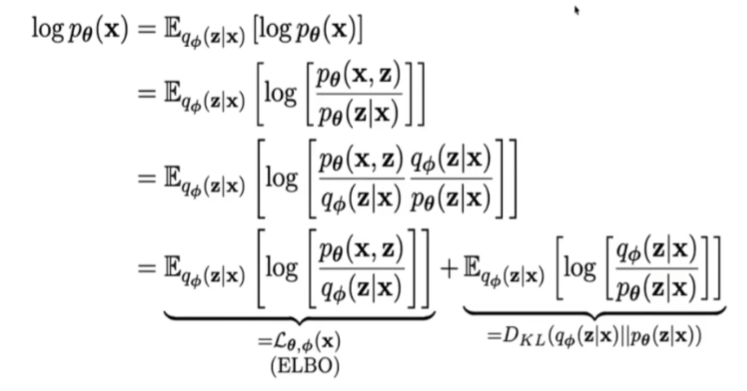

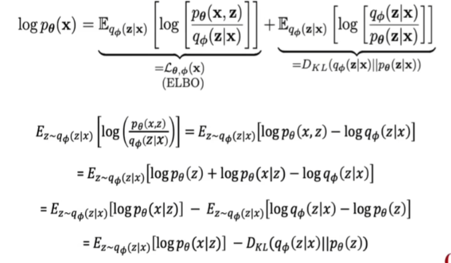

或者：

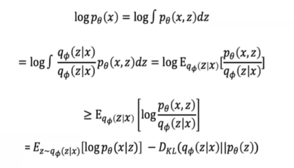

尝试3：对抗

生成器负责将生成的样本伪造的越来越像是真样本，而判别器负责越来越好地将伪造的样本和真实样本区别开。这就是 GAN Loss：

这里补充两篇附带的文章：

- [VAE概述](./VAE_Notes/VAE.md)
- [从隐变量模型到VAE、GAN、Flow 到 Diffusion](./VAE_Notes/从隐变量模型到VAE、GAN、Flow到Diffusion.md)

---

## Lecture 2 — 01/15: Denoising Diffusion Models

资源

- [Lecture 2 Slides](https://cmu-diffusion-10799.github.io/10799S26/assets/slides/Lecture2_Diffusion.pdf)
- [YouTube Video](https://youtu.be/H-RbhdiWzto)
- [Panopto Recording (CMU only)](https://scs.hosted.panopto.com/Panopto/Pages/Viewer.aspx?id=dba3e0c7-7f13-447a-accf-b3d301838c94)

阅读材料

**Tutorials:**

1. [The Principles of Diffusion Models - Chapter 2: Variational Perspective: From VAEs to DDPMs](https://arxiv.org/pdf/2510.21890#page=37.19) — Lai, Song, Kim, Mitsufuji, Ermon
2. [What are Diffusion Models?](https://lilianweng.github.io/posts/2021-07-11-diffusion-models/) — Lilian Weng
3. [Understanding Diffusion Models: A Unified Perspective](https://calvinyluo.com/2022/08/26/diffusion-tutorial.html) — Calvin Luo

**Papers:**

1. [Denoising Diffusion Probabilistic Models](https://arxiv.org/abs/2006.11239) — Ho, Jain, Abbeel (foundational DDPM paper)
2. [Deep Unsupervised Learning using Nonequilibrium Thermodynamics](https://arxiv.org/abs/1503.03585) — Sohl-Dickstein et al. (original diffusion paper)
3. [Elucidating the Design Space of Diffusion-Based Generative Models](https://arxiv.org/abs/2206.00364) — Karras, Aittala, Aila, Laine

------

### 回顾 VAE

上节课中学的 VAE 对扩散模型的开发会很有用。回顾一下：

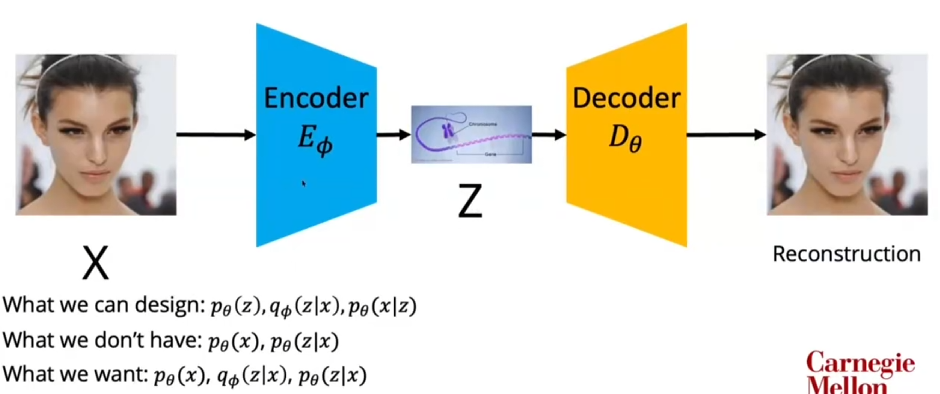

我们可以设计：
1. latent prior $p_\theta(z)$，通常是 N(0, I)，用于采样；
2. Encoder $q_\phi(z|x)$，用于把 x 映射到 z 的分布；
3. Decoder $p_\theta(x|z)$，用于从 z 生成或重构 x。

我们没有：
1. $p_\theta(x)$：模型对数据的边缘分布，因为需要积分掉 z，通常不可解；
2. $p_\theta(z|x)$：给定 x 时真实的 latent 后验，也通常不可解。

我们想要：
1. 一个好的生成模型 $p_\theta(x)$，能够生成类似训练数据的样本；
2. 一个好的 encoder $q_\phi(z|x)$，能够近似真实后验 $p_\theta(z|x)$。

我们做的是：

最大化 $log p_\theta(x)$ 的下界 ELBO，而不是直接最大化 $log p_\theta(x)$。ELBO 包含两部分：重构项让 x 能被还原，KL 项让 encoder 的 latent 分布接近 prior，从而保证可以从 prior 采样并生成合理样本。

接着，我们推导了 ELBO 的两种推导方式。

### 如何训练 VAE ？

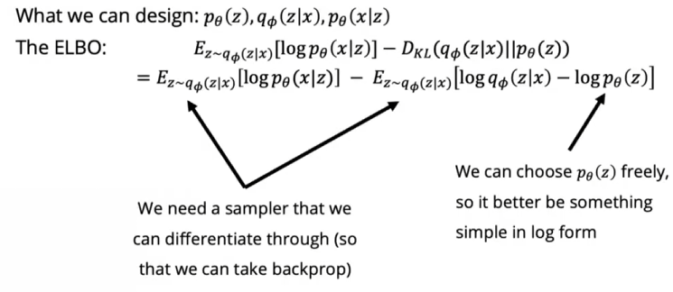

训练 VAE 时，我们要从 encoder 给出的 $q_\phi(z|x)$ 中采样 $z$，再用 decoder 重构 $x$。

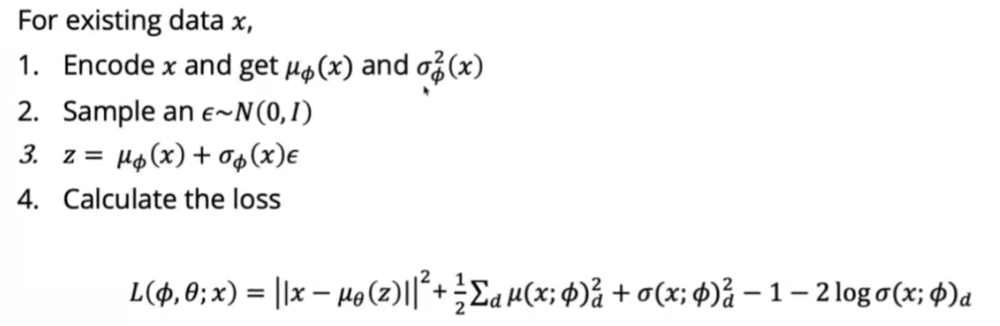

### 重参数化

为了让模型能用反向传播训练，这个**采样**过程必须是可微的。比如对于采样：$z \sim \mathcal{N}(\mu_\phi(x), \sigma_\phi^2(x))$ ，$\mu_\phi(x)$ 和 $\sigma_\phi(x)$ 是 encoder 预测出来的。如果直接写成“从这个分布采样 z”，随机性会挡住梯度，导致梯度很难传回 encoder。因此需要**重参数化**（reparameterization）。同时，latent prior $p(z)$ 最好选一个简单、容易采样、容易计算 $\log p(z)$ 的分布，比如标准正态分布。

这里使用：$\epsilon \sim \mathcal{N}(0, I)$，则有 $z = \mu_\phi(x) + \sigma_\phi(x) \odot \epsilon$，那么此时的随机性只来自于 $\epsilon$，而 z 对于 $\mu_\phi(x)$ 和 $\sigma_\phi(x)$ 是可微的。这样就能反向传播了。

因此，如果我们这么做的话，ELBO 里的 KL 项可以被化成闭式解，从而不需要采样估计 KL：
$$
\mathbb{E}_{z \sim q_{\phi}(z \mid x)}
\left[
\log q_{\phi}(z \mid x) - \log p_{\theta}(z)
\right]
=
\frac{1}{2}
\sum_{d}
\left(
\mu(x;\phi)_{d}^{2}
+
\sigma(x;\phi)_{d}^{2}
-
1
-
2\log \sigma(x;\phi)_{d}
\right)
$$
但整个 ELBO 通常还没有完全变成闭式解，因为重构项仍然要通过采样的 $z$ 来估计。

对于 $p_\theta(x|z)$ ，也就是第一项，我们该如何**参数化解码器**？

我们可以用高斯分布来假设这个分布 $p_{\theta}(x \mid z) \sim \mathcal{N}\left(\mu_{\theta}(z), \sigma^{2}I\right)$ ，因为这样计算起来很容易，这样就变成了“重建损失”：
$$
\mathbb{E}_{z \sim q_{\phi}(z \mid x)}
\left[
\log p_{\theta}(x \mid z)
\right]
\\
=
\frac{1}{2}
\mathbb{E}_{z \sim q_{\phi}(z \mid x)}
\left[
-\frac{1}{2\sigma^{2}}
\left\|x - \mu_{\theta}(z)\right\|^{2}
\right]
+ C
\\
\propto
-
\mathbb{E}_{z \sim q_{\phi}(z \mid x)}
\left[
\left\|x - \mu_{\theta}(z)\right\|^{2}
\right]
$$

### AR、VAE、GAN 都有缺陷

事实上，无论是自回归、VAE、GAN 都有很大的缺陷。这里不具体展开了。

### 从噪声到数据

我们想要的是一步从噪声生成图像，但是显然一步去噪是困难的，那么我们可以尝试逐步去噪。

我们通过这种 Diffusion 方式，来实现逐步加噪和去噪。

让我们从数学上来看这一过程。

前向的过程中，我们一直在给它加噪声：
$$
q(x_{1:T} \mid x_0)
:=
\prod_{t=1}^{T} q(x_t \mid x_{t-1})
\space\space\space\space
q(x_t \mid x_{t-1})
:=
\mathcal{N}
\left(
x_t;
\sqrt{1-\beta_t}x_{t-1},
\beta_t I
\right)
$$
我们知道正向的过程是高斯的，所以我们将反向过程参数化为高斯分布也是合理的。利用我们在 VAE 中学到的技巧，通过均值和方差来参数化分布。
$$
p_{\theta}(x_{0:T})
:=
p(x_T)
\prod_{t=1}^{T}
p_{\theta}(x_{t-1} \mid x_t)
\space\space\space\space
p_{\theta}(x_{t-1} \mid x_t)
:=
\mathcal{N}
\left(
x_{t-1};
\mu_{\theta}(x_t,t),
\Sigma_{\theta}(x_t,t)
\right)
$$
对于我们的训练而言，我们想要最大化 $\log p_\theta(x_0)$，而它是：
$$
\begin{aligned}
\log p_{\theta}(x_0)
&=
\log \int p_{\theta}(x_{0:T}) \, dx_{1:T}
\\
&=
\log \int q(x_{1:T} \mid x_0)
\frac{
p_{\theta}(x_{0:T})
}{
q(x_{1:T} \mid x_0)
}
\, dx_{1:T}
\\
&=
\log
\mathbb{E}_{q(x_{1:T} \mid x_0)}
\left[
\frac{
p_{\theta}(x_{0:T})
}{
q(x_{1:T} \mid x_0)
}
\right]
\\
&\overset{\text{Jensen 不等式}}{\ge}
\mathbb{E}_{q(x_{1:T} \mid x_0)}
\left[
\log
\frac{
p_{\theta}(x_{0:T})
}{
q(x_{1:T} \mid x_0)
}
\right]
\end{aligned}
$$
因此，我们能够得到：
$$
\begin{aligned}
L
&=
\mathbb{E}_{q}
\left[
-\log
\frac{
p_{\theta}(x_{0:T})
}{
q(x_{1:T}\mid x_0)
}
\right]
\\
&=
\mathbb{E}_{q}
\left[
-\log p(x_T)
-
\sum_{t\ge 1}
\log
\frac{
p_{\theta}(x_{t-1}\mid x_t)
}{
q(x_t\mid x_{t-1})
}
\right]
\\
&=
\mathbb{E}_{q}
\left[
-\log p(x_T)
-
\sum_{t>1}
\log
\frac{
p_{\theta}(x_{t-1}\mid x_t)
}{
q(x_t\mid x_{t-1})
}
-
\log
\frac{
p_{\theta}(x_0\mid x_1)
}{
q(x_1\mid x_0)
}
\right]
\\
&=
\mathbb{E}_{q}
\left[
-\log p(x_T)
-
\sum_{t>1}
\log
\left(
\frac{
p_{\theta}(x_{t-1}\mid x_t)
}{
q(x_{t-1}\mid x_t,x_0)
}
\cdot
\frac{
q(x_{t-1}\mid x_0)
}{
q(x_t\mid x_0)
}
\right)
-
\log
\frac{
p_{\theta}(x_0\mid x_1)
}{
q(x_1\mid x_0)
}
\right]
\\
&=
\mathbb{E}_{q}
\left[
-\log
\frac{
p(x_T)
}{
q(x_T\mid x_0)
}
-
\sum_{t>1}
\log
\frac{
p_{\theta}(x_{t-1}\mid x_t)
}{
q(x_{t-1}\mid x_t,x_0)
}
-
\log p_{\theta}(x_0\mid x_1)
\\
\right]
\\
&=
\mathbb{E}_{q}
\left[
\underbrace{
D_{KL}
\left(
q(x_T\mid x_0)
\| 
p(x_T)
\right)
}_{\text{prior matching term}}
+
\underbrace{
\sum_{t>1}
D_{KL}
\left(
q(x_{t-1}\mid x_t,x_0)
\|
p_{\theta}(x_{t-1}\mid x_t)
\right)
}_{\text{KL matching terms}}
+
\underbrace{
\left(
-
\log p_{\theta}(x_0\mid x_1)
\right)
}_{\text{reconstruction loss}}
\right]
\end{aligned}
$$
但是这个还是太复杂了。

### 更简单的方式/ Denoising Diffusion Probabilistic Models

我们可以训练一个噪声估计器，用来估计每一步的噪音，然后逐步去噪。这就是 DDPM 。已知：
$$
\mathbb{E}_{q}
\left[
\underbrace{
D_{KL}
\left(
q(x_T\mid x_0)
\| 
p(x_T)
\right)
}_{L_T}
+
\sum_{t>1}
\underbrace{
D_{KL}
\left(
q(x_{t-1}\mid x_t,x_0)
\|
p_{\theta}(x_{t-1}\mid x_t)
\right)
}_{L_{t-1}}
+
\underbrace{
\left(
-
\log p_{\theta}(x_0\mid x_1)
\right)
}_{L_0}
\right]
$$
首先，对于前向加噪过程，我们可以固定它，使得学习更加简单。比如，我们可以确定每一步都加了什么高斯噪声。

而我们知道，**一个高斯加上另一个高斯，仍然还是高斯**。所以实际上，我们可以直接计算在时间步 t 时，对于一开始的干净数据，我们的噪声水平是什么。
$$
q(x_{1:T}\mid x_0)
:=
\prod_{t=1}^{T}
q(x_t\mid x_{t-1})
\space\space\space\space
q(x_t\mid x_{t-1})
:=
\mathcal{N}
\left(
x_t;
\sqrt{1-\beta_t}x_{t-1},
\beta_t I
\right)
$$

$$
\alpha_t := 1 - \beta_t \space\space\text{and}\space\space \bar{\alpha}_t := \prod_{s=1}^{t}\alpha_s
$$

$$
q(x_t\mid x_0)
=
\mathcal{N}
\left(
x_t;
\sqrt{\bar{\alpha}_t}x_0,
(1-\bar{\alpha}_t)I
\right)
$$

此时，$L_T$ 就是一个常量了，因为它可以被设置为一个标准的高斯分布。

而对于第二部分，我们也可以固定：
$$
\begin{gathered}
q(x_{t-1}\mid x_t,x_0)
=
\mathcal{N}
\left(
x_{t-1};
\tilde{\mu}_t(x_t,x_0),
\tilde{\beta}_t I
\right),
\\
\text{where} \quad
\tilde{\mu}_t(x_t,x_0)
:=
\frac{
\sqrt{\bar{\alpha}_{t-1}}\beta_t
}{
1-\bar{\alpha}_t
}
x_0
+
\frac{
\sqrt{\alpha_t}(1-\bar{\alpha}_{t-1})
}{
1-\bar{\alpha}_t
}
x_t
\quad
\text{and}
\quad
\tilde{\beta}_t
:=
\frac{
1-\bar{\alpha}_{t-1}
}{
1-\bar{\alpha}_t
}
\beta_t
\end{gathered}
$$
对于第三部分，我们可以固定方差并且只学习均值（人们在实践中发现这么做学习效果很好）。所以我们只学习正向和反向过程中高斯分布的均值。
$$
\begin{gathered}
p_{\theta}(x_{t-1}\mid x_t)
=
\mathcal{N}
\left(
x_{t-1};
\mu_{\theta}(x_t,t),
\sigma_t^2 I
\right)
\\[0.8em]
q(x_{t-1}\mid x_t,x_0)
=
\mathcal{N}
\left(
x_{t-1};
\tilde{\mu}_t(x_t,x_0),
\tilde{\beta}_t I
\right),
\\[0.8em]
\text{where} \quad
\tilde{\mu}_t(x_t,x_0)
:=
\frac{
\sqrt{\bar{\alpha}_{t-1}}\beta_t
}{
1-\bar{\alpha}_t
}
x_0
+
\frac{
\sqrt{\alpha_t}(1-\bar{\alpha}_{t-1})
}{
1-\bar{\alpha}_t
}
x_t
\quad
\text{and}
\quad
\tilde{\beta}_t
:=
\frac{
1-\bar{\alpha}_{t-1}
}{
1-\bar{\alpha}_t
}
\beta_t
\\[0.8em]
L_{t-1}
=
\mathbb{E}_{q}
\left[
\frac{1}{2\sigma_t^2}
\left\|
\tilde{\mu}_t(x_t,x_0)
-
\mu_{\theta}(x_t,t)
\right\|^2
\right]
+
C
\end{gathered}
$$
这一步把复杂的 KL matching problem 转化成了一个更简单的 mean prediction MSE loss。

结合我们之前的重参数化技巧：

$$
x_t(x_0,\epsilon)
=
\sqrt{\bar{\alpha}_t}x_0
+
\sqrt{1-\bar{\alpha}_t}\epsilon
\quad
\text{for }
\epsilon \sim \mathcal{N}(0,I)
$$
我们可以用 $x_0$ 和 $\epsilon$ 来表示 $x_t$，而因此我们就能知道，我们该根据时间步长来给每个因素分配多少权重。
$$
\begin{gathered}
L_{t-1}
=
\mathbb{E}_{q}
\left[
\frac{1}{2\sigma_t^2}
\left\|
\tilde{\mu}_t(x_t,x_0)
-
\mu_{\theta}(x_t,t)
\right\|^2
\right]
+
C
\\[0.8em]
x_t(x_0,\epsilon)
=
\sqrt{\bar{\alpha}_t}x_0
+
\sqrt{1-\bar{\alpha}_t}\epsilon
\quad
\text{for }
\epsilon \sim \mathcal{N}(0,I)
\\[0.8em]
L_{t-1}-C
=
\mathbb{E}_{x_0,\epsilon}
\left[
\frac{1}{2\sigma_t^2}
\left\|
\tilde{\mu}_t
\left(
x_t(x_0,\epsilon),
\frac{1}{\sqrt{\bar{\alpha}_t}}
\left(
x_t(x_0,\epsilon)
-
\sqrt{1-\bar{\alpha}_t}\epsilon
\right)
\right)
-
\mu_{\theta}
\left(
x_t(x_0,\epsilon),t
\right)
\right\|^2
\right]
\end{gathered}
$$
通过重参数化公式，反解出 $x_0$，从而把对 $q$ 的期望改写成对 $x_0, \epsilon$ 的期望。

而模型要学习的均值 $\mu_{\theta}(x_t,t)$，要尽量接近真实后验分布的均值。接下来，我们把这个真实均值，改写成一个关于 $x_t$ 和 噪声 $\epsilon$ 的形式：
$$
\begin{gathered}
q(x_{t-1}\mid x_t,x_0)
=
\mathcal{N}
\left(
x_{t-1};
\tilde{\mu}_t(x_t,x_0),
\tilde{\beta}_t I
\right),
\\[0.8em]
\text{where} \quad
\tilde{\mu}_t(x_t,x_0)
:=
\frac{
\sqrt{\bar{\alpha}_{t-1}}\beta_t
}{
1-\bar{\alpha}_t
}
x_0
+
\frac{
\sqrt{\alpha_t}(1-\bar{\alpha}_{t-1})
}{
1-\bar{\alpha}_t
}
x_t
\quad
\text{and}
\quad
\tilde{\beta}_t
:=
\frac{
1-\bar{\alpha}_{t-1}
}{
1-\bar{\alpha}_t
}
\beta_t
\\[0.8em]
L_{t-1}-C
=
\mathbb{E}_{x_0,\epsilon}
\left[
\frac{1}{2\sigma_t^2}
\left\|
\underbrace{
\frac{1}{\sqrt{\alpha_t}}
\left(
x_t(x_0,\epsilon)
-
\frac{\beta_t}{\sqrt{1-\bar{\alpha}_t}}\epsilon
\right)
}_{\tilde{\mu}_t(x_t,x_0)}
-
\mu_{\theta}
\left(
x_t(x_0,\epsilon),t
\right)
\right\|^2
\right]
\end{gathered}
$$
其中第一部分是均值，而我们可以重参数化：
$$
\begin{gathered}
L_{t-1} - C
=
\mathbb{E}_{x_0,\epsilon}
\left[
\frac{1}{2\sigma_t^2}
\left\|
\underbrace{
\frac{1}{\sqrt{\alpha_t}}
\left(
x_t(x_0,\epsilon)
-
\frac{\beta_t}{\sqrt{1-\bar{\alpha}_t}}\epsilon
\right)
}_{\tilde{\mu}_t(x_t,x_0)}
-
\mu_{\theta}
\left(
x_t(x_0,\epsilon),t
\right)
\right\|^2
\right]
\\[1em]
\mu_{\theta}(x_t,t)
=
\tilde{\mu}_t
\left(
x_t,
\frac{1}{\sqrt{\bar{\alpha}_t}}
\left(
x_t
-
\sqrt{1-\bar{\alpha}_t}
\epsilon_{\theta}(x_t)
\right)
\right)
=
\frac{1}{\sqrt{\alpha_t}}
\left(
x_t
-
\frac{\beta_t}{\sqrt{1-\bar{\alpha}_t}}
\epsilon_{\theta}(x_t,t)
\right)
\\[1em]
L_{t-1} - C
=
\mathbb{E}_{x_0,\epsilon}
\left[
\frac{\beta_t^2}
{
2\sigma_t^2\alpha_t(1-\bar{\alpha}_t)
}
\left\|
\epsilon
-
\epsilon_{\theta}
\left(
\sqrt{\bar{\alpha}_t}x_0
+
\sqrt{1-\bar{\alpha}_t}\epsilon,
t
\right)
\right\|^2
\right]
\end{gathered}
$$
也就是说，**我们不直接预测均值，而是让神经网络预测噪声**。最终我们能够得到 DDPM 简化训练目标：
$$
L_{\mathrm{simple}}
=
\mathbb{E}_{t,x_0,\epsilon}
\left[
\left\|
\epsilon
-
\epsilon_{\theta}
\left(
\sqrt{\bar{\alpha}_t}x_0
+
\sqrt{1-\bar{\alpha}_t}\epsilon,
t
\right)
\right\|^2
\right]
$$
因此，由下面的几行来看，总结就是：训练时，DDPM 学的是噪声预测器 $\epsilon_\theta(x_t,t)$；采样时，用这个噪声预测器构造反向高斯分布的均值 $\mu_\theta(x_t,t)$，然后一步步从纯噪声$x_T$ 去噪到真实样本 $x_0$。
$$
\begin{gathered}
L_{t-1}-C
=
\mathbb{E}_{x_0,\epsilon}
\left[
\frac{1}{2\sigma_t^2}
\left\|
\frac{1}{\sqrt{\alpha_t}}
\left(
x_t(x_0,\epsilon)
-
\frac{\beta_t}{\sqrt{1-\bar{\alpha}_t}}\epsilon
\right)
-
\mu_{\theta}
\left(
x_t(x_0,\epsilon),t
\right)
\right\|^2
\right]
\\[1em]
p_{\theta}(x_{t-1}\mid x_t)
=
\mathcal{N}
\left(
x_{t-1};
\mu_{\theta}(x_t,t),
\sigma_t^2 I
\right)
\\[1em]
\mu_{\theta}(x_t,t)
=
\tilde{\mu}_t
\left(
x_t,
\frac{1}{\sqrt{\bar{\alpha}_t}}
\left(
x_t
-
\sqrt{1-\bar{\alpha}_t}
\epsilon_{\theta}(x_t)
\right)
\right)
=
\frac{1}{\sqrt{\alpha_t}}
\left(
x_t
-
\frac{\beta_t}{\sqrt{1-\bar{\alpha}_t}}
\epsilon_{\theta}(x_t,t)
\right)
\\[1em]
x_{t-1}
=
\underbrace{
\frac{1}{\sqrt{\alpha_t}}
\left(
x_t
-
\frac{\beta_t}{\sqrt{1-\bar{\alpha}_t}}
\epsilon_{\theta}(x_t,t)
\right)
}_{\mu_\theta(x_t,t)}
+
\sigma_t z,
\quad
z \sim \mathcal{N}(0,I)
\end{gathered}
$$

### DDPM 算法

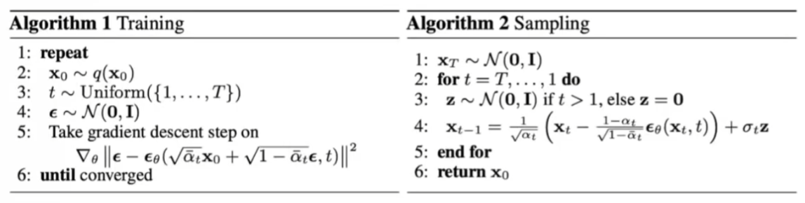

从这里也能看出，实际上的算法相当简单。而且实际的效果也相当惊艳：

### 扩散模型看上去像 VAE ？

### 训练 DDPM 的时候，用什么模型架构？

U-Net !

U-Net 有一些优秀的特点，非常适合用于扩散模型。

---

## Lecture 3 (Guest) — 01/16: How to train & serve your models on Modal

资源

- [YouTube Video](https://youtu.be/dPVpmv4eFnM)
- [Panopto Recording (CMU only)](https://scs.hosted.panopto.com/Panopto/Pages/Viewer.aspx?id=47b2faf1-c30d-4918-8df9-b3d7000d9e77)

### 📝 笔记

<!-- 在此记录你的笔记 -->

---

## Lecture 4 — 01/20: Score-Based Models

> 📌 **Quiz 1 Due**

资源

- [Lecture 4 Slides](https://cmu-diffusion-10799.github.io/10799S26/assets/slides/Lecture4_Score.pdf)
- [YouTube Video](https://youtu.be/UEJxHpFEb04)
- [Panopto Recording (CMU only)](https://scs.hosted.panopto.com/Panopto/Pages/Viewer.aspx?id=d3616939-c5a3-48ad-8d68-b3d8018650c1)

阅读材料

**Tutorials:**

1. [Generative Modeling by Estimating Gradients of the Data Distribution](https://yang-song.net/blog/2021/score/) — Yang Song
2. [The Principles of Diffusion Models - Appendix A: Crash Course on Differential Equations](https://arxiv.org/pdf/2510.21890#page=386.11) — Lai, Song, Kim, Mitsufuji, Ermon
3. [The Principles of Diffusion Models - Chapter 3: Score-Based Perspective: From EBMs to NCSN](https://arxiv.org/pdf/2510.21890#page=61.19) — Lai, Song, Kim, Mitsufuji, Ermon
4. [The Principles of Diffusion Models - Chapter 4: Diffusion Models Today: Score SDE Framework](https://arxiv.org/pdf/2510.21890#page=91.19) — Lai, Song, Kim, Mitsufuji, Ermon
5. [Generative Modeling by Estimating Gradients of the Data Distribution](https://andrewcharlesjones.github.io/journal/21-score-matching.html) — Andy Jones

**Papers:**

1. [Estimation of Non-Normalized Statistical Models by Score Matching](https://jmlr.org/papers/volume6/hyvarinen05a/hyvarinen05a.pdf) — Aapo Hyvärinen (original score matching paper)
2. [A Connection Between Score Matching and Denoising Autoencoders](https://www.iro.umontreal.ca/~vincentp/Publications/smdae_techreport.pdf) — Pascal Vincent (original denoising score matching paper)
3. [Generative Modeling by Estimating Gradients of the Data Distribution](https://arxiv.org/abs/1907.05600) — Song, Ermon (annealed Langevin dynamics + NCSN)
4. [Score-Based Generative Modeling through Stochastic Differential Equations](https://arxiv.org/abs/2011.13456) — Song, Sohl-Dickstein, Kingma, Kumar, Ermon, Poole (foundational SDE unification paper)

📝 笔记

<!-- 在此记录你的笔记 -->

---

## Lecture 5 — 01/22: Flow Matching

> 📌 **Quiz 2 Due** · **⏰ HW 1 (15%) Due 01/24 Sat**

资源

- [Lecture 5 Slides](https://cmu-diffusion-10799.github.io/10799S26/assets/slides/Lecture5_Flow.pdf)
- [YouTube Video](https://youtu.be/_OOITDB2VCY)
- [Panopto Recording (CMU only)](https://scs.hosted.panopto.com/Panopto/Pages/Viewer.aspx?id=a75c4020-502f-4162-893e-b3da018375fa)

阅读材料

**Tutorials:**

1. [Flow Matching Guide and Code](https://arxiv.org/abs/2412.06264) — Lipman et al.
2. [The Principles of Diffusion Models - Chapter 5: Flow-Based Perspective: From NFs to Flow Matching](https://arxiv.org/pdf/2510.21890#page=131.11) — Lai, Song, Kim, Mitsufuji, Ermon
3. [MIT 6.S184: Introduction to Flow Matching and Diffusion Models](https://diffusion.csail.mit.edu/2025/index.html) — Holderrieth, Erives
4. [An Introduction to Flow Matching](https://mlg.eng.cam.ac.uk/blog/2024/01/20/flow-matching.html) — Fjelde, Mathieu, Dutordoir
5. [Flow Matching: A visual introduction](https://peterroelants.github.io/posts/flow_matching_intro/) — Peter Roelants
6. [Flow With What You Know](https://drscotthawley.github.io/blog/posts/FlowModels.html) — Scott H. Hawley

**Papers:**

1. [Flow Matching for Generative Modeling](https://arxiv.org/abs/2210.02747) — Lipman, Chen, Ben-Hamu, Nickel, Le
2. [Flow Straight and Fast: Learning to Generate and Transfer Data with Rectified Flow](https://arxiv.org/abs/2209.03003) — Liu, Gong, Liu
3. [Building Normalizing Flows with Stochastic Interpolants](https://arxiv.org/abs/2209.15571) — Albergo, Vanden-Eijnden

📝 笔记

<!-- 在此记录你的笔记 -->

---

## Lecture 6 — 01/27: The Design Space of Diffusion Models & Solvers for Fast Sampling

资源

- [Lecture 6 Slides](https://cmu-diffusion-10799.github.io/10799S26/assets/slides/Lecture6_Fast.pdf)
- [YouTube Video](https://youtu.be/6-gp8fR9r8w)
- [Panopto Recording (CMU only)](https://scs.hosted.panopto.com/Panopto/Pages/Viewer.aspx?id=12d33dab-008b-4162-a402-b3df0186aae6)

阅读材料

**Papers:**

1. [Denoising Diffusion Implicit Models](https://arxiv.org/abs/2010.02502) — Song, Meng, Ermon (first fast deterministic sampling paper)
2. [DPM-Solver: A Fast ODE Solver for Diffusion Probabilistic Model Sampling in Around 10 Steps](https://arxiv.org/abs/2206.00927) — Lu et al.
3. [DPM-Solver++: Fast Solver for Guided Sampling of Diffusion Probabilistic Models](https://arxiv.org/abs/2211.01095) — Lu et al.
4. [Elucidating the Design Space of Diffusion-Based Generative Models](https://arxiv.org/abs/2206.00364) — Karras et al.
5. [Improved Denoising Diffusion Probabilistic Models](https://arxiv.org/abs/2102.09672) — Nichol, Dhariwal
6. [Variational Diffusion Models](https://arxiv.org/abs/2107.00630) — Kingma, Salimans, Poole, Ho
7. [Progressive Distillation for Fast Sampling of Diffusion Models](https://arxiv.org/abs/2202.00512) — Salimans, Ho

📝 笔记

<!-- 在此记录你的笔记 -->

---

## Lecture 7 — 01/29: Guidance & Controllable Generation

> 📌 **Quiz 3 Due**

资源

- [Lecture 7 Slides](https://cmu-diffusion-10799.github.io/10799S26/assets/slides/Lecture7_Guidance.pdf)
- [YouTube Video](https://youtu.be/lPipzIG6rkc)
- [Panopto Recording (CMU only)](https://scs.hosted.panopto.com/Panopto/Pages/Viewer.aspx?id=5d89c60e-0505-4852-ad73-b3e10187c916)

阅读材料

**Papers:**

1. [Diffusion Models Beat GANs on Image Synthesis](https://arxiv.org/abs/2105.05233) — Dhariwal, Nichol (classifier guidance)
2. [Classifier-Free Diffusion Guidance](https://arxiv.org/abs/2207.12598) — Ho, Salimans
3. [SDEdit: Guided Image Synthesis and Editing with Stochastic Differential Equations](https://arxiv.org/abs/2108.01073) — Meng, He, Song, Song, Wu, Zhu, Ermon
4. [RePaint: Inpainting using Denoising Diffusion Probabilistic Models](https://arxiv.org/abs/2201.09865) — Lugmayr et al.
5. [Diffusion Posterior Sampling for General Noisy Inverse Problems](https://arxiv.org/abs/2209.14687) — Chung et al.
6. [Manifold Preserving Guided Diffusion](https://arxiv.org/abs/2311.16424) — He et al.
7. [FreeDoM: Training-Free Energy-Guided Conditional Diffusion Model](https://arxiv.org/abs/2303.09833) — Yu et al.
8. [The Riemannian Geometry of Deep Generative Models](https://arxiv.org/abs/1711.08014) — Shao, Kumar, Fletcher
9. [Improving Diffusion Models for Inverse Problems using Manifold Constraints](https://arxiv.org/abs/2206.00941) — Chung et al.

📝 笔记

<!-- 在此记录你的笔记 -->

---

## Lecture 8 (Guest) — 02/03: Q&A with Max Simchowitz — Diffusion & Flow for Robotics, Control & Decision Making

- Speaker: [Max Simchowitz](https://msimchowitz.github.io/)

资源

- [Panopto Recording (CMU only)](https://scs.hosted.panopto.com/Panopto/Pages/Viewer.aspx?id=3e74017c-75d5-415d-8da4-b3e60184d9b7) *(No YouTube)*

📝 笔记

<!-- 在此记录你的笔记 -->

---

## Lecture 9 — 02/05: SOTA Diffusion/Flow Models for Text-to-Image Generation

> 📌 **Quiz 4 Due** · **⏰ HW 2 (15%) Due 02/05 Thu**

资源

- [Lecture 9 Slides](https://cmu-diffusion-10799.github.io/10799S26/assets/slides/Lecture9_SOTA.pdf)
- [YouTube Video](https://youtu.be/LHNPAtd7cU4)
- [Panopto Recording (CMU only)](https://scs.hosted.panopto.com/Panopto/Pages/Viewer.aspx?id=70f4eb33-b85f-4a03-a750-b3e80188564d)

阅读材料

**Papers:**

1. [High-Resolution Image Synthesis with Latent Diffusion Models](https://arxiv.org/abs/2112.10752) — Rombach et al. (Stable Diffusion / LDM)
2. [Neural Discrete Representation Learning](https://arxiv.org/abs/1711.00937) — van den Oord, Vinyals, Kavukcuoglu (VQ-VAE)
3. [Taming Transformers for High-Resolution Image Synthesis](https://arxiv.org/abs/2012.09841) — Esser, Rombach, Ommer (VQ-GAN)
4. [Learning Transferable Visual Models From Natural Language Supervision](https://arxiv.org/abs/2103.00020) — Radford et al. (CLIP)
5. [Exploring the Limits of Transfer Learning with a Unified Text-to-Text Transfer Transformer](https://arxiv.org/abs/1910.10683) — Raffel et al. (T5)
6. [Scalable Diffusion Models with Transformers](https://arxiv.org/abs/2212.09748) — Peebles, Xie (DiT)
7. [Scaling Rectified Flow Transformers for High-Resolution Image Synthesis](https://arxiv.org/abs/2403.03206) — Esser et al. (SD3 / MMDiT)
8. [FLUX.1](https://github.com/black-forest-labs/flux) — Black Forest Labs
9. [FLUX.2: Frontier Visual Intelligence](https://bfl.ai/blog/flux-2) — Black Forest Labs
10. [Z-Image: An Efficient Image Generation Foundation Model with Single-Stream Diffusion Transformer](https://arxiv.org/abs/2511.22699) — Tongyi
11. [HunyuanImage 3.0 Technical Report](https://arxiv.org/abs/2509.23951) — Tencent
12. [Transfusion: Predict the Next Token and Diffuse Images with One Multi-Modal Model](https://arxiv.org/abs/2408.11039) — Zhou et al.
13. [Nano Banana (Gemini 2.5 Flash Image)](https://deepmind.google/models/gemini-image/) — Google DeepMind
14. [Introducing 4o Image Generation](https://openai.com/index/introducing-4o-image-generation/) — OpenAI

📝 笔记

<!-- 在此记录你的笔记 -->

---

## Lecture 10 — 02/10: Distillation, Consistency Models & Flow Maps

> 📌 **Quiz 5 Due**

资源

- [Lecture 10 Slides](https://cmu-diffusion-10799.github.io/10799S26/assets/slides/Lecture10_Distillation.pdf)
- [YouTube Video](https://youtu.be/L9nsCHHMv-c)
- [Panopto Recording (CMU only)](https://scs.hosted.panopto.com/Panopto/Pages/Viewer.aspx?id=bdf7b265-d319-4212-a58e-b3ed018b1f4f)

阅读材料

**Papers:**

1. [Progressive Distillation for Fast Sampling of Diffusion Models](https://arxiv.org/abs/2202.00512) — Salimans, Ho
2. [Consistency Models](https://arxiv.org/abs/2303.01469) — Song, Dhariwal, Chen, Sutskever (single-step generation)
3. [Consistency Trajectory Models: Learning Probability Flow ODE Trajectory of Diffusion](https://arxiv.org/abs/2310.02279) — Kim et al.
4. [How to build a consistency model: Learning flow maps via self-distillation](https://arxiv.org/abs/2505.18825) — Boffi, Albergo, Vanden-Eijnden
5. [Align Your Flow: Scaling Continuous-Time Flow Map Distillation](https://arxiv.org/abs/2506.14603) — Sabour, Fidler, Kreis
6. [Joint Distillation for Fast Likelihood Evaluation and Sampling in Flow-based Models](https://arxiv.org/abs/2512.02636) — Ai et al.

📝 笔记

<!-- 在此记录你的笔记 -->

---

## Lecture 11 (Guest) — 02/12: Linqi "Alex" Zhou from Luma AI

- Speaker: [Linqi (Alex) Zhou](https://alexzhou907.github.io/) · [Luma AI](https://lumalabs.ai/)

资源

- [Lecture 11 Slides](https://cmu-diffusion-10799.github.io/10799S26/assets/slides/luma.pdf)
- [YouTube Video](https://youtu.be/H7MxR3XDt30)
- [Panopto Recording (CMU only)](https://scs.hosted.panopto.com/Panopto/Pages/Viewer.aspx?id=f47e7820-51c1-4c8f-b582-b3ef0189dd51)

> ⏰ **HW 3 (20%) Due 02/15 Sun**

📝 笔记

<!-- 在此记录你的笔记 -->

---

## Lecture 12 — 02/17: Discrete Diffusion & Masked Diffusion

> 📌 **Quiz 6 Due**

资源

- [Lecture 12 Slides](https://cmu-diffusion-10799.github.io/10799S26/assets/slides/Lecture12_Discrete_Diffusion.pdf)
- [YouTube Video](https://youtu.be/mXEjZblUBPs)
- [Panopto Recording (CMU only)](https://scs.hosted.panopto.com/Panopto/Pages/Viewer.aspx?id=ff97986e-c219-48f7-b67e-b3f401866d7f)

阅读材料

**Tutorials:**

1. [Discrete Diffusion (SEDD) blog post](https://aaronlou.com/blog/2024/discrete-diffusion) — Aaron Lou
2. [MDLM project page and video tutorial](https://s-sahoo.com/mdlm) — Subham Sekhar Sahoo
3. [Notes on D3PMs](https://beckham.nz/2022/07/11/d3pms.htm) — Christopher Beckham

**Papers:**

1. [Structured Denoising Diffusion Models in Discrete State-Spaces](https://arxiv.org/abs/2107.03006) — Austin et al. (D3PM)
2. [A Continuous Time Framework for Discrete Denoising Models](https://arxiv.org/abs/2205.14987) — Campbell et al. (CTMC discrete diffusion)
3. [Discrete Diffusion Modeling by Estimating the Ratios of the Data Distribution](https://arxiv.org/abs/2310.16834) — Lou, Meng, Ermon (SEDD)
4. [Simple and Effective Masked Diffusion Language Models](https://arxiv.org/abs/2406.03396) — Sahoo et al. (MDLM)
5. [Simplified and Generalized Masked Diffusion for Discrete Data](https://arxiv.org/abs/2406.04329) — Shi et al.
6. [LLaDA: Large Language Diffusion with mAsking](https://arxiv.org/abs/2502.09992) — Nie et al.

📝 笔记

<!-- 在此记录你的笔记 -->

---

## Lecture 13 — 02/19: Discrete Flow Matching & Edit Flow

> 📌 **Quiz 7 Due**

资源

- [Lecture 13 Slides](https://cmu-diffusion-10799.github.io/10799S26/assets/slides/Lecture13_Discrete_Flow.pdf)
- [YouTube Video](https://youtu.be/bK-LfpKLv0g)
- [Panopto Recording (CMU only)](https://scs.hosted.panopto.com/Panopto/Pages/Viewer.aspx?id=3a289219-c1c7-4b82-bbd7-b3f60185f7dc)

阅读材料

**Papers:**

1. [A Continuous Time Framework for Discrete Denoising Models](https://arxiv.org/abs/2205.14987) — Campbell et al.
2. [Generative Flows on Discrete State-Spaces: Enabling Multimodal Flows with Applications to Protein Co-Design](https://arxiv.org/abs/2402.04997) — Campbell et al.
3. [Discrete Flow Matching](https://arxiv.org/abs/2407.15595) — Gat et al.
4. [Edit Flows: Flow Matching with Edit Operations](https://arxiv.org/abs/2506.09018) — Havasi et al.
5. [OneFlow: Concurrent Mixed-Modal and Interleaved Generation with Edit Flows](https://arxiv.org/abs/2510.03506) — Nguyen et al.
6. [Block Diffusion: Interpolating Between Autoregressive and Diffusion Language Models](https://arxiv.org/abs/2503.09573) — Arriola et al.
7. [Simple and Effective Masked Diffusion Language Models](https://arxiv.org/abs/2406.03396) — Sahoo et al. (MDLM)

📝 笔记

<!-- 在此记录你的笔记 -->

---

## Lecture 14 — 02/24: No Class

> ⏰ **Final Presentation (15%) Poster submission due 02/25 Wed**

---

## Lecture 15 — 02/26: Final Poster Presentation

> ⏰ **HW 4 (20%) Due 02/27 Fri**

---

## 附录：成绩组成

| 项目 | 占比 | 截止日期 |
|------|:---:|------|
| HW 1 | 15% | 01/24 Sat |
| HW 2 | 15% | 02/05 Thu |
| HW 3 | 20% | 02/15 Sun |
| HW 4 | 20% | 02/27 Fri |
| Final Presentation (Poster) | 15% | 02/25 Wed |
| Quizzes (×7) | 15% | 随堂 |
