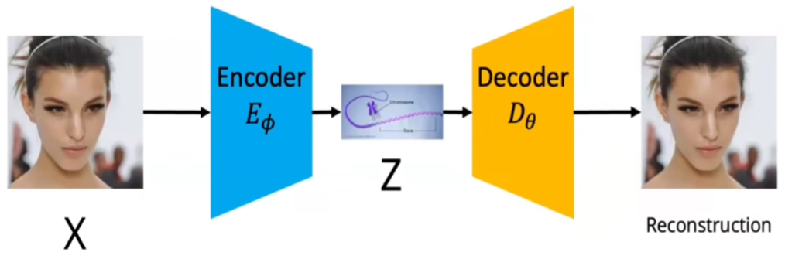
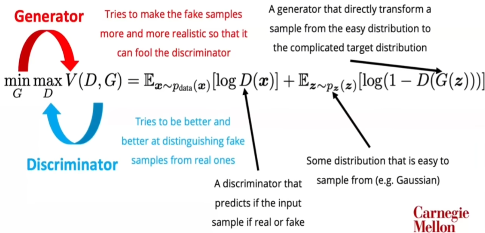
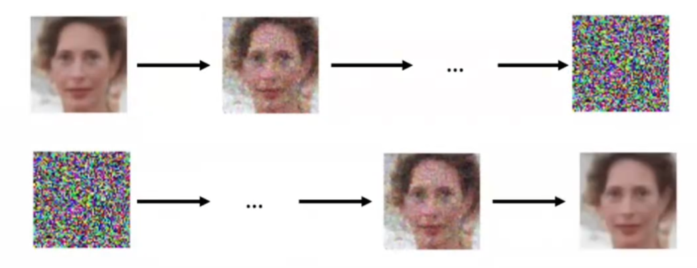
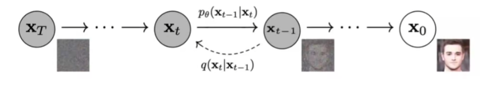
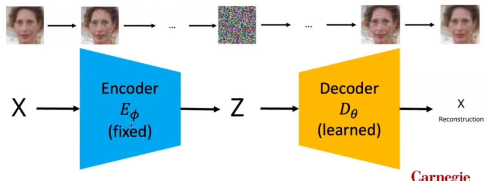
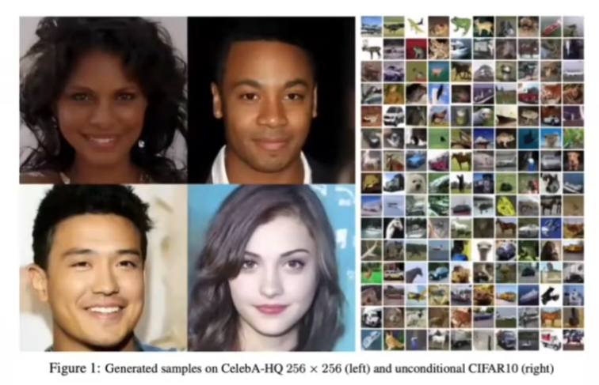
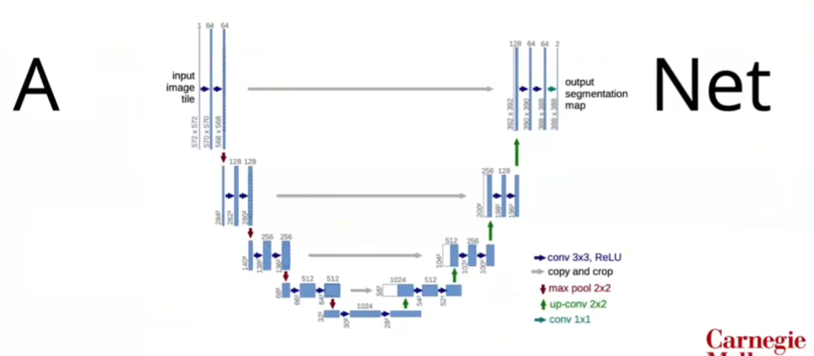

# CMU 10-799: Diffusion & Flow Matching — 课程笔记

[TOC]

> 这是一份按概念依赖而非 PPT 页序整理的复习笔记。理解模型所必需的数学推导直接融入正文；不承担主线、但有参考价值的替代推导放在原地的折叠块中。

---

## Lecture 1 — 01/13: Basics of Probabilistic & Generative Modeling

### 0. 本讲主线

本讲希望回答：

1. 生成建模究竟要学习什么？
2. 最大似然如何把“学习分布”变成优化问题？
3. AR、VAE、GAN 分别如何表示分布、训练模型和生成样本？
4. VAE 为什么需要近似后验与 ELBO？

整条逻辑链是：

> 未知数据分布 $p_{\mathrm{data}}$  
> $\rightarrow$ 参数化模型分布 $p_\theta$  
> $\rightarrow$ 最大似然  
> $\rightarrow$ AR 的显式分解  
> $\rightarrow$ 潜变量模型的不可解边缘似然  
> $\rightarrow$ VAE 的变分推断与 ELBO  
> $\rightarrow$ GAN 的隐式生成路线。

### 1. 生成建模的目标

#### 1.1 数据分布与模型分布

假设训练数据来自未知分布：

$$
x\sim p_{\mathrm{data}}(x).
$$

我们只能观察有限数据集：

$$
\mathcal D=\left\{x^{(1)},\ldots,x^{(N)}\right\},
$$

无法直接写出 $p_{\mathrm{data}}$。因此引入参数化模型 $p_\theta(x)$，希望：

$$
p_\theta(x)\approx p_{\mathrm{data}}(x).
$$

这里有两个不同阶段：

- **训练**：利用 $\mathcal D$ 学习参数 $\theta$；
- **生成**：训练完成后，从 $p_\theta(x)$ 采样新的 $x$。

#### 1.2 如何评价图像生成系统？

常见评价维度包括：

1. **保真度（Fidelity）**：样本是否真实、局部结构是否合理；
2. **可控性（Controllability）**：能否按照文本、类别或其他条件生成指定内容；
3. **速度（Speed）**：训练和采样是否高效，加速是否损害质量。

它们是最终系统指标，不等同于训练时直接优化的概率目标。较高 likelihood 也不自动等价于较好的感知质量。

#### 1.3 生成、密度估计与表示学习

生成模型可能支持：

- **生成**：从 $p_\theta(x)$ 采样；
- **密度估计**：计算 $p_\theta(x)$ 或 $\log p_\theta(x)$；
- **表示学习**：从数据中发现有用结构。

$p_\theta(x)$ 表示样本 $x$ 在生成模型下的概率质量或概率密度，不是分类概率 $p(y=\text{room}\mid x)$。对连续图像空间，严格来说讨论的是密度，而不是某个精确点的概率。

无监督学习是生成模型的常见设置，但不是生成建模的必要定义。条件生成模型也可以学习：

$$
p_\theta(x\mid y).
$$

### 2. 概率工具箱

#### 2.1 随机变量与样本

- $X,Y,Z$：随机变量；
- $x,y,z$：随机变量的具体取值；
- $p(X)$：随机变量的分布；
- $p(x)$：某个取值的概率质量或概率密度。

#### 2.2 联合、边缘与条件分布

联合分布：

$$
p(x,y).
$$

边缘化：

$$
p(x)=\int p(x,y)\,dy.
$$

条件分布：

$$
p(x\mid y)=\frac{p(x,y)}{p(y)}.
$$

离散变量将积分换成求和。

#### 2.3 Bayes 公式

由：

$$
p(x,y)=p(x\mid y)p(y)=p(y\mid x)p(x),
$$

可得：

$$
p(x\mid y)=\frac{p(y\mid x)p(x)}{p(y)}.
$$

其中 $p(x)$ 是观察 $y$ 之前的先验，$p(x\mid y)$ 是观察 $y$ 之后的后验。

#### 2.4 独立性与条件独立性

若 $X$ 与 $Y$ 独立：

$$
p(x,y)=p(x)p(y),
$$

等价地，在相应概率非零时：

$$
p(x\mid y)=p(x).
$$

后续 Markov 链会使用条件独立性：给定当前状态后，未来与更早历史无关。

#### 2.5 期望与 Monte Carlo

对 $x\sim p(x)$：

$$
\mathbb E_{x\sim p}[f(x)]
=
\int p(x)f(x)\,dx.
$$

若无法解析积分，可使用样本 $x^{(1)},\ldots,x^{(L)}\sim p$：

$$
\mathbb E_p[f(x)]
\approx
\frac{1}{L}\sum_{l=1}^{L}f(x^{(l)}).
$$

#### 2.6 Likelihood 与 log-likelihood

对已经观察到的数据 $x$，$p_\theta(x)$ 作为 $\theta$ 的函数时称为 likelihood。它不是参数 $\theta$ 的概率分布。

实际优化通常使用：

$$
\log p_\theta(x),
$$

因为对数将乘积变成求和，并且数值更稳定。

#### 2.7 KL 散度

$$
D_{\mathrm{KL}}(p\|q)
=
\mathbb E_{x\sim p}
\left[
\log\frac{p(x)}{q(x)}
\right].
$$

它满足：

$$
D_{\mathrm{KL}}(p\|q)\ge 0,
$$

并且通常等号成立当且仅当 $p=q$。但一般有：

$$
D_{\mathrm{KL}}(p\|q)
\neq
D_{\mathrm{KL}}(q\|p),
$$

因此它不是严格的度量距离。

#### 2.8 Jensen 不等式

对凹函数 $f$：

$$
f\left(\mathbb E[X]\right)
\ge
\mathbb E[f(X)].
$$

因为 $\log$ 是凹函数：

$$
\log\mathbb E[X]
\ge
\mathbb E[\log X].
$$

这会被用于构造 ELBO。

### 3. 路线一：最大似然与自回归模型

#### 3.1 数据集最大似然

假设训练样本独立同分布，整个数据集的 likelihood 为：

$$
p_\theta(\mathcal D)
=
\prod_{i=1}^{N}p_\theta(x^{(i)}).
$$

最大似然估计为：

$$
\begin{aligned}
\theta^*
&=
\arg\max_\theta
\prod_{i=1}^{N}p_\theta(x^{(i)})
\\
&=
\arg\max_\theta
\sum_{i=1}^{N}\log p_\theta(x^{(i)}).
\end{aligned}
$$

> Lecture 1 的一页官方幻灯片将目标写成了 $\sum_i p_\theta(x^{(i)})$。这不是 i.i.d. 数据集的最大似然目标；这里使用上面的正确形式。

最小化版本称为 negative log-likelihood：

$$
\mathcal L_{\mathrm{NLL}}(\theta)
=
-\sum_{i=1}^{N}\log p_\theta(x^{(i)}).
$$

#### 3.2 用链式法则分解复杂分布

若：

$$
x=(x_1,\ldots,x_K),
$$

则：

$$
p_\theta(x)
=
\prod_{k=1}^{K}p_\theta(x_k\mid x_{<k}),
$$

其中 $x_{<k}=(x_1,\ldots,x_{k-1})$。取对数：

$$
\log p_\theta(x)
=
\sum_{k=1}^{K}
\log p_\theta(x_k\mid x_{<k}).
$$

这就是自回归建模。

#### 3.3 为什么训练目标是交叉熵？

对离散的 $x_k$，模型输出类别分布 $p_\theta(\cdot\mid x_{<k})$。若真实标签写成 one-hot 向量 $y$：

$$
-\sum_c y_c\log p_\theta(c\mid x_{<k})
=
-\log p_\theta(x_k\mid x_{<k}).
$$

因此 teacher forcing 下的 token-level 交叉熵就是自回归 NLL。

#### 3.4 优势与代价

- **优势**：likelihood 精确可计算，训练目标直接；
- **代价**：生成必须依次采样 $x_1,x_2,\ldots,x_K$，难以完全并行。

### 4. 路线二：潜变量生成模型

复杂数据往往可以由不可直接观察的因素解释。例如，人脸图像可能由身份、姿态、表情和光照共同产生。用 $z$ 表示潜变量，生成故事是：

$$
z\sim p(z),
\qquad
x\sim p_\theta(x\mid z).
$$

于是联合分布为：

$$
p_\theta(x,z)
=
p(z)p_\theta(x\mid z),
$$

边缘分布为：

$$
p_\theta(x)
=
\int p(z)p_\theta(x\mid z)\,dz.
$$

> 图中 decoder 对应生成模型 $p_\theta(x\mid z)$。Encoder 不是生成故事的起点，而是为了解决后验推断问题才被引入。

潜变量模型面临两个相关困难：

1. 边缘似然 $p_\theta(x)$ 的积分通常无法高效计算；
2. 真实后验

   $$
   p_\theta(z\mid x)
   =
   \frac{p(z)p_\theta(x\mid z)}{p_\theta(x)}
   $$

   也因为分母 $p_\theta(x)$ 而通常不可解。

这些分布被模型定义了，只是通常无法直接计算，不能说模型“没有”它们。

### 5. VAE：用变分推断获得可训练目标

#### 5.1 引入近似后验

VAE 引入可学习分布：

$$
q_\phi(z\mid x),
$$

近似难以计算的 $p_\theta(z\mid x)$。它通常由 encoder 实现。

对每个输入 $x$ 单独优化一个近似后验会很慢；使用共享参数 $\phi$ 的网络直接学习从 $x$ 到近似后验的映射，称为**可摊销变分推断**。

#### 5.2 从 posterior gap 推导 ELBO

从 KL 散度开始：

$$
\begin{aligned}
D_{\mathrm{KL}}
\left(
q_\phi(z\mid x)
\|
p_\theta(z\mid x)
\right)
&=
\mathbb E_{q_\phi(z\mid x)}
\left[
\log
\frac{q_\phi(z\mid x)}
{p_\theta(z\mid x)}
\right].
\end{aligned}
$$

使用 Bayes 公式：

$$
p_\theta(z\mid x)
=
\frac{p_\theta(x,z)}{p_\theta(x)},
$$

得到：

$$
\begin{aligned}
D_{\mathrm{KL}}
\left(
q_\phi(z\mid x)
\|
p_\theta(z\mid x)
\right)
&=
\mathbb E_{q_\phi(z\mid x)}
\left[
\log q_\phi(z\mid x)
-
\log p_\theta(x,z)
\right]
\\
&\quad+
\log p_\theta(x).
\end{aligned}
$$

移项：

$$
\begin{aligned}
\log p_\theta(x)
&=
\underbrace{
\mathbb E_{q_\phi(z\mid x)}
\left[
\log p_\theta(x,z)
-
\log q_\phi(z\mid x)
\right]
}_{\mathcal L_{\mathrm{ELBO}}(x)}
\\
&\quad+
D_{\mathrm{KL}}
\left(
q_\phi(z\mid x)
\|
p_\theta(z\mid x)
\right).
\end{aligned}
$$

因为 KL 非负：

$$
\boxed{
\log p_\theta(x)
\ge
\mathcal L_{\mathrm{ELBO}}(x)
}
$$

这就是 Evidence Lower Bound。它不是凭空拼接出来的两个损失，而是边缘对数似然与 posterior gap 的恒等分解。

#### 5.3 把 ELBO 写成可解释的两项

利用：

$$
p_\theta(x,z)=p(z)p_\theta(x\mid z),
$$

继续展开：

$$
\begin{aligned}
\mathcal L_{\mathrm{ELBO}}(x)
&=
\mathbb E_{q_\phi(z\mid x)}
\left[
\log p(z)
+
\log p_\theta(x\mid z)
-
\log q_\phi(z\mid x)
\right]
\\
&=
\underbrace{
\mathbb E_{q_\phi(z\mid x)}
\left[
\log p_\theta(x\mid z)
\right]
}_{\text{expected reconstruction log-likelihood}}
\\
&\quad-
\underbrace{
D_{\mathrm{KL}}
\left(
q_\phi(z\mid x)
\|
p(z)
\right)
}_{\text{prior regularization}}.
\end{aligned}
$$

最大化 ELBO 等价于最小化负 ELBO：

$$
\mathcal L_{\mathrm{VAE}}
=
-\mathbb E_{q_\phi(z\mid x)}
\left[
\log p_\theta(x\mid z)
\right]
+
D_{\mathrm{KL}}
\left(
q_\phi(z\mid x)
\|
p(z)
\right).
$$

第一项取负后才称为 reconstruction loss。第二项鼓励近似后验与 prior 兼容，但不能保证聚合后验严格等于 prior，也不能单独保证所有 prior 样本都能被 decoder 良好解码。

另一种推导：从 Jensen 不等式直接得到 ELBO

从边缘似然出发：

$$
\begin{aligned}
\log p_\theta(x)
&=
\log\int p_\theta(x,z)\,dz
\\
&=
\log\int
q_\phi(z\mid x)
\frac{p_\theta(x,z)}{q_\phi(z\mid x)}
\,dz
\\
&=
\log
\mathbb E_{q_\phi(z\mid x)}
\left[
\frac{p_\theta(x,z)}
{q_\phi(z\mid x)}
\right].
\end{aligned}
$$

因为 $\log$ 是凹函数，Jensen 不等式给出：

$$
\begin{aligned}
\log p_\theta(x)
&\ge
\mathbb E_{q_\phi(z\mid x)}
\left[
\log
\frac{p_\theta(x,z)}
{q_\phi(z\mid x)}
\right]
\\
&=
\mathcal L_{\mathrm{ELBO}}(x).
\end{aligned}
$$

posterior-gap 推导强调下界与真实后验之间的差距；Jensen 推导强调如何从不可计算的 log-integral 构造可计算下界。

#### 5.4 ELBO 之后还缺什么？

现在已经得到训练目标，但还需要回答：

1. 如何从 $q_\phi(z\mid x)$ 采样并对 $\phi$ 反向传播？
2. $p(z)$、$q_\phi(z\mid x)$、$p_\theta(x\mid z)$ 应选择什么分布族？
3. 如何估计 ELBO 中的期望？

Lecture 2 会补全这些训练细节，并展示它们如何被 DDPM 复用。

### 6. 路线三：GAN 与隐式生成模型

GAN 从简单 prior 中采样：

$$
z\sim p(z),
$$

再由生成器直接生成：

$$
x=G_\theta(z).
$$

判别器 $D_\psi(x)$ 尝试区分真实样本与生成样本。原始 minimax 目标为：

$$
\min_\theta\max_\psi
\left\{
\mathbb E_{x\sim p_{\mathrm{data}}}
[\log D_\psi(x)]
+
\mathbb E_{z\sim p(z)}
[\log(1-D_\psi(G_\theta(z)))]
\right\}.
$$

> 图中保留的是从简单 prior 到生成样本的结构，以及判别器提供训练信号的方式；关键公式已经转写到正文。

GAN 通常没有显式、可计算的 $p_\theta(x)$，因此属于隐式生成模型。它可以产生锐利样本，但训练可能不稳定，并可能出现 mode collapse。

### 7. AR、VAE、GAN 的统一比较

| 模型 | 分布表示 | 实际训练目标 | Likelihood | 采样方式 | 主要代价 |
|---|---|---|---|---|---|
| AR | 显式链式分解 | 精确 NLL | 可精确计算 | 串行逐元素采样 | 采样慢 |
| VAE | 显式潜变量模型 | ELBO | 优化下界 | prior 采样后一次解码 | 近似推断、结果可能偏平滑 |
| GAN | 隐式生成器 | 对抗目标 | 通常不可计算 | prior 采样后一次生成 | 训练不稳定、mode collapse |

这三种方法不是严格的历史替代关系，而是在分布表达、目标可计算性、采样代价和样本质量之间做不同取舍。

### 8. 通向 Diffusion 的桥梁

真实数据分布复杂，而高斯等简单分布容易采样。一步把高斯变成数据可能仍然困难，因此可以考虑：

> 复杂的一步生成  
> $\rightarrow$ 许多局部的小变化  
> $\rightarrow$ 固定一个逐步破坏数据的前向过程  
> $\rightarrow$ 学习逐步逆转它的生成过程。

### 9. Lecture 1 速查

数据集最大似然：

$$
\theta^*
=
\arg\max_\theta
\sum_{i=1}^{N}
\log p_\theta(x^{(i)}).
$$

自回归分解：

$$
p_\theta(x)
=
\prod_{k=1}^{K}
p_\theta(x_k\mid x_{<k}).
$$

潜变量模型：

$$
p_\theta(x,z)=p(z)p_\theta(x\mid z),
$$

$$
p_\theta(x)=\int p(z)p_\theta(x\mid z)\,dz,
$$

$$
\log p_\theta(x)
=
\mathcal L_{\mathrm{ELBO}}(x)
+
D_{\mathrm{KL}}
\left(
q_\phi(z\mid x)
\|
p_\theta(z\mid x)
\right),
$$

$$
\mathcal L_{\mathrm{ELBO}}
=
\mathbb E_{q_\phi(z\mid x)}
[\log p_\theta(x\mid z)]
-
D_{\mathrm{KL}}
(q_\phi(z\mid x)\|p(z)).
$$

隐式生成模型：

$$
z\sim p(z),
\qquad
x=G_\theta(z).
$$

GAN 通过判别器给生成器提供训练信号，通常不显式构造一个可逐点计算的 $p_\theta(x)$。

复习检查：

1. 为什么数据集 MLE 使用 log-likelihood 之和？
2. AR 的 likelihood 为什么容易计算，采样为什么慢？
3. 潜变量模型为什么会出现不可解边缘似然？
4. $q_\phi(z\mid x)$ 的职责是什么？
5. ELBO 与 $\log p_\theta(x)$ 之间的 gap 是什么？
6. GAN 为什么通常无法直接报告精确 likelihood？
7. AR、VAE、GAN 分别把主要困难放在了训练、推断或采样的哪个环节？

### 10. 资源与阅读材料

- [Lecture 1 Slides](https://kellyyutonghe.github.io/10799S26/assets/slides/Lecture1_Basics.pdf)
- [Lecture 1 YouTube Video](https://youtu.be/p7Q77S_ZhdA)
- [Auto-Encoding Variational Bayes](https://arxiv.org/abs/1312.6114)
- [An Introduction to Variational Autoencoders](https://arxiv.org/abs/1906.02691)
- [Generative Adversarial Networks](https://arxiv.org/abs/1406.2661)

---

## Lecture 2 — 01/15: Denoising Diffusion Models

### 0. 本讲主线

本讲从 VAE 的潜变量视角出发：

> 补全 VAE 的实际训练工具  
> $\rightarrow$ 把一步生成拆成许多小步骤  
> $\rightarrow$ 定义前向加噪链 $q$ 与反向生成链 $p_\theta$  
> $\rightarrow$ 推导任意时刻的闭式边缘 $q(x_t\mid x_0)$  
> $\rightarrow$ 把 $x_{1:T}$ 看成层级潜变量  
> $\rightarrow$ 用 VLB 训练  
> $\rightarrow$ 把解析后验的 Gaussian KL 化为噪声预测。

学完后应该能够回答：

1. 为什么训练可以直接构造任意 $x_t$，采样却要从 $T$ 逐步走到 $0$？
2. $q(x_{t-1}\mid x_t,x_0)$ 为什么只在训练时使用？
3. 为什么预测噪声可以决定反向过程的均值？
4. 精确 VLB、带权噪声 MSE 与 $L_{\mathrm{simple}}$ 有什么关系？

### 1. VAE 的实际训练工具

Lecture 1 已经得到：

$$
\mathcal L_{\mathrm{ELBO}}
=
\mathbb E_{q_\phi(z\mid x)}
[\log p_\theta(x\mid z)]
-
D_{\mathrm{KL}}
(q_\phi(z\mid x)\|p(z)).
$$

现在需要将它变成可以反向传播的目标。

#### 1.1 高斯 prior 与近似后验

经典 VAE 通常固定：

$$
p(z)=\mathcal N(0,I),
$$

并令 encoder 输出对角高斯参数：

$$
q_\phi(z\mid x)
=
\mathcal N
\left(
z;
\mu_\phi(x),
\operatorname{diag}(\sigma_\phi^2(x))
\right).
$$

#### 1.2 重参数化

采样写成：

$$
\epsilon\sim\mathcal N(0,I),
\qquad
z
=
\mu_\phi(x)
+
\sigma_\phi(x)\odot\epsilon.
$$

随机性来自与 $\phi$ 无关的 $\epsilon$，而 $z$ 是 $\mu_\phi,\sigma_\phi$ 的可微函数。这给出了 reconstruction expectation 关于 $\phi$ 的 pathwise gradient。

> KL 项有闭式解是因为 prior 和 approximate posterior 都是高斯；重参数化解决的是随机期望的梯度估计。二者不要混为一谈。

#### 1.3 高斯 KL 的闭式解

对单个维度：

$$
q(z_d\mid x)=\mathcal N(\mu_d,\sigma_d^2),
\qquad
p(z_d)=\mathcal N(0,1).
$$

代入高斯 log-density：

$$
\begin{aligned}
D_{\mathrm{KL}}(q\|p)
&=
\mathbb E_q
[\log q(z_d\mid x)-\log p(z_d)]
\\
&=
\frac12
\left(
\mu_d^2+\sigma_d^2-1-\log\sigma_d^2
\right).
\end{aligned}
$$

对全部维度求和：

$$
D_{\mathrm{KL}}
\left(
q_\phi(z\mid x)
\|
\mathcal N(0,I)
\right)
=
\frac12
\sum_d
\left(
\mu_d(x)^2
+
\sigma_d(x)^2
-1
-\log\sigma_d(x)^2
\right).
$$

#### 1.4 Gaussian decoder 与 MSE

假设：

$$
p_\theta(x\mid z)
=
\mathcal N
\left(
x;
\mu_\theta(z),
\sigma_x^2I
\right),
$$

并固定 $\sigma_x^2$，记观测维度为 $D=\dim(x)$。则：

$$
\log p_\theta(x\mid z)
=
-\frac{D}{2}\log(2\pi\sigma_x^2)
-
\frac{1}{2\sigma_x^2}
\|x-\mu_\theta(z)\|^2.
$$

所以：

$$
\begin{aligned}
\mathbb E_{q_\phi(z\mid x)}
[\log p_\theta(x\mid z)]
&=
-\frac{1}{2\sigma_x^2}
\mathbb E_{q_\phi(z\mid x)}
\left[
\|x-\mu_\theta(z)\|^2
\right]
+C
\\
&\propto
-\mathbb E_{q_\phi(z\mid x)}
\left[
\|x-\mu_\theta(z)\|^2
\right].
\end{aligned}
$$

固定方差的 Gaussian decoder 下，负重构 log-likelihood 等价于加权 MSE。对二值数据也可以使用 Bernoulli decoder，对应 binary cross-entropy。

#### 1.5 VAE 的训练与生成

训练步骤：

1. 输入数据 $x$；
2. Encoder 输出 $\mu_\phi(x),\sigma_\phi(x)$；
3. 采样 $\epsilon\sim\mathcal N(0,I)$ 并构造 $z$；
4. Decoder 定义 $p_\theta(x\mid z)$；
5. 计算 reconstruction NLL 与 KL regularization；
6. 更新 $\theta,\phi$。

生成步骤：

1. 采样 $z\sim p(z)=\mathcal N(0,I)$；
2. 从 $p_\theta(x\mid z)$ 采样，或使用其均值。

DDPM 将借用三样东西：

- 潜变量生成模型；
- 变分下界；
- 线性高斯的闭式性质，以及用标准高斯噪声表示随机变量的方法。

在 VAE 中，重参数化主要用于获得 encoder 参数的 pathwise gradient；在 DDPM 中，前向过程 $q$ 是固定的，同样的高斯表示主要用于直接构造 $x_t$ 并产生监督噪声标签。形式相似，不代表两者的职责完全相同。

### 2. 为什么采用逐步生成？

不同模型存在不同取舍：

- AR 的 likelihood 清晰，但采样串行；
- 经典 VAE 采样快，但简单观测模型可能产生偏平滑的结果；
- GAN 可生成锐利样本，但训练不稳定且可能 mode collapse。

这并不意味着它们“完全不行”，而是说明复杂数据分布很难通过一个简单步骤建模。

Diffusion 的设计动机是：

> 与其学习一次巨大的变化，不如将它拆成许多局部、幅度很小、容易建模的变化。

> 上行表示逐步破坏数据的前向过程；下行表示从简单噪声出发、逐步恢复数据结构的生成过程。

### 3. DDPM 的变量、方向与职责

#### 3.1 符号约定

- $x_0$：干净数据，$x_0\sim q_{\mathrm{data}}(x_0)$；
- $x_t$：时间步 $t$ 的带噪状态；
- $x_T$：接近纯高斯噪声的终点；
- $q$：固定的前向加噪过程；
- $p_\theta$：学习的反向生成过程；
- $T$：离散时间步总数。

本讲沿用 DDPM 文献的习惯，把数据分布写成 $q_{\mathrm{data}}$；它与 Lecture 1 的 $p_{\mathrm{data}}$ 表示同一个未知真实数据分布，并不代表多出了一个分布。

#### 3.2 固定的前向过程

定义 Markov 链：

$$
q(x_{1:T}\mid x_0)
=
\prod_{t=1}^{T}
q(x_t\mid x_{t-1}),
$$

其中：

$$
q(x_t\mid x_{t-1})
=
\mathcal N
\left(
x_t;
\sqrt{1-\beta_t}\,x_{t-1},
\beta_tI
\right),
\qquad
0<\beta_t<1.
$$

令：

$$
\alpha_t:=1-\beta_t,
\qquad
\bar\alpha_t:=\prod_{s=1}^{t}\alpha_s,
\qquad
\bar\alpha_0:=1.
$$

单步采样写成：

$$
x_t
=
\sqrt{\alpha_t}\,x_{t-1}
+
\sqrt{1-\alpha_t}\,\epsilon_t,
\qquad
\epsilon_t\sim\mathcal N(0,I).
$$

#### 3.3 学习的反向过程

生成模型定义为：

$$
p_\theta(x_{0:T})
=
p(x_T)
\prod_{t=1}^{T}
p_\theta(x_{t-1}\mid x_t),
$$

其中：

$$
p(x_T)=\mathcal N(0,I),
$$

并使用高斯参数化：

$$
p_\theta(x_{t-1}\mid x_t)
=
\mathcal N
\left(
x_{t-1};
\mu_\theta(x_t,t),
\Sigma_\theta(x_t,t)
\right).
$$

需要区分：

- $q(x_{t-1}\mid x_t,x_0)$：给定训练数据 $x_0$ 的解析 posterior，严格为高斯；
- $q(x_{t-1}\mid x_t)$：对所有可能的 $x_0$ 边缘化后的真实反向条件，一般不必是单个高斯。

DDPM 使用高斯 $p_\theta(x_{t-1}\mid x_t)$ 近似反向条件；当单步噪声很小时，这是合理且方便的参数化。

#### 3.4 固定项与学习项

| 对象 | 是否学习 | 训练时可用 | 采样时可用 |
|---|:---:|:---:|:---:|
| $q(x_t\mid x_{t-1})$ | 否 | 是 | 不使用 |
| $q(x_t\mid x_0)$ | 否 | 是 | 不使用 |
| $q(x_{t-1}\mid x_t,x_0)$ | 否 | 是 | 否，因为没有 $x_0$ |
| $p(x_T)$ | 否 | 是 | 是 |
| $p_\theta(x_{t-1}\mid x_t)$ | 是 | 是 | 是 |

### 4. 前向过程的闭式性质

前向过程最重要的性质是：可以从 $x_0$ 直接采样任意 $x_t$，不必真的执行前面 $t$ 次加噪。

#### 4.1 推导 $q(x_t\mid x_0)$

假设：

$$
x_{t-1}
=
\sqrt{\bar\alpha_{t-1}}x_0
+
\sqrt{1-\bar\alpha_{t-1}}\,
\bar\epsilon_{t-1},
\qquad
\bar\epsilon_{t-1}\sim\mathcal N(0,I).
$$

代入单步关系：

$$
\begin{aligned}
x_t
&=
\sqrt{\alpha_t}x_{t-1}
+
\sqrt{1-\alpha_t}\epsilon_t
\\
&=
\sqrt{\alpha_t\bar\alpha_{t-1}}x_0
+
\sqrt{\alpha_t(1-\bar\alpha_{t-1})}\,
\bar\epsilon_{t-1}
+
\sqrt{1-\alpha_t}\epsilon_t.
\end{aligned}
$$

因为：

$$
\alpha_t\bar\alpha_{t-1}=\bar\alpha_t,
$$

而两个独立高斯噪声之和的协方差为：

$$
\begin{aligned}
\alpha_t(1-\bar\alpha_{t-1})
+
(1-\alpha_t)
&=
1-\alpha_t\bar\alpha_{t-1}
\\
&=
1-\bar\alpha_t,
\end{aligned}
$$

所以可以合并成一个 $\epsilon\sim\mathcal N(0,I)$：

$$
x_t
=
\sqrt{\bar\alpha_t}x_0
+
\sqrt{1-\bar\alpha_t}\epsilon.
$$

因此：

$$
\boxed{
q(x_t\mid x_0)
=
\mathcal N
\left(
x_t;
\sqrt{\bar\alpha_t}x_0,
(1-\bar\alpha_t)I
\right)
}
$$

#### 4.2 这个闭式公式解决了什么？

训练时可以：

1. 采样 $x_0\sim q_{\mathrm{data}}$；
2. 随机采样 $t$；
3. 采样 $\epsilon\sim\mathcal N(0,I)$；
4. 直接构造对应的 $x_t$。

这里的 $\epsilon$ 是从 $x_0$ 到 $x_t$ 的**累计噪声**，不是第 $t$ 个局部转移单独加入的 $\epsilon_t$。

若噪声日程使 $\bar\alpha_T\approx0$：

$$
q(x_T\mid x_0)
\approx
\mathcal N(0,I).
$$

它通常只是近似标准正态；生成 prior $p(x_T)=\mathcal N(0,I)$ 才是明确固定的标准正态。

### 5. DDPM 为什么可以使用 ELBO？

把 $x_1,\ldots,x_T$ 看成潜变量后：

- $q(x_{1:T}\mid x_0)$ 是固定的 variational encoder；
- $p_\theta(x_{0:T})$ 是学习的 generative decoder；
- $x_1,\ldots,x_T$ 与 $x_0$ 同维，并构成 Markov 链。

因此 DDPM 可以理解成特殊的**层级 VAE**，并复用 ELBO 训练边缘模型 $p_\theta(x_0)$。这个观察必须先于 VLB 推导，否则很难解释为什么要对 $x_{1:T}$ 引入 $q$。

### 6. 从 marginal likelihood 到 VLB

对一个给定的数据点 $x_0$，目标仍然是最大化边缘似然：

$$
\log p_\theta(x_0)
=
\log
\int
p_\theta(x_{0:T})
\,dx_{1:T}.
$$

乘除固定的前向分布 $q(x_{1:T}\mid x_0)$：

$$
\begin{aligned}
\log p_\theta(x_0)
&=
\log
\int
q(x_{1:T}\mid x_0)
\frac{p_\theta(x_{0:T})}
{q(x_{1:T}\mid x_0)}
\,dx_{1:T}
\\
&=
\log
\mathbb E_{q(x_{1:T}\mid x_0)}
\left[
\frac{p_\theta(x_{0:T})}
{q(x_{1:T}\mid x_0)}
\right]
\\
&\ge
\mathbb E_q
\left[
\log
\frac{p_\theta(x_{0:T})}
{q(x_{1:T}\mid x_0)}
\right].
\end{aligned}
$$

最后一步使用 Jensen 不等式。定义负 ELBO，并依照 DDPM 记作 $\mathcal L_{\mathrm{VLB}}$：

$$
\mathcal L_{\mathrm{VLB}}
=
\mathbb E_q
\left[
-\log
\frac{p_\theta(x_{0:T})}
{q(x_{1:T}\mid x_0)}
\right],
$$

于是

$$
-\log p_\theta(x_0)
\le
\mathcal L_{\mathrm{VLB}}.
$$

它是 negative log-likelihood 的 variational upper bound；因此最小化 $\mathcal L_{\mathrm{VLB}}$ 是在最小化数据 NLL 的一个可计算上界。

#### 6.1 利用 Markov 结构展开

代入两条链的分解：

$$
q(x_{1:T}\mid x_0)
=
\prod_{t=1}^{T}
q(x_t\mid x_{t-1}),
$$

$$
p_\theta(x_{0:T})
=
p(x_T)
\prod_{t=1}^{T}
p_\theta(x_{t-1}\mid x_t).
$$

可得

$$
\mathcal L_{\mathrm{VLB}}
=
\mathbb E_q
\left[
-\log p(x_T)
-\sum_{t=1}^{T}
\log p_\theta(x_{t-1}\mid x_t)
+
\sum_{t=1}^{T}
\log q(x_t\mid x_{t-1})
\right].
$$

为了把它变成可解释的局部项，对 $t\ge2$ 使用 Bayes 恒等式：

$$
q(x_t\mid x_{t-1})
q(x_{t-1}\mid x_0)
=
q(x_{t-1}\mid x_t,x_0)
q(x_t\mid x_0).
$$

因此

$$
\log q(x_t\mid x_{t-1})
=
\log q(x_{t-1}\mid x_t,x_0)
+
\log q(x_t\mid x_0)
-
\log q(x_{t-1}\mid x_0).
$$

把这些项代回后，关于 $q(x_t\mid x_0)$ 的 log-ratio 会首尾相消，得到：

$$
\boxed{
\mathcal L_{\mathrm{VLB}}
=
L_T
+
\sum_{t=2}^{T}L_{t-1}
+
L_0
}
$$

其中

$$
L_T
=
D_{\mathrm{KL}}
\left(
q(x_T\mid x_0)
\|
p(x_T)
\right),
$$

$$
L_{t-1}
=
\mathbb E_{q(x_t\mid x_0)}
\left[
D_{\mathrm{KL}}
\left(
q(x_{t-1}\mid x_t,x_0)
\|
p_\theta(x_{t-1}\mid x_t)
\right)
\right],
\qquad 2\le t\le T,
$$

$$
L_0
=
\mathbb E_{q(x_1\mid x_0)}
\left[
-\log p_\theta(x_0\mid x_1)
\right].
$$

三类项的职责是：

| 项 | 比较或重建什么 | 对 $\theta$ 的作用 |
|---|---|---|
| $L_T$ | 前向终点与生成 prior | 前向过程和 prior 固定时为常数 |
| $L_{t-1}$ | 真实单步后验与学习的反向转移 | 训练主要来源 |
| $L_0$ | 从 $x_1$ 重建干净数据 $x_0$ | decoder likelihood |

注意：$L_T$ 对 $\theta$ 是常数，不代表它严格为零。由于 $q(x_T\mid x_0)$ 只是被噪声日程推到近似 $\mathcal N(0,I)$，该 KL 通常只是较小且可解析。

### 7. 真实单步后验：反向模型的教师

以下非退化 Gaussian posterior 推导均假设 $2\le t\le T$；$t=1$ 的退化边界留到 9.1 节处理。

训练时已知 $x_0$，所以可以计算：

$$
q(x_{t-1}\mid x_t,x_0)
\propto
q(x_t\mid x_{t-1})
q(x_{t-1}\mid x_0).
$$

两项分别为

$$
q(x_t\mid x_{t-1})
=
\mathcal N
\left(
x_t;
\sqrt{\alpha_t}x_{t-1},
\beta_t I
\right),
$$

$$
q(x_{t-1}\mid x_0)
=
\mathcal N
\left(
x_{t-1};
\sqrt{\bar\alpha_{t-1}}x_0,
(1-\bar\alpha_{t-1})I
\right).
$$

忽略与 $x_{t-1}$ 无关的归一化常数，二者乘积的指数为

$$
-\frac{
\|x_t-\sqrt{\alpha_t}x_{t-1}\|^2
}{2\beta_t}
-
\frac{
\|x_{t-1}-\sqrt{\bar\alpha_{t-1}}x_0\|^2
}{2(1-\bar\alpha_{t-1})}.
$$

关于 $x_{t-1}$ 配方。其精度为

$$
\frac{1}{\tilde\beta_t}
=
\frac{\alpha_t}{\beta_t}
+
\frac{1}{1-\bar\alpha_{t-1}}
=
\frac{1-\bar\alpha_t}
{\beta_t(1-\bar\alpha_{t-1})},
$$

所以

$$
\tilde\beta_t
=
\frac{1-\bar\alpha_{t-1}}
{1-\bar\alpha_t}
\beta_t.
$$

一次项给出均值

$$
\tilde\mu_t(x_t,x_0)
=
\tilde\beta_t
\left(
\frac{\sqrt{\alpha_t}}{\beta_t}x_t
+
\frac{\sqrt{\bar\alpha_{t-1}}}
{1-\bar\alpha_{t-1}}x_0
\right),
$$

化简后：

$$
\boxed{
\tilde\mu_t(x_t,x_0)
=
\frac{
\sqrt{\bar\alpha_{t-1}}\beta_t
}{1-\bar\alpha_t}
x_0
+
\frac{
\sqrt{\alpha_t}(1-\bar\alpha_{t-1})
}{1-\bar\alpha_t}
x_t
}
$$

因此

$$
\boxed{
q(x_{t-1}\mid x_t,x_0)
=
\mathcal N
\left(
\tilde\mu_t(x_t,x_0),
\tilde\beta_t I
\right)
}.
$$

这个后验是训练时的“教师”：它依赖已知的 $x_0$，可以为每个训练样本提供目标；生成时没有 $x_0$。在对训练数据与前向噪声取期望后，最小化这些 KL 会让 $p_\theta(x_{t-1}\mid x_t)$ 学习对 $x_0$ 边缘化后的反向条件，而不是在生成时调用某个含 $x_0$ 的 posterior。

### 8. 从 posterior KL 到噪声预测

令反向模型为

$$
p_\theta(x_{t-1}\mid x_t)
=
\mathcal N
\left(
x_{t-1};
\mu_\theta(x_t,t),
\sigma_t^2I
\right).
$$

对 $t\ge2$，下面保持 $\sigma_t^2$ 为一般的固定值。经典选择包括 $\sigma_t^2=\beta_t$ 或 $\sigma_t^2=\tilde\beta_t$。在精确 VLB 中，这个选择会决定噪声回归权重 $w_t$；使用 $\mathcal L_{\mathrm{simple}}$ 时，它不再影响均值网络的 MSE 权重，但采样时仍必须明确指定反向方差。$t=1$ 的 decoder 项将在 9.1 节单独处理。

当两个高斯的方差相对于 $\theta$ 固定时，高斯 KL 中只有均值差影响优化：

$$
L_{t-1}
=
\mathbb E_q
\left[
\frac{1}{2\sigma_t^2}
\left\|
\tilde\mu_t(x_t,x_0)
-
\mu_\theta(x_t,t)
\right\|^2
\right]
+
C_t,
$$

其中 $C_t$ 与 $\theta$ 无关。

#### 8.1 用噪声改写教师均值

由前向闭式采样式

$$
x_t
=
\sqrt{\bar\alpha_t}x_0
+
\sqrt{1-\bar\alpha_t}\epsilon,
\qquad
\epsilon\sim\mathcal N(0,I),
$$

可反解

$$
x_0
=
\frac{
x_t-\sqrt{1-\bar\alpha_t}\epsilon
}{
\sqrt{\bar\alpha_t}
}.
$$

将它代入 $\tilde\mu_t(x_t,x_0)$ 并使用 $\bar\alpha_t=\alpha_t\bar\alpha_{t-1}$，可得

$$
\boxed{
\tilde\mu_t(x_t,x_0)
=
\frac{1}{\sqrt{\alpha_t}}
\left(
x_t
-
\frac{\beta_t}
{\sqrt{1-\bar\alpha_t}}
\epsilon
\right)
}.
$$

于是把模型均值参数化为同样形式：

$$
\boxed{
\mu_\theta(x_t,t)
=
\frac{1}{\sqrt{\alpha_t}}
\left(
x_t
-
\frac{\beta_t}
{\sqrt{1-\bar\alpha_t}}
\epsilon_\theta(x_t,t)
\right)
}.
$$

代回均值回归目标：

$$
L_{t-1}
=
\mathbb E
\left[
w_t
\|
\epsilon-\epsilon_\theta(x_t,t)
\|^2
\right]
+
C_t,
$$

其中

$$
\boxed{
w_t
=
\frac{
\beta_t^2
}{
2\sigma_t^2\alpha_t(1-\bar\alpha_t)
}
}.
$$

这条链路很重要：

$$
\text{posterior KL}
\longrightarrow
\text{Gaussian mean regression}
\longrightarrow
\text{noise regression}.
$$

#### 8.2 模型究竟在预测哪一个噪声？

对一条训练样本 $(x_0,t,\epsilon,x_t)$，监督标签就是构造 $x_t$ 时实际采样的**累计噪声** $\epsilon$，不是最后一步的增量噪声。

但只给定 $(x_t,t)$ 时，产生同一个 $x_t$ 的 $(x_0,\epsilon)$ 组合并不唯一。因此在总体 MSE 意义下，最优函数是条件均值：

$$
\epsilon_\theta^*(x_t,t)
=
\mathbb E[\epsilon\mid x_t,t].
$$

定义时刻 $t$ 的扰动边缘分布：

$$
q_t(x_t)
:=
\int
q_{\mathrm{data}}(x_0)
q(x_t\mid x_0)
\,dx_0.
$$

条件噪声均值还与它的 score 相联系：

$$
\mathbb E[\epsilon\mid x_t,t]
=
-\sqrt{1-\bar\alpha_t}
\nabla_{x_t}\log q_t(x_t).
$$

这里先把它视为一个预告；score 的系统解释会在后续课程出现。

还要区分两个容易混淆的概念：

- **重参数化采样**：用 $\epsilon$ 表示高斯随机变量，使采样路径可微或可直接构造；
- **$\epsilon$-parameterization**：让网络输出 $\epsilon_\theta(x_t,t)$，再由它定义反向均值。

前者是采样技巧，后者是模型输出的参数化选择。

### 9. 精确 VLB 与简化目标

由 VLB 推导得到的第 $t$ 个噪声回归项带有权重：

$$
\mathbb E
\left[
w_t
\|
\epsilon-\epsilon_\theta(x_t,t)
\|^2
\right].
$$

原始 DDPM 常用的简化目标是

$$
\boxed{
\mathcal L_{\mathrm{simple}}
=
\mathbb E_{
\substack{
x_0\sim q_{\mathrm{data}},\;
t\sim\mathrm{Unif}\{1,\ldots,T\},\\
\epsilon\sim\mathcal N(0,I)
}
}
\left[
\left\|
\epsilon
-
\epsilon_\theta
\left(
\sqrt{\bar\alpha_t}x_0
+
\sqrt{1-\bar\alpha_t}\epsilon,
t
\right)
\right\|^2
\right]
}.
$$

$\mathcal L_{\mathrm{simple}}$ 去掉了随时间变化的 VLB 权重 $w_t$。因此它与精确 VLB **不是纯代数等价**；它是经验上有利于生成质量的重加权训练目标。

去掉 $w_t$ 后，均值网络的这个训练目标不再决定 $\sigma_t^2$；反向采样仍需另行选定方差日程。

#### 9.1 $t=1$ 的边界项

前面的 posterior KL 到噪声回归推导适用于 $t\ge2$。当 $t=1$ 时，

$$
\tilde\beta_1
=
\frac{1-\bar\alpha_0}{1-\bar\alpha_1}\beta_1
=
0,
$$

因为 $\bar\alpha_0=1$。此时 $q(x_0\mid x_1,x_0)$ 退化为点质量，不能把它当作普通的非退化高斯 KL。

所以：

- 精确 VLB 在 $t=1$ 使用 decoder negative log-likelihood $L_0$；
- $\mathcal L_{\mathrm{simple}}$ 通常把噪声 MSE 统一扩展到 $t=1$；
- 后者是简化训练约定，不应伪装成同一个 KL 推导。

### 10. 训练算法：随机抽一个时间步

训练不需要先生成完整的 $x_1,\ldots,x_T$。前向过程的闭式公式允许直接构造任意时刻的 $x_t$：

1. 从数据集中采样 $x_0\sim q_{\mathrm{data}}$；
2. 均匀采样 $t\sim\mathrm{Unif}\{1,\ldots,T\}$；
3. 采样 $\epsilon\sim\mathcal N(0,I)$；
4. 构造

   $$
   x_t
   =
   \sqrt{\bar\alpha_t}x_0
   +
   \sqrt{1-\bar\alpha_t}\epsilon;
   $$

5. 计算

   $$
   \ell
   =
   \|
   \epsilon-\epsilon_\theta(x_t,t)
   \|^2;
   $$

6. 对 $\theta$ 做一次梯度更新。

因此一次训练迭代只需一次网络前向与反向传播，不需要运行 $T$ 次网络。不同的训练迭代随机覆盖不同时间步。

### 11. 生成算法：逐步运行反向链

训练完成后，从固定 prior 开始：

$$
x_T\sim\mathcal N(0,I).
$$

随后对 $t=T,T-1,\ldots,1$ 依次计算网络预测，并从反向转移采样。利用噪声参数化：

$$
\mu_\theta(x_t,t)
=
\frac{1}{\sqrt{\alpha_t}}
\left(
x_t
-
\frac{\beta_t}
{\sqrt{1-\bar\alpha_t}}
\epsilon_\theta(x_t,t)
\right).
$$

采样更新为

$$
\boxed{
x_{t-1}
=
\frac{1}{\sqrt{\alpha_t}}
\left(
x_t
-
\frac{\beta_t}
{\sqrt{1-\bar\alpha_t}}
\epsilon_\theta(x_t,t)
\right)
+
\sigma_t z
},
$$

其中

$$
z\sim\mathcal N(0,I)
\quad\text{当 }t>1,
\qquad
z=0
\quad\text{当 }t=1.
$$

也可以先从网络预测干净样本：

$$
\hat x_0(x_t,t)
=
\frac{
x_t-\sqrt{1-\bar\alpha_t}\epsilon_\theta(x_t,t)
}{
\sqrt{\bar\alpha_t}
},
$$

再把 $\hat x_0$ 代入后验均值公式。两种写法表达的是同一个反向均值参数化。

训练与生成的计算结构并不对称：

- 训练：利用闭式公式，随机选一个 $t$，一步到达 $x_t$；
- 生成：没有 $x_0$，必须从 $x_T$ 开始按 $T\to0$ 顺序运行反向链。

这解释了为什么 DDPM 训练可以并行采样时间步，而朴素 DDPM 采样较慢。

### 12. 网络架构：带时间条件的 U-Net

网络接口是

$$
(x_t,t)
\longmapsto
\epsilon_\theta(x_t,t),
$$

输出与 $x_t$ 形状相同，表示每个位置的噪声预测。

典型 U-Net 包含：

- **下采样路径**：逐步扩大感受野，提取多尺度语义；
- **中间块**：处理最低分辨率的全局信息；
- **上采样路径**：恢复空间分辨率；
- **skip connections**：把高分辨率局部信息直接送到对应的上采样层；
- **time embedding**：把时间步 $t$ 编码后注入多个残差块，使同一网络能够处理不同噪声强度；
- **attention**：在部分分辨率上增强远距离依赖建模。

若所有时间步共享同一个网络，就必须输入 $t$、$\sigma_t$ 或其他等价的噪声等级条件：同一个数值模式在低噪声与高噪声时可能需要完全不同的去噪策略。

### 13. 把整条逻辑链串起来

DDPM 的核心不是孤立的噪声 MSE，而是下面这条推导链：

$$
\begin{aligned}
&\text{固定前向过程 }q(x_t\mid x_{t-1})
\\
\Longrightarrow\;&
\text{闭式边缘 }q(x_t\mid x_0)
\\
\Longrightarrow\;&
\text{层级潜变量模型与 VLB}
\\
\Longrightarrow\;&
\text{解析后验 }q(x_{t-1}\mid x_t,x_0)
\\
\Longrightarrow\;&
\text{posterior KL 的高斯均值回归}
\\
\Longrightarrow\;&
\text{累计噪声回归 }\epsilon_\theta(x_t,t)
\\
\Longrightarrow\;&
\text{随机时间步训练与逐步反向采样}.
\end{aligned}
$$

#### 13.1 常见混淆清单

1. $q$ 是预先规定的前向加噪过程；$p_\theta$ 是学习的反向生成过程。
2. $q(x_t\mid x_0)$ 中的 $\epsilon$ 是从 $x_0$ 到 $x_t$ 的累计噪声，不是第 $t$ 步单独加入的噪声。
3. $q(x_T\mid x_0)\approx\mathcal N(0,I)$ 通常是近似；$p(x_T)=\mathcal N(0,I)$ 是模型定义。
4. $L_T$ 对 $\theta$ 为常数，不等于数学上必然为零。
5. $\mathcal L_{\mathrm{simple}}$ 删除了精确 VLB 的时间权重，是重加权目标，不是完全相同的式子。
6. posterior KL 到噪声 MSE 的推导适用于 $t\ge2$；$t=1$ 在精确 VLB 中属于 decoder likelihood。
7. 训练可以直接构造任意 $x_t$；生成必须按反向时间顺序迭代。
8. 高斯重参数化是采样技巧；$\epsilon$-parameterization 是网络输出约定。
9. 只给定 $(x_t,t)$ 时真实噪声不唯一；MSE 的总体最优预测是条件均值。
10. 反向方差 $\sigma_t^2$ 在 sampler 中必须明确；优化精确 VLB 时，它还会决定训练权重 $w_t$。

#### 13.2 Lecture 2 公式速查

噪声日程：

$$
\alpha_t=1-\beta_t,
\qquad
\bar\alpha_t=\prod_{s=1}^{t}\alpha_s,
\qquad
\bar\alpha_0=1.
$$

前向一步：

$$
q(x_t\mid x_{t-1})
=
\mathcal N
\left(
x_t;
\sqrt{\alpha_t}x_{t-1},
\beta_t I
\right).
$$

任意时刻直接加噪：

$$
x_t
=
\sqrt{\bar\alpha_t}x_0
+
\sqrt{1-\bar\alpha_t}\epsilon.
$$

真实单步后验：

$$
q(x_{t-1}\mid x_t,x_0)
=
\mathcal N
\left(
x_{t-1};
\tilde\mu_t,
\tilde\beta_t I
\right).
$$

$$
\tilde\mu_t
=
\frac{
\sqrt{\bar\alpha_{t-1}}\beta_t
}{1-\bar\alpha_t}
x_0
+
\frac{
\sqrt{\alpha_t}(1-\bar\alpha_{t-1})
}{1-\bar\alpha_t}
x_t,
\qquad
\tilde\beta_t
=
\frac{1-\bar\alpha_{t-1}}
{1-\bar\alpha_t}
\beta_t.
$$

噪声形式的反向均值：

$$
\mu_\theta(x_t,t)
=
\frac{1}{\sqrt{\alpha_t}}
\left(
x_t
-
\frac{\beta_t}
{\sqrt{1-\bar\alpha_t}}
\epsilon_\theta(x_t,t)
\right).
$$

精确 VLB 中 $t\ge2$ 的带权噪声回归：

$$
L_{t-1}
=
\mathbb E
\left[
w_t
\|
\epsilon-\epsilon_\theta(x_t,t)
\|^2
\right]
+
C_t,
\qquad
w_t
=
\frac{
\beta_t^2
}{
2\sigma_t^2\alpha_t(1-\bar\alpha_t)
}.
$$

简化训练目标：

$$
\mathcal L_{\mathrm{simple}}
=
\mathbb E
\left[
\|
\epsilon-\epsilon_\theta(x_t,t)
\|^2
\right].
$$

反向采样：

$$
x_{t-1}
=
\mu_\theta(x_t,t)
+
\sigma_t z.
$$

其中 $t>1$ 时 $z\sim\mathcal N(0,I)$，$t=1$ 时令 $z=0$；精确 VLB 的 $t=1$ 项应使用 decoder likelihood $L_0$。

复习检查：

1. 为什么训练时可以直接从 $x_0$ 构造任意 $x_t$？
2. 如何从递推式推导 $q(x_t\mid x_0)$？
3. 为什么 DDPM 可以被视为层级 VAE？
4. VLB 为什么分成 $L_T$、$L_{t-1}$ 与 $L_0$？
5. 如何通过 Gaussian conditioning 得到 $\tilde\mu_t$ 与 $\tilde\beta_t$？
6. posterior KL 为什么能化为带权噪声 MSE？
7. 精确 VLB 与 $\mathcal L_{\mathrm{simple}}$ 的区别是什么？
8. 训练和采样为什么具有不同的计算成本？
9. 为什么网络必须接收时间步 $t$？
10. $\epsilon_\theta$ 在单个训练样本与总体最优解两种语境下分别代表什么？

### 14. 资源与阅读材料

- [Lecture 2 Slides](https://kellyyutonghe.github.io/10799S26/assets/slides/Lecture2_Diffusion.pdf)
- [Lecture 2 YouTube Video](https://youtu.be/H-RbhdiWzto)
- [Denoising Diffusion Probabilistic Models](https://arxiv.org/abs/2006.11239)
- [Deep Unsupervised Learning using Nonequilibrium Thermodynamics](https://arxiv.org/abs/1503.03585)
- [What are Diffusion Models?](https://lilianweng.github.io/posts/2021-07-11-diffusion-models/)
- [Understanding Diffusion Models: A Unified Perspective](https://calvinyluo.com/2022/08/26/diffusion-tutorial.html)
